<p align="center">
  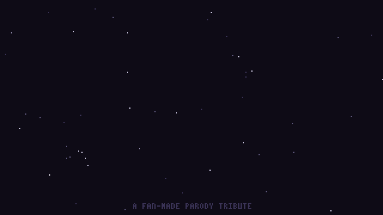
</p>

<h1 align="center">UFO 40</h1>

<p align="center">
  <b>A pretend 1980s console with forty cartridges (well, twelve so far), built from scratch<br>
  for the PlayStation Vita, Windows and the web.</b><br><br>
  <a href="https://naniiic137.github.io/ufo-40/"><b>▶ Play it in your browser</b></a> ·
  <a href="https://github.com/naniiic137/ufo-40/releases">Download for Vita / Windows</a>
</p>

> **Disclaimer.** UFO 40 is a fan-made parody tribute. It contains no code, art,
> music or levels from UFO 50 and is not affiliated with or endorsed by Mossmouth.

> **Vibe-coded.** UFO 40 is a vibe-coded project. It was built by directing an AI
> coding assistant (Claude Code), which wrote the code, pixel art, music, levels
> and tests from my descriptions, research notes and play-testing feedback.

---

## What is this?

UFO 40 is inspired by **UFO 50** by Mossmouth, a collection of fifty "lost" games
from a console that never existed. This is a joke port with a shorter name
and fewer games: forty cartridge slots on the equally fictional
**Beamdown Softworks** console.

Each cartridge is a tribute to one UFO 50 game and sits in the slot with that
game's number. It plays by the same rules: the controls, systems, foes, items,
scoring, goals and structure follow the original as closely as written sources
describe it. Every cartridge has a design document in `docs/games/` that lists
each mechanic and where it comes from. Everything you see and hear is new:
the names, characters, setting, pixel art, levels and chiptune music. Where the
original builds its levels at random, so does the tribute, with its own
generator. Where the original's levels are hand-made, the tribute's are too,
drawn from scratch.

Everything is written in plain C with no dependencies in the core:

- a 320×180 indexed-colour software renderer
- a four-channel chiptune synthesiser with its own music format
- a scene system and a save system

A thin SDL2 layer runs that same core on a modded **PS Vita** (HENkaku/Ensō),
on **Windows/Linux** and in the **browser** through Emscripten. A headless build
drives the whole console from scripted input for testing and for every
screenshot and GIF on this page.

## The console

<p align="center">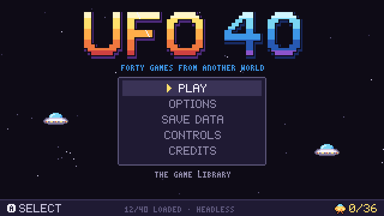</p>

After the boot animation a **main menu** opens: **Play** (the library),
**Options** (music and sound volumes you hear change as you set them, a
**jukebox** with every tune in the console and its cartridges, and window
size and fullscreen on PC), **Save data** (each cartridge's save and goals;
delete one save, reset one cartridge's goals, or delete everything after two
confirmations; it also shows where the saves live and marks a damaged file),
**Controls** (the buttons on the Vita, keyboard, gamepad and touch), **Credits**
and, on PC, **Quit**. It remembers where you were. Everything saves by itself,
and the music and sound volumes are in every game's pause menu too.

<p align="center">
  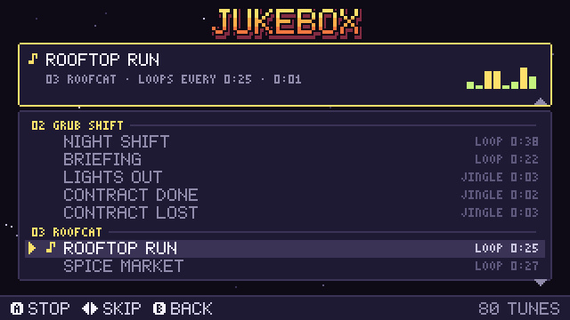
  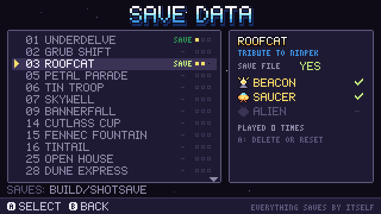
</p>

## The library (12 of 40 loaded)

<p align="center">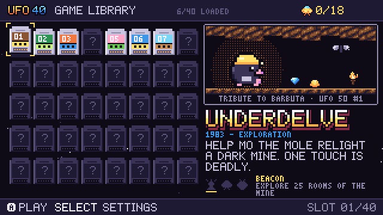</p>

| # | Cartridge | Tribute to | What plays the same | What's ours |
|---|---|---|---|---|
| 01 | **UNDERDELVE** | Barbuta | an 8×8 wrapping map, one-hit deaths, six spare lives and no continue, one fixed jump with no air control, a roaming death that moves a room whenever you do, traps, hidden walls and ladders, hint-givers, a death taken on purpose, items that open the way, three paths to the final boss | Mo the mole, a dark mine, the Gloom, the glow-worms, 64 new screens |
| 02 | **GRUB SHIFT** | Bug Hunter | a 6×5 field dealt afresh each morning, seven tools that each work once a shift, a shop open any time, pods that blow up in threes, grubs that grow by colour into adults, queens and eggs, 30 kills in 10, 9 or 8 shifts | Tilly the farm robot, the grub species, 41 tools |
| 03 | **ROOFCAT** | Ninpek | one long auto-scrolling town of stacked rooftops where left walks you back against the scroll, high and double jumps, one star at a time (three, farther and faster, with power-ups), points only from eggs, a spirit that floats back after a death, two bonus stretches, a 35-hit boss hit only in the eye, a harder second loop | Pepper the courier cat, a whitewashed seaside town, Old Crab |
| 05 | **PETAL PARADE** | Magic Garden | a 12×12 field where you never stop and turn only at the next tile, a trail you must never run into, each follower left on the moving star tiles saved for 10 × its place, potions by strength, a witch who plants mushrooms when a star area goes unused, 200 to win | Posy the gardener, petalpups, sun circles, Madame Nettle |
| 06 | **TIN TROOP** | Mortol | 20 lives that carry through ten levels, the arrow, bomb and stone sacrifices, bodies as ledges and weights, water, fire and plants, a ship that drops the next life | a toy army in a toymaker's house, the Jack of the Chest, 10 new levels |
| 07 | **SKYWELL** | Velgress | a random shaft of crumbling platforms, a roller that only follows you up, stun instead of damage, four-way shooting, a shop between levels, a key bird, a locked fourth level | Kip the scrap-diver, the Grinder, the Tinker, the Well Eye |
| 09 | **BANNERFALL** | Attactics | a 6×8 field between two keeps, a countdown turn where you drag troops within your half, the same end-of-turn order and clashes, eight unit types with promotions and heroes, the original's 24 campaign battles, ranked, survival and 2P versus | the Marigold Guard and the Thistle Host, all units and battle names |
| 14 | **CUTLASS CUP** | Bushido Ball | first to 8 points, a ball that gets faster with every return, aimed, lobbed and curved strikes, secondary weapons and charged super shots, the fouls and penalty points, six fighters, a five-match tournament, 2P versus and co-op doubles | six corsairs, the galley *Merry Mackerel*, old Bosun Crabbe |
| 15 | **FENNEC FOUNTAIN** | Block Koala | pushing numbered blocks (never into a heavier one, a 1 that can't move is taken in), grey at five, blue and black blocks, mimics, arrows, stone patches and doors, unlimited undo and a room menu, fifty rooms behind gates, a room editor | Fen the fennec, a dry spring garden, 50 new rooms |
| 16 | **TINTAIL** | Camouflage | sneaking on a grid past watchers by taking the colour of the ground you stand on, hollow logs, sun and rain pads, hatchlings with their own colour, a danger view you can't move in, undo, a branching map | Twig the chameleon, Salt Island, toads and storks, 15 new levels |
| 25 | **OPEN HOUSE** | Party House | drawing guests from a deck into a house with limited space, the original's 46 guest abilities, costs and trouble, police, fire marshal and bans, set guest lists and a random list, win by ending a party with four stars within 25 nights, 2P hot-seat | a whitewashed house by the sea, all 46 guests' names and faces |
| 28 | **DUNE EXPRESS** | Rail Heist | real time until a guard is alert, then 10-second turns, one-bullet lawmen who hit each other too, punches through walls and floors, carrying and throwing, hiding in barrels, levers, a crank gun, rams, three outlaws, three stars a mission with the original's time goals, 2P versus | Wade, Hush and Pearl, the Governor's tax trains, Biscuit the camel, 20 new trains |
| 04, 08, 10–13, 17–24, 26–27, 29–40 | *coming soon* | | | still in the saucer's cargo hold |

Every cartridge has three goals, which follow the original's own three: a
**Beacon** (a side challenge), the **Saucer** (beating the game) and the
**Alien** (a secret, harder challenge). Earned goals light up on the
cartridge in the library.

### 01 · UNDERDELVE

*Tribute to Barbuta (UFO 50 #1).*

<p align="center">
  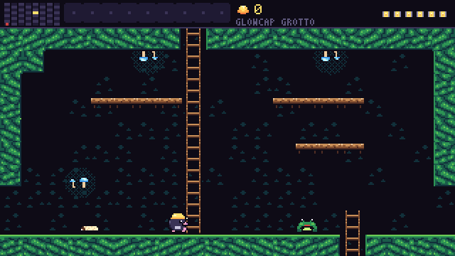
</p>
<p align="center">
  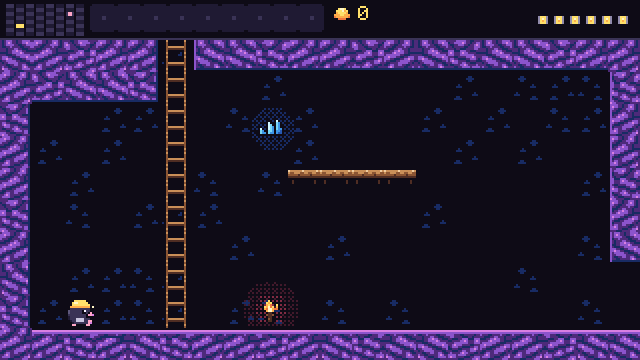
  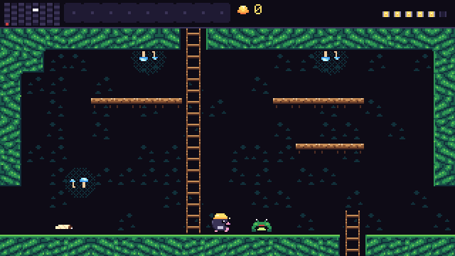
</p>

An 8×8 mine that wraps round at the sides, in four zones: the Ember Deep at
the bottom, then the Crystal Veins, the Glowcap Hollows and the headframe at
the top.

- **Plays like Barbuta:** it boots straight into the mine. Any touch kills;
  Mo has six spare lanterns, then the delve is over, with no continue. He
  walks slowly, his pick barely reaches, and his one fixed jump can't be
  steered once he leaves the ground. Foes come back when you re-enter a room
  and show no damage until they die. The Gloom moves one room whenever Mo
  does; if it finds him it rises in the middle and comes at twice his speed.
  Nothing is explained. The first step right from the camp drops a rock
  from the ceiling; walls hide gems, cracked rock gives way to the pick,
  ladders and ledges hide, still pools are safe and churning ones aren't,
  and one death must be taken on purpose. Glow-worms each give one
  cryptic hint. Items open the way: a copper pot for drips, a tuning
  fork for crystal, a gear crank for the lifts, gloves, a brass tally, a
  canary and a hungry pick. There are three ways up to the Old Lode: a
  lever, the Deep Gate and a 500-ore sledgehammer.
- **Ours:** Mo the mole, the mine and its 64 screens, and its plan: which
  room sits where and how the rooms join (only the coarse structure is
  Barbuta's). The shopkeepers and glow-worms, every tile and the music.

<details>
<summary>The whole mine: all 64 screens, stitched from headless screenshots (spoilers)</summary>
<p align="center">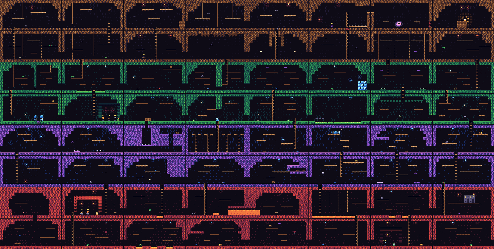</p>
</details>

### 02 · GRUB SHIFT

*Tribute to Bug Hunter (UFO 50 #2).*

<p align="center">
  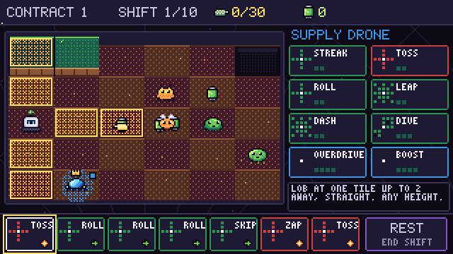
</p>
<p align="center">
  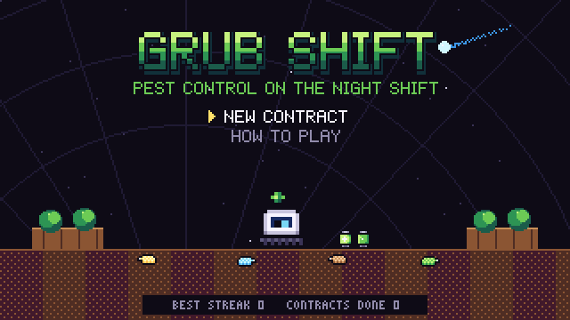
  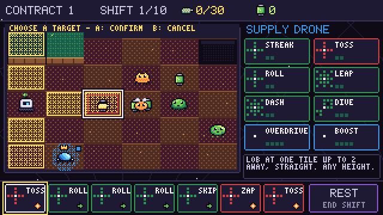
</p>

- **Plays like Bug Hunter:** a 6×5 field whose ground is dealt afresh each
  morning, and seven tool slots that each work once per shift. The shop is
  open any time: swap a tool in and use it at once. Rolls shove grubs and
  squash them from planters; shots can't go uphill. Energy pods blow up when
  three share a tile. Each night one colour whose grubs survived grows a
  level (larva, adult, queen), and its new grubs hatch at that level;
  queens left overnight turn into eggs, and an egg left at the end of a
  shift fails the contract. Clear 30 grubs before the shifts run out; stop
  after a win and the streak waits for you.
- **Ours:** Tilly the farm robot, the dome, the grub species and the names
  and looks of all 41 tools. Three contracts in a row make Employee of the
  Month.

### 03 · ROOFCAT

*Tribute to Ninpek (UFO 50 #3).*

<p align="center">
  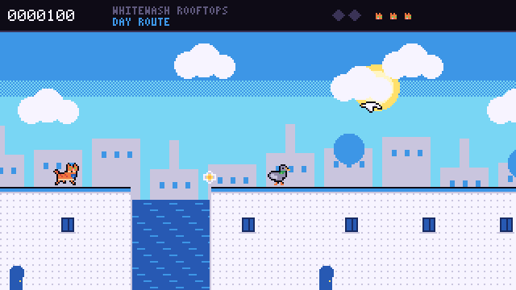
</p>
<p align="center">
  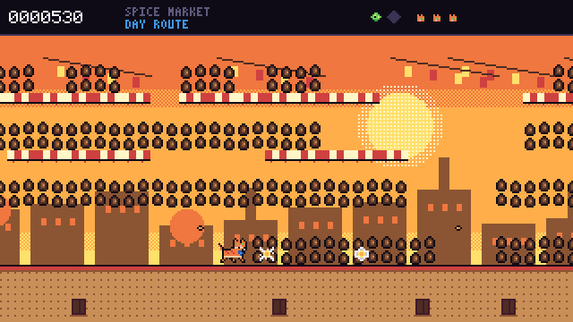
  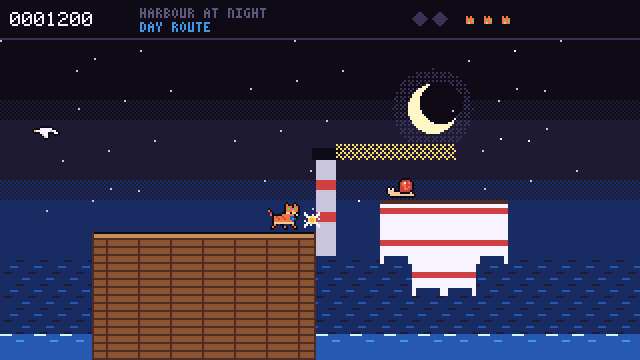
</p>
<p align="center">
  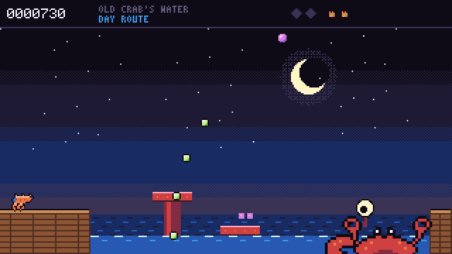
  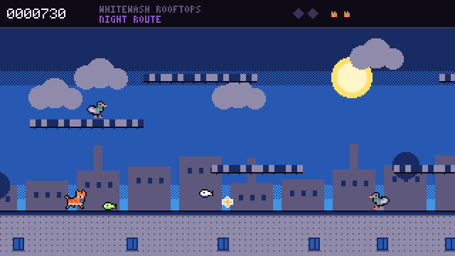
</p>

- **Plays like Ninpek:** one nine-minute town that scrolls on its own, built in
  tiers (the top is the safer way through) and busier the further you get.
  With no input you ride along; left walks you back (tap it to hold your
  place) and right runs ahead. Hold A to jump higher, double jump (also
  after walking off an edge), and drop through ledges. One star at a time;
  the power-up every third kill drops adds a star and throws farther and
  faster, and is lost with a life. Points come only from the eggs foes drop
  (and letters, crowns and snacks). Three lives; a hit stuns you and knocks
  you off the screen, then a spirit floats down and comes back where it is,
  with no grace period. Lanterns at 3,000, 7,000 and every 5,000 must be
  shot for a life. Two bonus stretches are a solid mass of snacks. Old Crab
  has 35 hit points and only its eye counts; it sits low by the water, so
  wait for a low leg. Then a harder second loop. Every foe follows Ninpek's
  roster, and the board keeps the five best scores.
- **Ours:** Pepper the courier cat and Grandma Rosa's parcel, a whitewashed
  seaside town (the rooftops, the Spice Market, the fort walls and the
  harbour), the Magpie Mob, Old Crab and the Night Route. All 52 screens.
  A demo player in the tests gets through the first area with real button
  presses.

### 05 · PETAL PARADE

*Tribute to Magic Garden (UFO 50 #5).*

<p align="center">
  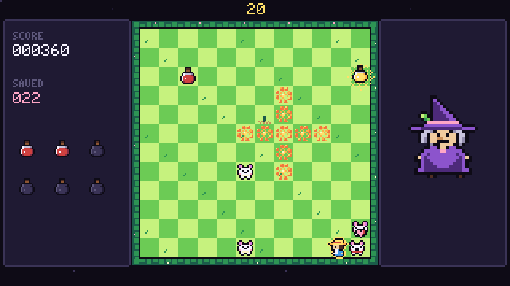
</p>
<p align="center">
  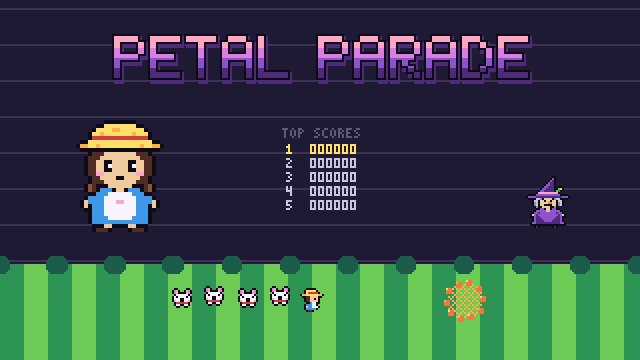
  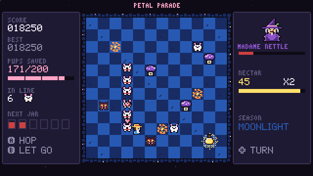
</p>

- **Plays like Magic Garden:** Posy never stops walking, and a turn waits for
  the next tile. Pups she walks over follow in a line; running into it ends
  the run, as does the hedge, a bramble or a toadstool, and a hop clears
  exactly one tile. Let the line go and every pup standing on the sun circle
  is saved, scoring 10 × its place in the line; the rest turn into brambles,
  which look where they are about to hop. The sun circle (a line, a ring or
  a cross) moves on every 10 seconds, and if nobody was saved on it the witch
  plants a toadstool. Saved pups fill a six-jar counter; extra pups make the
  jar riper, and jars ripen on the ground. Eight seconds of nectar let Posy
  smash brambles for a rising chain (only blue and gold break toadstools). Save 200 to win;
  scores go on a board of five.
- **Ours:** Posy the palace gardener, the petalpups and the brambles they turn
  into, the sun circles, the nectar jars, Madame Nettle and four seasons of
  garden. A demo player in the tests wins a whole run with real button
  presses.

### 06 · TIN TROOP

*Tribute to Mortol (UFO 50 #6).*

<p align="center">
  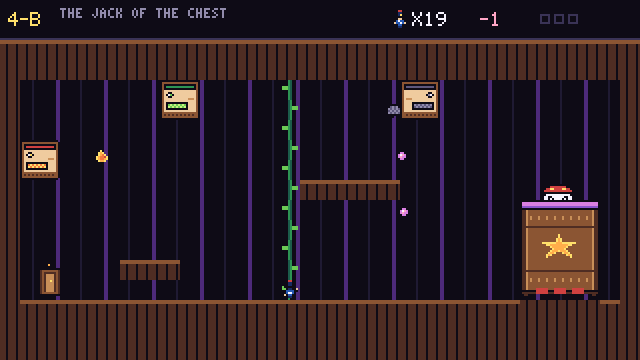
</p>
<p align="center">
  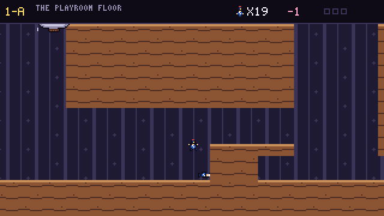
  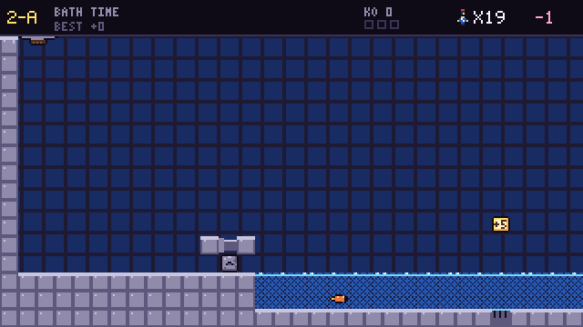
  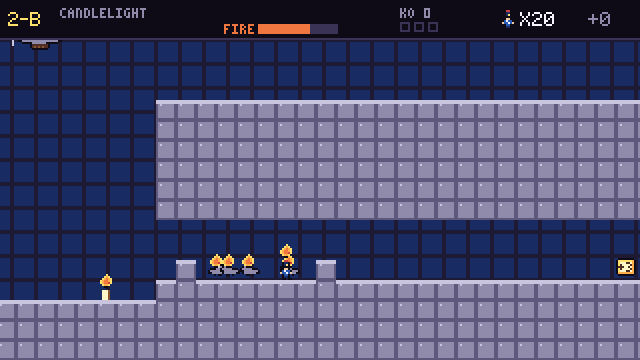
  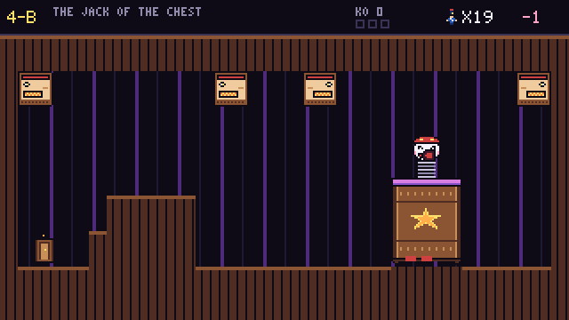
</p>

- **Plays like Mortol:** twenty soldiers are your lives, and spending them is
  how you get anywhere. B alone flies a soldier into the nearest wall, where
  he stays as a ledge; up+B blows him up, breaking toy blocks and foes;
  down+B turns him to stone, and a stone dropped from the air smashes down
  through every block under it and crushes spikes. Rituals chain in mid-air
  for the one soldier. Bodies hold switches down, lie on spikes for the next
  man to cross, float when drowned, and stop laser beams. Burning soldiers
  can't be hurt and set foes alight, seeded soldiers and creatures grow into
  vines, a blast sets a vine burning, and a stone stops a bath tap. Pill
  bugs are rolling bombs whose blast breaks tin blocks a Pop only cracks,
  and launchers shut down once three of their creatures are killed. The
  plane waits at the top left of a view that only scrolls forward; the toy
  chest has doors instead, and no music. Lives carry from level to level,
  and replaying a level to do better raises every level after it. Ten
  levels, the last one the final boss.
- **Ours:** Captain Pip's tin soldiers, the toy blimp, a toymaker's house at
  night (nursery, bathroom, kitchen and toy chest), wind-up mice, paper darts,
  tin rams, pill bugs, toy dragons and the Jack of the Chest. All ten levels
  are new layouts.

### 07 · SKYWELL

*Tribute to Velgress (UFO 50 #7).*

<p align="center">
  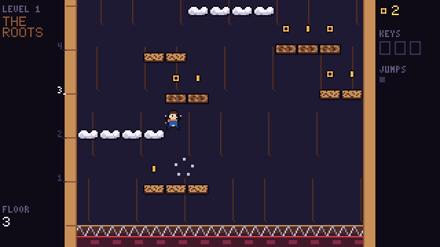
</p>
<p align="center">
  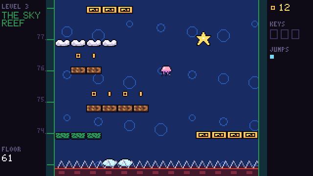
  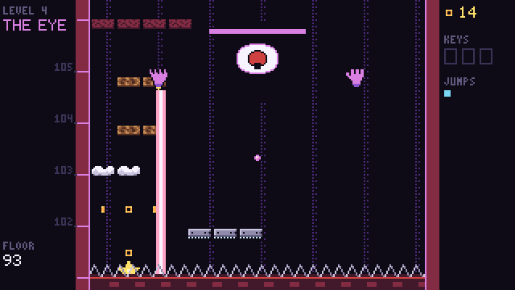
</p>

- **Plays like Velgress:** every run is a new shaft, and a spiked roller at
  the foot of the screen rises whenever you climb past the middle. It is
  the only thing that can kill you, but creatures and hazards knock you
  flying so hard that, unless a platform catches you, you drop floors
  towards it. You come round with your jump in the air still to use. Every
  platform crumbles soon after you land, and you can bounce off any
  creature's head. You double jump, shoot the way you face or straight up
  or down, ride star blocks, and spend coins in a shop between levels.
- **Level by level:** bats that wake when you pass under them, then TNT,
  cloud mines and zappers, then bubbles, fish, jellies and squids, then
  bouncing metal. Shoot down the bird on each level's 12th floor for a key;
  with all three keys a fourth level opens with a final boss.
- **Ours:** Kip the scrap-diver, the Grinder, the Roots, the Sparkworks, the
  Sky Reef, the Tinker's cart, the Keeper Owl and the Well Eye.

### 09 · BANNERFALL

<p align="center">
  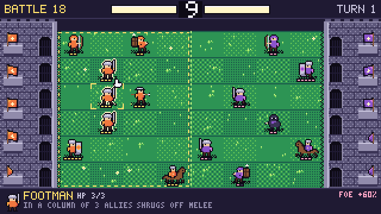
</p>
<p align="center">
  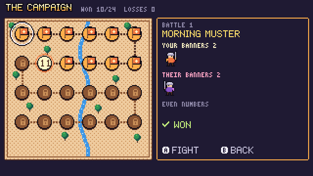
  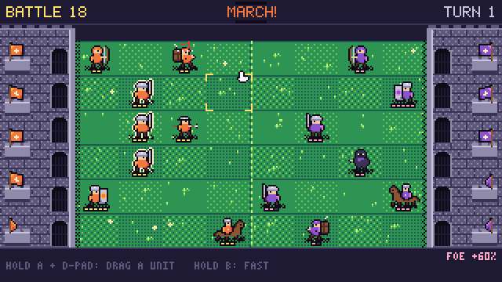
</p>

*A tribute to **Attactics** (UFO 50 #9).*

- **Plays the same:** a 6 × 8 field between two keeps and one new unit a turn
  on a random row. While the timer counts down from 9 you drag units up, down
  or back within your half (forward only to where you picked them up). Then
  everyone attacks and marches in Attactics' order; when two foes step into
  the same tile, the side with the longer line behind pushes through.
- **The troops:** eight units with the original's rules. Footmen in a column
  of three shrug off melee, bowmen shoot down their lane unless a friend is in
  the way, wardens stop arrows until they're hurt, riders move twice, and
  powdermen blow up. Every fifth promotion calls a champion. Battles that
  bring a new troop open with a line about it, and the campaign map shows
  what the next battle brings.
- **The CPU** never moves its troops, but it gets extra ones. The 24-battle
  campaign uses the original's banners, unit pools and percentages. Ranked,
  Survival and 2P Versus are there too.
- **Ours:** the Marigold Guard and the Thistle Host, every unit's name and
  look, the keeps, the battle names and every line of text, the march and the
  battle music.

### 14 · CUTLASS CUP

<p align="center">
  
</p>
<p align="center">
  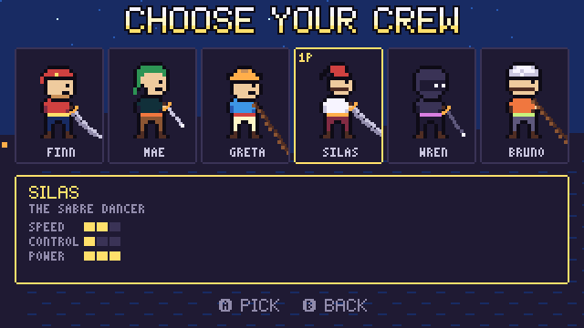
  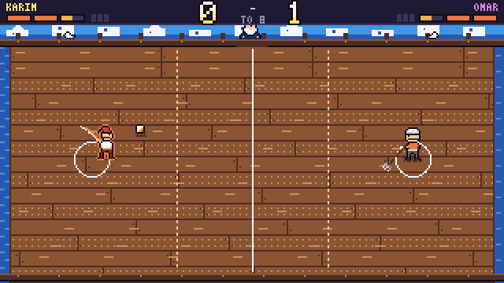
</p>

*A tribute to **Bushido Ball** (UFO 50 #14).*

- **Plays the same:** knock the ball past your rival for a point, first to 8.
  The ball gets faster with every return (a lob slows things down again), up
  and down aim, and a rolling strike goes faster or curves. The judge rolls
  the ball out to whoever lost the last point.
- **Meter:** two strikes fill half a bar. A double tap throws your trick, and
  holding the button charges a broadside, which spare bars upgrade; one that
  hits you is caught and must be mashed back.
- **Fouls:** dawdling, a blade on your rival and jumping the serve (play goes
  on); the third gives away a point. You may go right up to your rival's
  circle.
- **Modes:** six fighters with the original's stats and kits, a five-match
  tournament with unlimited continues, 2P versus and 2P co-op doubles. Like
  the original, there's no music during play. A demo player in the tests
  beats three rivals with real button presses.
- **Ours:** the harbour and the galley *Merry Mackerel*, old Bosun Crabbe, and
  Finn, Mae, Greta, Silas, Wren and Bruno with their coins, sea urchins,
  harpoon, squall, darts and powder pots. The tunes are ours too.

### 15 · FENNEC FOUNTAIN

<p align="center">
  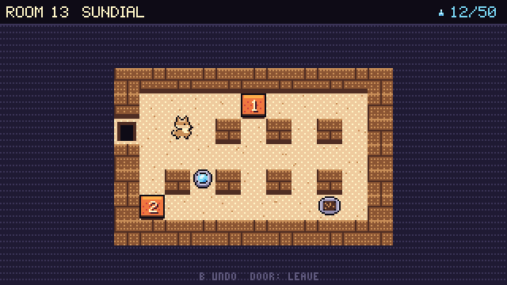
</p>
<p align="center">
  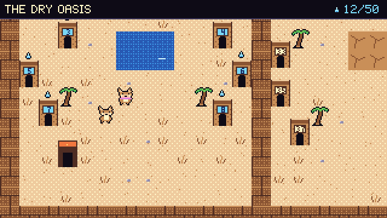
  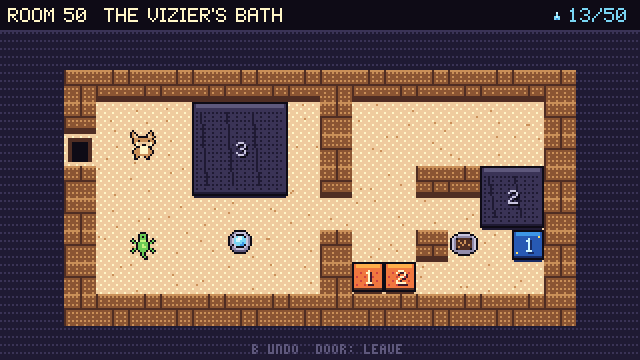
</p>

*A tribute to **Block Koala** (UFO 50 #15).*

- **Plays the same:** Sokoban where numbers are weights. A line of blocks
  moves only if no block is pushed into a heavier one, and a block pushed
  into a 1 that can't move takes it in (2 and 1 make 3). Five turns grey.
  The fennec is slow, B undoes without limit and A opens the room menu
  (start over, leave, or set one undo mark).
- **Special blocks:** blue blocks move only for other blocks, black ones
  shrink when you stop pushing them, geckos copy your steps, arrows send
  blocks one way, stone patches take no blocks, and plates hold doors open.
- **Structure:** fifty rooms around a garden, with gates at 5, 10, 20, 30
  and 40 drops, and a workshop for ten rooms of your own.
- **Ours:** Fen and Tuft the fennecs, Lord Humph the camel and his bath, the
  garden, all fifty rooms and the music.

### 16 · TINTAIL

<p align="center">
  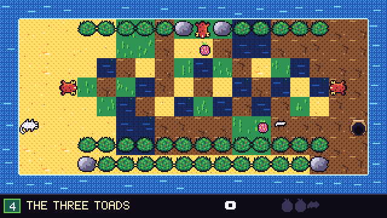
</p>
<p align="center">
  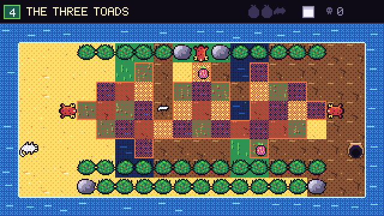
  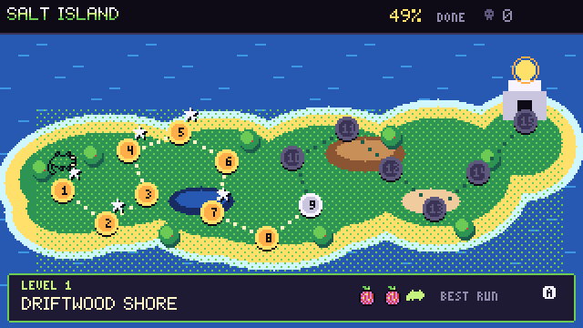
</p>

*A tribute to **Camouflage** (UFO 50 #16).*

- **Plays the same:** a grid stealth puzzle in real time. Twig takes the
  colour of the tile she stands on; matching the ground, she walks through a
  predator's sight unseen. One colour at a time, she's exposed while she
  changes and can't change in danger, so every crossing is planned ahead.
- **The island:** toads watch fixed areas, storks walk fixed loops (they block
  the toads' view, and walk into you whatever colour you are), hollow logs
  hide you, and sun and rain pads dry or wet the grass. Hold B and every
  watched tile turns pink, but you can't move. If you're eaten you can undo.
- **Structure:** fifteen single-screen levels on a branching map, each with
  two prickly pears and a hatchling that follows one step behind in its own
  colour. Only the best single escape counts toward completion.
- **Ours:** Twig, the toads, storks and falcon, Salt Island and the Sun Gate,
  all fifteen levels (a solver in the tests proves each one), and the music.

### 25 · OPEN HOUSE

<p align="center">
  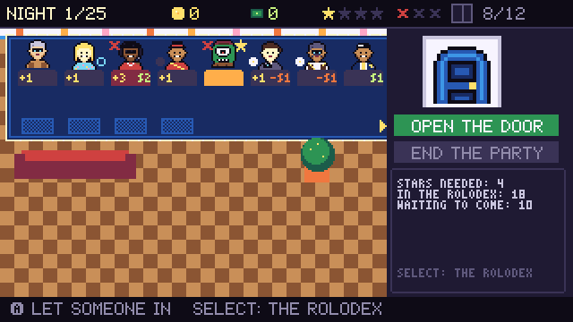
</p>
<p align="center">
  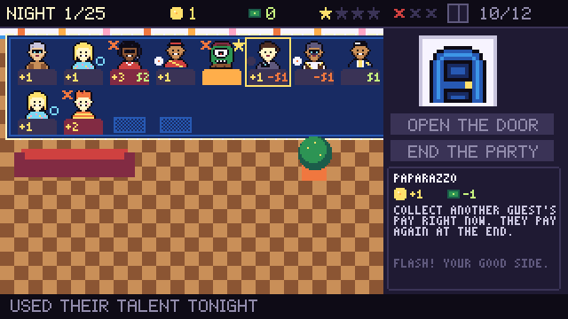
  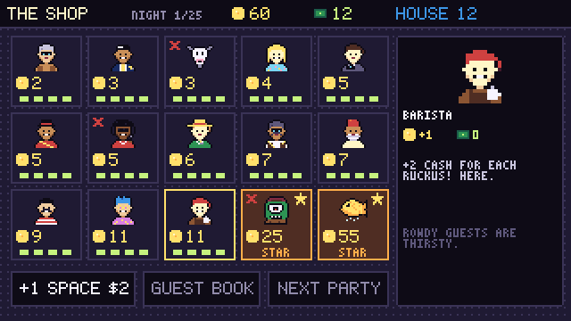
</p>

*A tribute to **Party House** (UFO 50 #25).*

- **Plays the same:** open the door and a random guest from your guest book
  walks in. Three rowdy guests bring the police, and guests brought along
  can overflow the house for the fire marshal; either way nobody pays and one
  guest misses the next party. End the party in time and everyone pays fame
  (to buy guests) and cash (to add space).
- **The guests:** all 46 of Party House's guests with their costs, pay,
  talents and trouble, from fetchers, bouncers and peekers to drummers,
  upstarts and the nine star guests. Win by ending a party well with four
  stars in it, within 25 nights.
- **Structure:** five set guest lists with the original's pools, then a
  Random list and the five-win streak. 2P Versus takes alternate nights and
  shares the shop.
- **Ours:** the house by the sea, the nosy neighbour's lamp, every guest's
  name, portrait and line (the Saucer Pilot, the Wish Fish, the Punk Singer,
  the Goat...), the list names and the music.

### 28 · DUNE EXPRESS

<p align="center">
  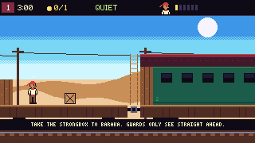
</p>
<p align="center">
  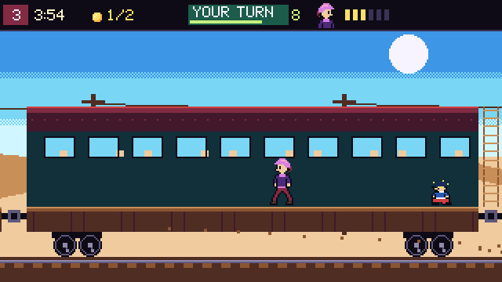
  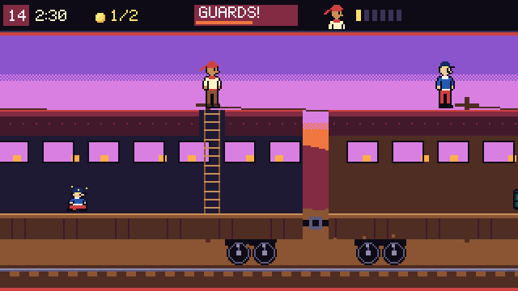
</p>

*A tribute to **Rail Heist** (UFO 50 #28).*

- **Plays the same:** rob a moving train and escape to your mount at the back
  before the train reaches town. Each heist opens with a look along the whole
  train, inside and out. While every guard stands still it's real time; once
  one is up and about it goes in turns, ten seconds for you (the clock runs)
  and three and a half for the lawmen (it stops).
- **The rules:** a guard shoots an outlaw he sees straight ahead, once, and
  then can only punch and throw; his bullet takes whoever is first in line,
  another lawman too, and a gunshot wakes everyone nearby. Duck behind
  anything a tile high, punch through walls, floors and ceilings, push, carry
  and throw barrels, crates, anvils, powder sticks and geese, hide and roll in
  a barrel, stand on a guard's head, and load the gun slowly. Levers flip
  every iron gate, the crank gun turns on the lawmen from behind, and rams
  run down whoever is in front.
- **Structure:** twenty missions in order for the same three outlaws, one or
  two a mission (a pair starts at opposite ends and takes turns), with loot,
  a rescue, a full belt of bullets and the Governor to finish; three stars a
  mission (no kills, every guard down, and Rail Heist's own time goals); 2P
  Versus on a longer train dealt fresh each time.
- **Ours:** Wade, Hush and Pearl, Old Hettie and Biscuit the camel, the Salt
  Line and all twenty trains (every one is won by a scripted run in the
  tests, without a kill and under its time goal), the powder sticks, geese,
  rams and the lucky horseshoe, and the music.

## Install on PS Vita

You need a Vita running HENkaku / h-encore / Ensō with **VitaShell**.

1. Download `ufo40.vpk` from the [latest release](https://github.com/naniiic137/ufo-40/releases).
2. Copy it to the Vita:
   - **USB:** in VitaShell press **SELECT** to start USB mode, then copy the file to `ux0:`.
   - **FTP:** press **SELECT** for FTP, then upload the file with any FTP client.
3. In VitaShell, find `ufo40.vpk`, press **Cross** and choose **Install**.
4. Start **UFO 40** from the LiveArea bubble (title ID `UFOF00040`).

Saves live in `ux0:data/UFO40/`. The game runs at 960×540 (the 320×180
framebuffer at exactly ×3) with 2-pixel bars top and bottom.

## Windows

Download `UFO40-windows.zip` from the releases and run `ufo40.exe`.

- Saves go to `%APPDATA%\UFO40`. If you put an empty `portable.txt` next to the
  exe, it keeps them in a `saves` folder beside it instead.
- **F11** or **Alt+Enter** toggles fullscreen. The window scale is in Options.

## Controls

| Console | Keyboard (PC / web) | PS Vita | Gamepad |
|---|---|---|---|
| D-pad | Arrows or WASD | D-pad or left stick | D-pad or left stick |
| A | Z, J or Space | Cross | A (bottom face button) |
| B | X or K | Circle | B (right face button) |
| START | Enter or Esc | START | Start |
| SELECT | Shift or Backspace | SELECT | Back / Select |

- **START** opens the pause menu in every game: Resume, Restart, Controls, Quit.
- **SELECT** opens Options in the library, and **B** goes back to the main menu.
- **Two players:** the 2-player modes of Bannerfall and Cutlass Cup take two
  gamepads, or split the keyboard: player 1 on WASD + F/G, player 2 on the
  arrows + K/L. On the Vita (one controller) those modes are locked.
- On phones the web page shows an on-screen D-pad with A, B, START and SELECT.

## Building

The core is portable C11. Local builds on Windows use the portable
[w64devkit](https://github.com/skeeto/w64devkit) toolchain (gcc + make), and
nothing needs installing.

```sh
make headless     # the headless runner
make test         # build it and run every scripted test in tests/
make shots        # regenerate the README screenshots and GIFs into docs/shots

# Windows desktop build (w64devkit + SDL2 mingw development libraries)
make sdl SDL2_DIR=C:/path/to/SDL2-2.32.10/x86_64-w64-mingw32

# Linux desktop build (uses sdl2-config)
make sdl
```

CMake does the same job for Vita, the web and CI. It reads the same file list
(`sources.mk`), so there's only one list to maintain:

```sh
# PS Vita (inside the vitasdk/vitasdk docker image)
cmake -S . -B build-vita -DUFO40_VITA=ON && cmake --build build-vita    # -> build-vita/ufo40.vpk

# Web (with emsdk activated)
emcmake cmake -S . -B build-web && cmake --build build-web              # -> build-web/index.html

# Desktop + CTest
cmake -S . -B build && cmake --build build && ctest --test-dir build
```

The Vita and web builds run in GitHub Actions (`.github/workflows/`):

| Workflow | What it does |
|---|---|
| `test` | builds the headless runner with gcc on Ubuntu and runs every test (Make and CTest) |
| `vita` | builds the `.vpk` inside `vitasdk/vitasdk:latest` |
| `web` | builds with emsdk and deploys to GitHub Pages from `main` |
| `windows` | cross-compiles with mingw-w64 and zips the exe with `SDL2.dll` |
| `release` | on `v*` tags, attaches the `.vpk` and the Windows zip to a GitHub Release |

## Architecture

```
src/engine/            platform-independent core (no dependencies)
  gfx.c                320x180 8-bit framebuffer, 32-colour palette, sprites with
                       flip / palette swap / outline, clipping, camera, dithering,
                       palette fades and flashes
  font.c               original 5x7 proportional font + 3x5 tiny font
  audio.c              4-channel synth (2 PolyBLEP pulses, 4-bit triangle, LFSR noise),
                       ADSR envelopes, vibrato, sweeps, arpeggios; UFO-MML sequencer
  input.c rng.c        pressed / held / released / auto-repeat; PCG32
  save.c scene.c       CRC32-checked saves; scenes with palette-fade transitions
src/shell/             the console: boot, main menu, 40-slot library, options and jukebox,
                       save data, pause menu, goal toasts
src/games/*/           one folder per cartridge: rules, art, audio, levels
src/platform/sdl2/     PC + PS Vita + Emscripten in one file
src/platform/headless/ scripted test runner, PNG / GIF / WAV writers, Vita LiveArea art
```

- **Rendering.** Games draw palette indices into the framebuffer. Once per
  frame, the platform layer runs the 57,600 pixels through a 32-entry colour
  table into one streaming SDL texture and scales it by a whole number. That
  keeps the Vita's 444 MHz ARM (which the game clocks up to) nearly idle.
  Palette fades and white flashes happen in that colour table, so they cost
  nothing.
- **Timing.** The game logic always steps at a fixed 60 Hz. A frame that
  lasts a whole number of 1/60 s ticks (within a millisecond) runs exactly
  that many steps, so a 60 Hz vsync gives one step per refresh with no drift
  or judder; other refresh rates fall back to an accumulator. 120 Hz screens
  don't change the game's speed.
- **Audio.**
  - Output is 48 kHz stereo, rendered in the SDL audio callback (or on the
    main thread on the web).
  - Music is written in **UFO-MML**, a compact text notation. For example
    `@14 v12 o5 c8 e g ^4 [d e]2` sets instrument, volume and octave, then
    plays notes with lengths, ties and repeat blocks.
  - Sound effects use the same notation and take over one channel for a
    moment, just like old hardware.
  - Every track and jingle is original: 80 compositions across the console and
    the twelve cartridges.
- **Art.** Sprites are written as strings of palette letters in the C source
  (`k` ink, `y` yellow, `C` cyan and so on), so there are no binary assets at
  all. The Vita LiveArea images are drawn by the engine itself
  (`ufo40_headless --vita-assets vita/sce_sys`) and saved as 8-bit indexed PNGs.
- **Saves.**
  - Global progress (goals and settings) goes in one CRC-checked file.
  - Each game saves its own run or checkpoint (or, like Roofcat, just its
    high scores).
  - The main menu's Save data screen deletes one game's save, resets its
    goals (which clears its save too, since games rebuild goals from their
    saved progress) or deletes everything, play counts included.
  - Where they're stored: the exe folder or `%APPDATA%\UFO40` on PC,
    `ux0:data/UFO40/` on Vita and `localStorage` in the browser.
- **Testing.**
  - Tests are plain text scripts (`tests/*.ufs`) that press buttons, wait,
    use cheats to set up situations and then `expect` game state.
  - Grub Shift keeps its rules in one pure struct. An autoplay bot that looks
    two moves ahead plays whole contracts from it as a balance smoke test.
  - Underdelve checks its mine with probes built on its own physics: every
    room walked and jumped from every way in, the rooms reachable from the
    camp with each route into the tower, and no way into a room that drops a
    returning Mo onto spikes. Its opening and the smith's way into the
    tower are also played by buttons alone.
  - Tin Troop has a route test for every level that plays its obstacles the
    intended way, and Skywell has a demo climber that checks generated pits
    can be climbed.
  - Fennec Fountain ships every room with its shortest solution, and a test
    plays all fifty with button presses on the real rules.

Example test (`tests/ud_02_hazard_death.ufs`):

```
# UNDERDELVE: spikes kill in one hit; a lantern goes out and Mo comes back
# where he entered the room.
game underdelve
wait 15
cheat no_gloom
cheat room 1 0 170 130
cheat clear_enemies
wait 5
expect lanterns == 6
hold RIGHT 60
expect deaths == 1
expect lanterns == 5
wait 90
expect state == 1
expect px < 180
```

## Credits and license

- A vibe-coded project by [@naniiic137](https://github.com/naniiic137): the
  design, code, pixel art, music and levels were generated with an AI coding
  assistant (Claude Code), directed and play-tested by naniiic137.
- Inspired by the idea and games of **UFO 50** by Mossmouth. Go play the real thing.
- [SDL2](https://www.libsdl.org/) (zlib license) handles windows, input and
  audio on every platform. [vitasdk](https://vitasdk.org/) and
  [Emscripten](https://emscripten.org/) handle the Vita and web builds.

UFO 40 is **non-commercial**. You may play, share, study and change it for any
non-commercial purpose, but you may not sell it or use it commercially.

- **Code:** [PolyForm Noncommercial License 1.0.0](LICENSE).
- **Pixel art, music, sound effects, text and level designs:**
  [Creative Commons Attribution-NonCommercial 4.0](LICENSE-ASSETS.md).
- Third-party parts keep their own licences: SDL2 (zlib) and stb_image_write
  (public domain).
