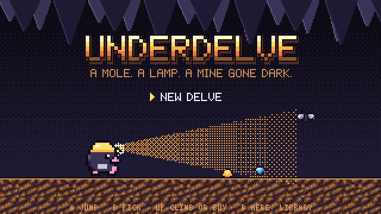
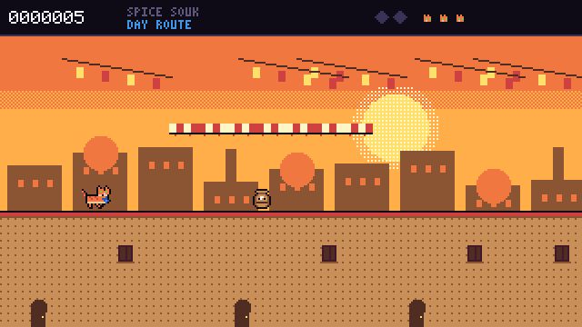

<p align="center">
  
</p>

<h1 align="center">UFO 40</h1>

<p align="center">
  <b>A pretend 1980s console with forty cartridges (well, six so far), built from scratch<br>
  for the PlayStation Vita, Windows and the web.</b><br><br>
  <a href="https://naniiic137.github.io/ufo-40/"><b>▶ Play it in your browser</b></a> ·
  <a href="https://github.com/naniiic137/ufo-40/releases">Download for Vita / Windows</a>
</p>

> **Disclaimer.** UFO 40 is a fan-made parody tribute. It contains no code, art,
> music or levels from UFO 50 and is not affiliated with or endorsed by Mossmouth.

---

## What is this?

UFO 40 is inspired by **UFO 50** by Mossmouth, a collection of fifty "lost" games
from a console that never existed. This is a joke port with a shorter name
and fewer games: forty cartridge slots on the equally fictional
**Beamdown Softworks** console.

Each cartridge is a tribute to one UFO 50 game and sits in the slot with that
game's number. It plays by the same rules: the controls, systems, foes, items,
scoring, goals and structure follow the original as closely as written sources
describe it. Every cartridge has a design document in `docs/games/` that lists
each mechanic and where it comes from. Everything you see and hear is new:
the names, characters, setting, pixel art, levels and chiptune music. Where the
original builds its levels at random, so does the tribute, with its own
generator. Where the original's levels are hand-made, the tribute's are too,
drawn from scratch.

Everything is written in plain C with no dependencies in the core:

- a 320×180 indexed-colour software renderer
- a four-channel chiptune synthesiser with its own music format
- a scene system and a save system

A thin SDL2 layer runs that same core on a modded **PS Vita** (HENkaku/Ensō),
on **Windows/Linux** and in the **browser** through Emscripten. A headless build
drives the whole console from scripted input for testing and for every
screenshot and GIF on this page.

## The library (6 of 40 loaded)

<p align="center"></p>

| # | Cartridge | Tribute to | What plays the same | What's ours |
|---|---|---|---|---|
| 01 | **UNDERDELVE** | Barbuta | an 8×8 wrapping map, one-hit deaths and six lives, committed jumps, a roaming death that moves whenever you change room, items that open the way, three paths to the final boss | Mo the mole, a dark mine, the Gloom, 64 new screens |
| 02 | **GRUB SHIFT** | Bug Hunter | a random 6×5 field, seven one-shot tool modules, energy pods that blow up in threes, grubs that evolve by colour, a daily shop, a kill quota | Tilly the farm robot, the grub species, 41 tools |
| 03 | **ROOFCAT** | Ninpek | one long auto-scrolling world, double jumps, thrown stars, a spirit that floats back after a death, token pickups, one final boss, a harder second loop | Harissa the courier cat, a Tunisian seaside town, Old Crab |
| 05 | **PETAL PARADE** | Magic Garden | a 12×12 field, a trail of followers you must never run into, saving them on star pads for rising points, potions by strength, a witch who plants mushrooms | Lina the gardener, petalpups, sun circles, Madame Nettle |
| 06 | **TIN TROOP** | Mortol | 20 lives that carry through ten levels, the arrow, bomb and stone sacrifices, bodies as ledges and weights, water, fire and plants, a ship that drops the next life | a toy army in a toymaker's house, the Jack of the Chest, 10 new levels |
| 07 | **SKYWELL** | Velgress | a random shaft of crumbling platforms, a roller that only follows you up, stun instead of damage, four-way shooting, a shop between levels, a key bird, a locked fourth level | Kip the scrap-diver, the Grinder, the Tinker, the Well Eye |
| 04, 08–40 | *coming soon* | | | still in the saucer's cargo hold |

Every cartridge has three goals, which follow the original's own three: a
**Beacon** (a side challenge), the **Saucer** (beating the game) and the
**Alien** (a secret, harder challenge). Earned goals light up on the
cartridge in the library.

### 01 · UNDERDELVE

*Tribute to Barbuta (UFO 50 #1).*

<p align="center">
  
</p>
<p align="center">
  
  
</p>

An 8×8 mine that wraps round at the sides, in four zones: the Ember Deep at
the bottom, then the Crystal Veins, the Glowcap Hollows and the headframe at
the top.

- **Plays like Barbuta:** any touch costs one of six lanterns. Jumps are
  locked in once you leave the ground. Foes come back when you re-enter a
  room and show no damage until they die. The Gloom moves one room every
  time you change room. Items open the way: a copper pot for drips, a tuning
  fork for crystal, a gear crank for the lifts, gloves, a key, a canary and a
  hungry pick. There are three ways up to the Old Lode: a lever, the Deep
  Gate and a 500-ore sledgehammer.
- **Ours:** Mo the mole, the mine and its 64 screens, the shopkeepers and
  every tile.

<details>
<summary>The whole mine: all 64 screens, stitched from headless screenshots (spoilers)</summary>
<p align="center"></p>
</details>

### 02 · GRUB SHIFT

*Tribute to Bug Hunter (UFO 50 #2).*

<p align="center">
  
</p>
<p align="center">
  
  
</p>

- **Plays like Bug Hunter:** a new 6×5 field every contract and seven tool
  slots that each work once per shift. Energy pods blow up when three share a
  tile. A grub's colour decides what it grows into, and a hatched egg fails
  the contract. A shop of new tools opens each morning, and you have 30 grubs
  to clear before the days run out.
- **Ours:** Tilly the farm robot, the dome, the grub species and the names
  and looks of all 41 tools. Three contracts in a row make Employee of the
  Month.

### 03 · ROOFCAT

*Tribute to Ninpek (UFO 50 #3).*

<p align="center">
  
</p>
<p align="center">
  
  
</p>
<p align="center">
  
  
</p>

- **Plays like Ninpek:** one continuous auto-scrolling town, a double jump and
  stars thrown at a steady rate. Foes drop tokens instead of points, a spirit
  floats back down after a death, and extra lives come from score. There are
  hidden spots, one boss at the very end and a harder second loop.
- **Ours:** Harissa the courier cat and Grandma Zohra's parcel, a whitewashed
  seaside town (the rooftops, the Spice Souk, the fort walls and the harbour),
  the Magpie Mob, Old Crab and the Night Route.

### 05 · PETAL PARADE

*Tribute to Magic Garden (UFO 50 #5).*

<p align="center">
  
</p>
<p align="center">
  
  
</p>

- **Plays like Magic Garden:** you never stop walking. Pups you walk over
  follow in a line, and running into it ends the game, as does a wall, an
  angry pup or a mushroom. Let the line go on a star pad and each pup scores
  more than the last. Let it go anywhere else and they turn angry. Saved pups
  fill a counter that brews potions of four strengths; drink one to smash
  what's in your way for a while. A witch plants mushrooms if you dawdle.
  Save 200 to win.
- **Ours:** Lina the palace gardener, the petalpups and the brambles they turn
  into, the sun circles, the nectar jars, Madame Nettle and four seasons of
  garden.

### 06 · TIN TROOP

*Tribute to Mortol (UFO 50 #6).*

<p align="center">
  
</p>
<p align="center">
  
  
</p>

- **Plays like Mortol:** you have twenty lives, and spending them is how you
  get anywhere. A soldier can fly into a wall and stay there as a ledge, blow
  himself up to clear blocks and foes, or turn into a stone block. Bodies
  press switches and weigh down scales. Drowned soldiers float, burning ones
  can't be hurt, and seeded ones grow into vines. New soldiers parachute from
  a ship that follows your progress. Lives carry from level to level, and
  replaying a level to do better raises every level after it. There are ten
  levels in four worlds, then the final boss.
- **Ours:** Captain Pip's tin soldiers, the toy blimp, a toymaker's house at
  night (nursery, bathroom, kitchen and toy chest), wind-up mice, paper darts,
  tin rams and the Jack of the Chest. All ten levels are new layouts.

### 07 · SKYWELL

*Tribute to Velgress (UFO 50 #7).*

<p align="center">
  
</p>
<p align="center">
  
  
</p>

- **Plays like Velgress:** every run is a new shaft. Platforms crumble soon
  after you land. A spiked roller follows you up and is the only thing that
  can kill you; every other hazard just stuns. You double jump, shoot in four
  directions and collect coins for the shop between levels. Shoot down the
  bird on each level's 12th floor for a key, and with all three keys a fourth
  level opens with a final boss.
- **Ours:** Kip the scrap-diver, the Grinder, the Roots, the Sparkworks, the
  Sky Reef, the Tinker's cart, the Keeper Owl and the Well Eye.

## Install on PS Vita

You need a Vita running HENkaku / h-encore / Ensō with **VitaShell**.

1. Download `ufo40.vpk` from the [latest release](https://github.com/naniiic137/ufo-40/releases).
2. Copy it to the Vita:
   - **USB:** in VitaShell press **SELECT** to start USB mode, then copy the file to `ux0:`.
   - **FTP:** press **SELECT** for FTP, then upload the file with any FTP client.
3. In VitaShell, find `ufo40.vpk`, press **Cross** and choose **Install**.
4. Start **UFO 40** from the LiveArea bubble (title ID `UFOF00040`).

Saves live in `ux0:data/UFO40/`. The game runs at 960×540 (the 320×180
framebuffer at exactly ×3) with 2-pixel bars top and bottom.

## Windows

Download `UFO40-windows.zip` from the releases and run `ufo40.exe`.

- Saves go to `%APPDATA%\UFO40`. If you put an empty `portable.txt` next to the
  exe, it keeps them in a `saves` folder beside it instead.
- **F11** or **Alt+Enter** toggles fullscreen. The window scale is in Settings.

## Controls

| Console | Keyboard (PC / web) | PS Vita | Gamepad |
|---|---|---|---|
| D-pad | Arrows or WASD | D-pad or left stick | D-pad or left stick |
| A | Z, J or Space | Cross | A (bottom face button) |
| B | X or K | Circle | B (right face button) |
| START | Enter or Esc | START | Start |
| SELECT | Shift or Backspace | SELECT | Back / Select |

- **START** opens the pause menu in every game: Resume, Restart, Controls, Quit.
- **SELECT** opens Settings in the library.
- On phones the web page shows an on-screen D-pad with A, B, START and SELECT.

## Building

The core is portable C11. Local builds on Windows use the portable
[w64devkit](https://github.com/skeeto/w64devkit) toolchain (gcc + make), and
nothing needs installing.

```sh
make headless     # the headless runner
make test         # build it and run every scripted test in tests/
make shots        # regenerate the README screenshots and GIFs into docs/shots

# Windows desktop build (w64devkit + SDL2 mingw development libraries)
make sdl SDL2_DIR=C:/path/to/SDL2-2.32.10/x86_64-w64-mingw32

# Linux desktop build (uses sdl2-config)
make sdl
```

CMake does the same job for Vita, the web and CI. It reads the same file list
(`sources.mk`), so there's only one list to maintain:

```sh
# PS Vita (inside the vitasdk/vitasdk docker image)
cmake -S . -B build-vita -DUFO40_VITA=ON && cmake --build build-vita    # -> build-vita/ufo40.vpk

# Web (with emsdk activated)
emcmake cmake -S . -B build-web && cmake --build build-web              # -> build-web/index.html

# Desktop + CTest
cmake -S . -B build && cmake --build build && ctest --test-dir build
```

The Vita and web builds run in GitHub Actions (`.github/workflows/`):

| Workflow | What it does |
|---|---|
| `test` | builds the headless runner with gcc on Ubuntu and runs every test (Make and CTest) |
| `vita` | builds the `.vpk` inside `vitasdk/vitasdk:latest` |
| `web` | builds with emsdk and deploys to GitHub Pages from `main` |
| `windows` | cross-compiles with mingw-w64 and zips the exe with `SDL2.dll` |
| `release` | on `v*` tags, attaches the `.vpk` and the Windows zip to a GitHub Release |

## Architecture

```
src/engine/            platform-independent core (no dependencies)
  gfx.c                320x180 8-bit framebuffer, 32-colour palette, sprites with
                       flip / palette swap / outline, clipping, camera, dithering,
                       palette fades and flashes
  font.c               original 5x7 proportional font + 3x5 tiny font
  audio.c              4-channel synth (2 PolyBLEP pulses, 4-bit triangle, LFSR noise),
                       ADSR envelopes, vibrato, sweeps, arpeggios; UFO-MML sequencer
  input.c rng.c        pressed / held / released / auto-repeat; PCG32
  save.c scene.c       CRC32-checked saves; scenes with palette-fade transitions
src/shell/             the console: boot, 40-slot library, settings, pause menu, goal toasts
src/games/*/           one folder per cartridge: rules, art, audio, levels
src/platform/sdl2/     PC + PS Vita + Emscripten in one file
src/platform/headless/ scripted test runner, PNG / GIF / WAV writers, Vita LiveArea art
```

- **Rendering.** Games draw palette indices into the framebuffer. Once per
  frame, the platform layer runs the 57,600 pixels through a 32-entry colour
  table into one streaming SDL texture and scales it by a whole number. That
  keeps the Vita's 444 MHz ARM (which the game clocks up to) nearly idle.
  Palette fades and white flashes happen in that colour table, so they cost
  nothing.
- **Timing.** The game logic always steps at a fixed 60 Hz. A frame that
  lasts a whole number of 1/60 s ticks (within a millisecond) runs exactly
  that many steps, so a 60 Hz vsync gives one step per refresh with no drift
  or judder; other refresh rates fall back to an accumulator. 120 Hz screens
  don't change the game's speed.
- **Audio.**
  - Output is 48 kHz stereo, rendered in the SDL audio callback (or on the
    main thread on the web).
  - Music is written in **UFO-MML**, a compact text notation. For example
    `@14 v12 o5 c8 e g ^4 [d e]2` sets instrument, volume and octave, then
    plays notes with lengths, ties and repeat blocks.
  - Sound effects use the same notation and take over one channel for a
    moment, just like old hardware.
  - Every track and jingle is original: 42 compositions across the console and
    the six cartridges.
- **Art.** Sprites are written as strings of palette letters in the C source
  (`k` ink, `y` yellow, `C` cyan and so on), so there are no binary assets at
  all. The Vita LiveArea images are drawn by the engine itself
  (`ufo40_headless --vita-assets vita/sce_sys`) and saved as 8-bit indexed PNGs.
- **Saves.**
  - Global progress (goals and settings) goes in one CRC-checked file.
  - Each game saves its own run or checkpoint.
  - Where they're stored: the exe folder or `%APPDATA%\UFO40` on PC,
    `ux0:data/UFO40/` on Vita and `localStorage` in the browser.
- **Testing.**
  - Tests are plain text scripts (`tests/*.ufs`) that press buttons, wait,
    use cheats to set up situations and then `expect` game state.
  - Grub Shift keeps its rules in one pure struct. A greedy autoplay bot plays
    whole contracts from it as a balance smoke test.
  - Tin Troop has a route test for every level that plays its obstacles the
    intended way, and Skywell has a demo climber that checks generated pits
    can be climbed.

Example test (`tests/ud_02_hazard_death.ufs`):

```
# UNDERDELVE: spikes kill in one hit; a lantern goes out and Mo comes back
# where he entered the room.
game underdelve
wait 10
press A
wait 5
cheat no_gloom
cheat room 5 0 170 130
cheat clear_enemies
wait 5
expect lanterns == 6
hold RIGHT 60
expect deaths == 1
expect lanterns == 5
wait 90
expect state == 1
expect px < 180
```

## Credits and license

- Design, code, pixel art, music and levels were made for UFO 40 by
  **Hamza Ben Ismail** ([@naniiic137](https://github.com/naniiic137)),
  from Nabeul, Tunisia.
- Inspired by the idea and games of **UFO 50** by Mossmouth. Go play the real thing.
- [SDL2](https://www.libsdl.org/) (zlib license) handles windows, input and
  audio on every platform. [vitasdk](https://vitasdk.org/) and
  [Emscripten](https://emscripten.org/) handle the Vita and web builds.

Code is released under the **MIT License**. The pixel art, music, sound effects
and level designs made for this project are released under the same license.
See [LICENSE](LICENSE).
