<p align="center">
  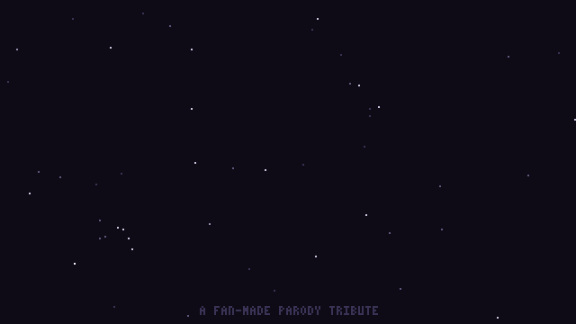
</p>

<h1 align="center">UFO 40</h1>

<p align="center">
  <b>A pretend 1980s console with fifty cartridges (well, twenty-seven so far), built from scratch<br>
  for the PlayStation Vita, Windows and the web.</b><br><br>
  <a href="https://naniiic137.github.io/ufo-40/"><b>▶ Play it in your browser</b></a> ·
  <a href="https://github.com/naniiic137/ufo-40/releases">Download for Vita / Windows</a>
</p>

> **Disclaimer.** UFO 40 is a fan-made parody tribute. It contains no code, art,
> music or levels from UFO 50 and is not affiliated with or endorsed by Mossmouth.

> **Vibe-coded.** UFO 40 is a vibe-coded project. It was built by directing an AI
> coding assistant (Claude Code), which wrote the code, pixel art, music, levels
> and tests from my descriptions, research notes and play-testing feedback.

## What's new (v0.8.0)

- **27 cartridges** in a 50-slot library, each checked against its UFO 50 original by an independent review, then fixed.
- **New: 11 HAT TRICK** (tribute to Kick Club): kick a ball round 40 single-screen pitches in four worlds, keep it lit for bigger combos, beat the clock before the Timekeeper comes; 1P, co-op with one shared ball, and a code-only versus.
- **Library:**
  - every empty slot shows a grey **coming-soon cartridge** with its "tribute to" credit
  - a red **NEW** tag on cartridges you haven't opened yet
  - **SELECT** on a cartridge opens its card over the library: time played, times opened, last played, its goals, DELETE SAVE and per-cartridge **CONTROLS** (swap A, B and SELECT)
- **Confirm boxes** are centred (DELETE ALL DATA, RESTART GAME and the rest), with a test that measures it.
- **One licence** for everything (PolyForm Noncommercial), with a fan-project notice.

Earlier in v0.7.0: CHIME CIRCUIT (19), SKID KIDS (26), TILTSHOT (31), BUZZBOLT (39), and DUSKLING's gentler start.

---

## What is this?

UFO 40 is inspired by **UFO 50** by Mossmouth, a collection of fifty "lost" games
from a console that never existed. It started as a joke port with a shorter
name and fewer games, forty cartridge slots on the equally fictional
**Beamdown Softworks** console. Then it kept going: UFO 40 is now a tribute
that is growing to all 50 of UFO 50's games, one per slot. The name stayed 40;
the library didn't.

Each cartridge is a tribute to one UFO 50 game and sits in the slot with that
game's number. It plays by the same rules: the controls, systems, foes, items,
scoring, goals and structure follow the original as closely as written sources
describe it. Every cartridge has a design document in `docs/games/` that lists
each mechanic and where it comes from. Everything you see and hear is new:
the names, characters, setting, pixel art, levels and chiptune music. Where the
original builds its levels at random, so does the tribute, with its own
generator. Where the original's levels are hand-made, the tribute's are too,
drawn from scratch.

Once the tributes are in, the plan is to add some twists of my own on top,
such as harder modes, kept apart from the faithful versions.

Everything is written in plain C with no dependencies in the core:

- a 320×180 indexed-colour software renderer
- a four-channel chiptune synthesiser with its own music format
- a scene system and a save system

A thin SDL2 layer runs that same core on a modded **PS Vita** (HENkaku/Ensō),
on **Windows/Linux** and in the **browser** through Emscripten. A headless build
drives the whole console from scripted input for testing and for every
screenshot and GIF on this page.

## The console

<p align="center">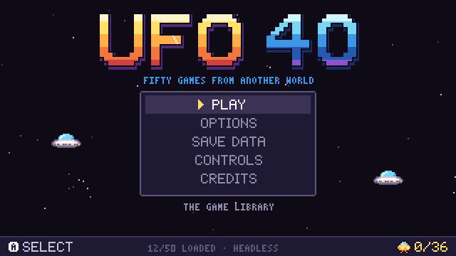</p>

After the boot animation a **main menu** opens: **Play** (the library),
**Options** (music and sound volumes you hear change as you set them, a
**jukebox** with every tune in the console and its cartridges, and window
size and fullscreen on PC), **Save data** (each cartridge's save and goals;
delete one save, reset one cartridge's goals, or delete everything after two
confirmations; it also shows where the saves live and marks a damaged file),
**Controls** (the buttons on the Vita, keyboard, gamepad and touch), **Credits**
and, on PC, **Quit**. It remembers where you were. Everything saves by itself,
and the music and sound volumes are in every game's pause menu too.

<p align="center">
  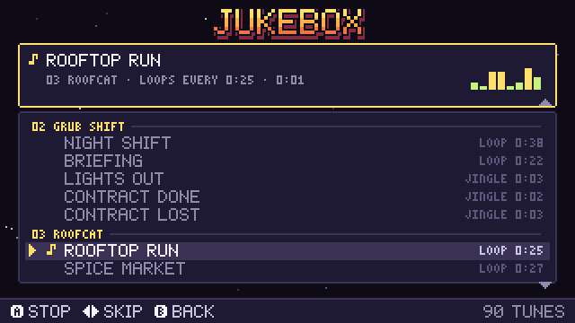
  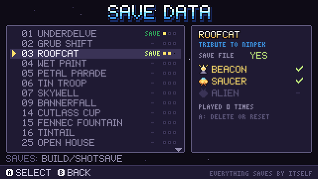
</p>

## The library (27 of 50 loaded)

<p align="center">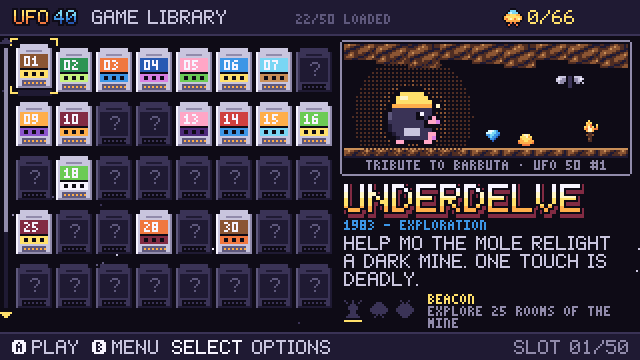</p>

Eight full-size cartridges to a row, five rows at a time: the grid scrolls
as the cursor moves down to slots 41–50, and a bar in the left margin shows
when there is more above or below. An empty slot holds a grey placeholder
cartridge for the game still to come (COMING SOON, its number and the UFO 50
game it will pay tribute to); it can't be started yet. A cartridge you
haven't started since it arrived wears a red NEW tag until you play it.

<p align="center">
  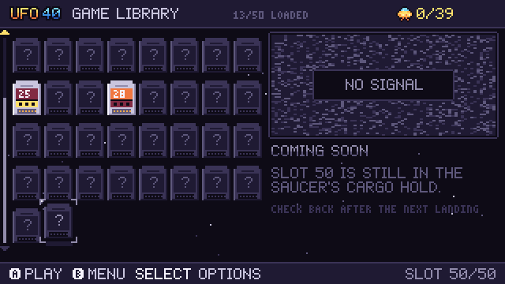
  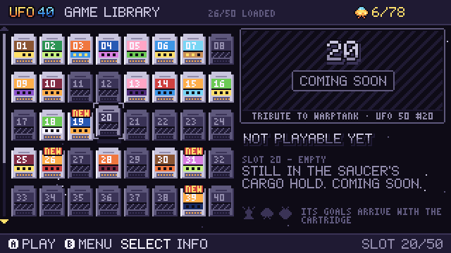
</p>

SELECT on a cartridge opens its card over the library: time played, times
opened and the day it was last played, its three goals, DELETE SAVE, and
CONTROLS, where the A, B and SELECT jobs can move between those three
buttons for that cartridge only (its controls list, here and in the pause
menu, shows the buttons as you now press them). SELECT or B closes it.

<p align="center">
  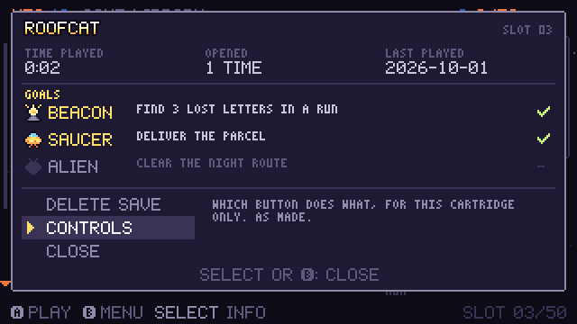
  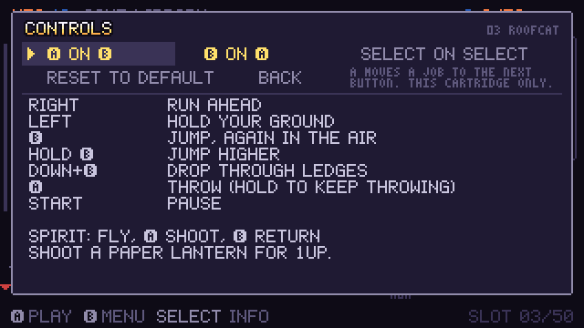
</p>

| # | Cartridge | Tribute to | What plays the same | What's ours |
|---|---|---|---|---|
| 01 | **UNDERDELVE** | Barbuta | an 8×8 wrapping map, one-hit deaths, six spare lives and no continue, one fixed jump with no air control, a roaming death that moves a room whenever you do, traps, hidden walls and ladders, hint-givers, a death taken on purpose, items that open the way, three paths to the final boss | Mo the mole, a dark mine, the Gloom, the glow-worms, 64 new screens |
| 02 | **GRUB SHIFT** | Bug Hunter | a 6×5 field dealt afresh each morning, seven tools that each work once a shift, a shop open any time, pods that blow up in threes, grubs that grow by colour into adults, queens and eggs, 30 kills in 10, 9 or 8 shifts | Tilly the farm robot, the grub species, 41 tools |
| 03 | **ROOFCAT** | Ninpek | one long auto-scrolling town of stacked rooftops where left walks you back against the scroll, high and double jumps, one star at a time (three, farther and faster, with power-ups), points only from eggs, a spirit that floats back after a death, two bonus stretches, a 35-hit boss hit only in the eye, a harder second loop | Pepper the courier cat, a whitewashed seaside town, Old Crab |
| 04 | **WET PAINT** | Paint Chase | a car that never stops and can't turn round (the pad back brakes), every tile it crosses painted, a clock and a goal share on each of 25 one-screen courses, points for every per cent over, three lives and no continue, foes that paint pink from flashing garages, boost arrows, bumpers, barriers, bollards, belts and four power-ups, a final against a rival with all your tricks, 2P versus | Bo's blue kart, Foxy Fuchsia, the Marshal, smudgers, dusters, gloops, hedgehogs, conkers and jellies, 26 new courses |
| 05 | **PETAL PARADE** | Magic Garden | a 12×12 field where you never stop and turn only at the next tile, a trail you must never run into, each follower left on the moving star tiles saved for 10 × its place, potions by strength, a witch who plants mushrooms when a star area goes unused, 200 to win | Posy the gardener, petalpups, sun circles, Madame Nettle |
| 06 | **TIN TROOP** | Mortol | 20 lives that carry through ten levels, the arrow, bomb and stone sacrifices, bodies as ledges and weights, water, fire and plants, a ship that drops the next life | a toy army in a toymaker's house, the Jack of the Chest, 10 new levels |
| 07 | **SKYWELL** | Velgress | a random shaft of crumbling platforms, a roller that only follows you up, stun instead of damage, four-way shooting, a shop between levels, a key bird, a locked fourth level | Kip the scrap-diver, the Grinder, the Tinker, the Well Eye |
| 09 | **BANNERFALL** | Attactics | a 6×8 field between two keeps, a countdown turn where you drag troops within your half, the same end-of-turn order and clashes, eight unit types with promotions and heroes, the original's 24 campaign battles, ranked, survival and 2P versus | the Marigold Guard and the Thistle Host, all units and battle names |
| 13 | **DUSKLING** | Mooncat | every way on the D-pad is left and both buttons are right (or the other way round); a jump goes toward the side held (higher the longer you press), low hops, rolls and sprints, somersaults, and a slam that pauses with a "!" and drops straight down; spiked foes flipped by a slam beside them and kicked away; one touch and back to the room's start, as often as it takes; flowers that mean a warp, stone faces that show hidden ledges, warps within warps to three eggs and three bosses, 42 rooms, 2P co-op | the duskling and the dayling, the Hush Wood, the Sunken Mere, the Old Steps and the Humming Works, the Ember Caves and the Windy Heights, the Brass Warden, the Ember Hermit and the Old Badger, 42 new rooms |
| 10 | **BOOMTOWN** | Devilition | a 10 × 8 board, pieces dealt three at a time from bags of six, nine piece patterns (rockets land on their own pad), one detonation a night whose chain sets off every piece it reaches, demons that take one or two hits or heal, a hole a night, the original's round table, a 10-hit boss in the middle four tiles, the win score and clock bonus | Hazel the fireworks maker, Mossbury's folk, the bogles and the Bog King, eight fireworks |
| 11 | **HAT TRICK** | Kick Club | one-screen pitches that wrap wherever there is no wall, every one the same on both sides; one ball, the only thing that hurts the creatures, picked up by walking into it, tapped, aimed with the pad (lobs, drives, volleys) or held for a driven shot, and with no ball a running slide that floats over gaps or a header; a jump that goes higher while A is held and stiff but real air control; the lit ball whose chain drops 100, 200, 500 and then 1,000 food, which only appears where the body lands; hidden desserts; a 20-count clock at 2.5 s a count and 100 a count left; an invincible hunter in extra time who stays; three lives, extends at 10k to 100k, no continues; 4 worlds of 9 screens and a boss (a pair in world 3); co-op with one ball, and versus by two codes | Teddy and Mae, Sandy Court, Lucky Lanes, the Lido and the Big Stadium, all 12 creatures, King Spiker, the Kingpin, the Lifeguard and his Chair, the Captain, the Timekeeper, 40 new screens, a Morse secret of our own |
| 14 | **CUTLASS CUP** | Bushido Ball | first to 8 points, a ball that gets faster with every return, aimed, lobbed and curved strikes, secondary weapons and charged super shots, the fouls and penalty points, six fighters, a five-match tournament, 2P versus and co-op doubles | six corsairs, the galley *Merry Mackerel*, old Bosun Crabbe |
| 15 | **FENNEC FOUNTAIN** | Block Koala | pushing numbered blocks (never into a heavier one, a 1 that can't move is taken in), grey at five, blue and black blocks, mimics, arrows, stone patches and doors, unlimited undo and a room menu, fifty rooms behind gates, a room editor | Fen the fennec, a dry spring garden, 50 new rooms |
| 16 | **TINTAIL** | Camouflage | sneaking on a grid past watchers by taking the colour of the ground you stand on, hollow logs, sun and rain pads, hatchlings with their own colour, a danger view you can't move in, undo, a branching map | Twig the chameleon, Salt Island, toads and storks, 15 new levels |
| 17 | **BELLHOP** | Campanella | side-on flight where gravity always pulls, a held thrust that burns fuel and a tap that hovers, steering that drifts, and any touch of a wall, an enemy or a shot a crash; a slash to the side you last steered that breaks blocks, glass and bubbles, puts fuel back and slows the fall a little; a start bubble with no time limit; three spare ships and one every 1,000 points; 50 one-screen stages in five worlds with a crystal room at X-5 and a boss at X-10; a cup behind an unmarked spot on all 40 regular stages; circlers, timed coins, levers that can lock a cup away, bombs, plates, fire wheels and cannons; four warp sparkles that show for five seconds (one chained on from another); a hidden face after a minute; one sitting, no save | Ansel and the Tinkler (the chime ship of CHIME CIRCUIT), Lady Hush, tea, the five worlds and all 50 stages, the Millwheel, the Cider Press, the Twin Cogs and the Gumball Machine, the owl, the BREW-ROOM code |
| 18 | **LOST LINKS** | Golfaria | a top-down open world where every roll is a stroke and strokes are your health, twenty to start and three more for each of twenty irons found underground, pins and safe zones, sand you can only chip out of, water and pits that send you back, jumping flowers, holes down to a whole layer underneath, parbot-style scorecrows, two kinds of bug, four abilities in the four corners, the four-piece star relic, a plate puzzle and a burrowing boss | Dimple the golf ball, the Brass Badger, slicers, sippers, larks, strays, twenty ball folk and a hidden village of Keepers, both layers of the world |
| 19 | **CHIME CIRCUIT** | The Big Bell Race | side-view flight with gravity, thrust and drift, six ships on one screen, eight laps on each of eight courses in a fixed order, three hit points that walls, floors and weapons take, a slash that only knocks, a relaunch from under the start line to fly the lap again, a hit point back every lap, pickup stations with a "!!" warning (bullets, mines, fireballs, the big slash, the payload), boost arrows and side routes, 9/7/5/3/2/1 points, the winner starting last, CPUs that turn on you, 2P at once | the chime ship, Ansel and Clary and four visitors from other UFO 40 cartridges, the eight tracks and their skies, the LOOT-GALE code |
| 21 | **TUSKWIND** | Waldorf's Journey | a new random map every run, a chain of floating islets to a door at the far end; every jump aimed with a cursor and charged before launch (aimed flat, a lunge with no air), then nothing in the air but flapping on a bar only fish refill; one-way islets, solid bouncy rocks and foam that lasts one full charge; six terns from six lighthouses as lives; 36 loose shells that are money and score, two chests and two keys and a hidden third; winds at 40 % and 80 % and bells that toggle them once; charging rams; mantas to dodge, ride or burst for keys; stalls of two random wares from six items, one visit each; 22 signs and a hidden one; an end room with spiral shells for unused terns, a shaft and the hidden chest; two endings split at 50 shells; a 2P brawl on a wrapping screen whose islets crumble | Burl the walrus in his nightcap, Skerry the old one, the Duchess Auk, terns, rams and mantas, the bobber, spyglass, grapnel, kite, spinner and sprat tin, every sign, both talks and the hall |
| 23 | **TURNIP TRUCK** | Onion Delivery | one wrapping city under a fixed camera, steering that turns the truck to its own left and right, a tapped turn that sidesteps, a weak brake that becomes reverse, A+B powerslides and the spin-out's spin attack, walls that only spin you, three hearts that come back at top speed and refill on every delivery, seven workdays of five timed deliveries (+8 s, +30 s for the fifth, +12 s for a crate hanging over a hazard past a ramp) and back to the depot before 00, overtime, three spare tries for the whole week, six chaos events in a shuffled order from Tuesday, ramps, brine pools and drop zones, gas canisters, rocks and right-hand traffic, a practice code and a reverse code | Zib, Granny Root, Glenda Glorp of Channel 9, Blipton and its 33 places, the brine burst, the big beet, the mush mob, the radish ring, the downpour and the moon raid |
| 24 | **SHUTTERBUG** | Caramel Caramel | a side-scroller with no power-ups: hold fire for an automatic gun that also charges four rings which bounce off rock, tap the other button for a photo a third of the screen ahead that stuns, doubles damage and points, blows up the foes round it, stops green foes firing back, brings down wall foes, stops whole trains and opens boss weak points; a camera that refills slowly, or at once with two bulbs that only fly to you when you stop firing; rock that does no harm; two hits a life, no spare ships to start, eight from points, a lost ship back to the stage start with the shown score at 0; a tutorial, three planets and two open wave stages, two mid-bosses (one you can leave), three bosses, a red repair foe per planet, and U, F and O hidden one per planet for the true last boss; 2P co-op | Poppy and Sprig, Teatime, Gloom and Fossil Planets, Comet Rain, Madame Scone, the Teapot, Old Croak, the Signalman, King Thunderjaw, the Kaleidoscope, every cave and wave |
| 25 | **OPEN HOUSE** | Party House | drawing guests from a deck into a house with limited space, the original's 46 guest abilities, costs and trouble, police, fire marshal and bans, set guest lists and a random list, win by ending a party with four stars within 25 nights, 2P hot-seat; the fame and cash caps; the owner's endless OPEN ALL NIGHT, a custom list and two guests of his own | a whitewashed house by the sea, all 48 guests' names and faces |
| 26 | **SKID KIDS** | Hot Foot | top-down two-on-two dodgeball with beanbags that skid along the floor, one button to pick up, pass, swap kids and wind up (a tap tosses, a full wind-up knocks down, a jump calls it off), a team jump that earns half-stars over sliding bags, stars for each kid's special throw or move, juice boxes, the Coach's items, the forced throw, first to 15; the original's 12 kits one for one, a draft or a free pick of the team, six matches with the kid nobody picked coming back with a robot, co-op, versus, the codes and the demo | NOODLE, PIPPA, HOPS, MILO, SPARKY, NELL, KIKI, ROXIE, TOBY, SID, BUZZY and MOOSE, Boomer the kangaroo, Benchbot, the Coach and the Hornets' gym |
| 28 | **DUNE EXPRESS** | Rail Heist | real time until a guard is alert, then 10-second turns, one-bullet lawmen who hit each other too, punches through walls and floors, carrying and throwing, hiding in barrels, levers, a crank gun, rams, three outlaws, three stars a mission with the original's time goals, 2P versus | Wade, Hush and Pearl, the Governor's tax trains, Biscuit the camel, 20 new trains |
| 45 | **DOT & DASH** | Mini & Max | one room at four sizes, where holding down shrinks you into whatever you stand on and holding up grows you back, a generated micro world that is the same for everyone inside every speck, a tiny size for one-tile gaps, lifting things from under your feet to throw, stack and ride (and carrying one up to full size as a step), a dog who roams and sniffs out secrets, long falls that send you back to full size, 39 upgrades that level up wherever they're found, five shops, favours for tiny towns, a 500 door and a 1,000 true ending | Dot and her talking dog Dash, the lumber room, Queen Tabitha the cat, Sir Sprocket, 21 towns and landmarks |
| 46 | **MANDIBLES** | Combatants | you are one slow ant who holds a button for a cross of nine commands (follow, hold, instinct, their soldier-only versions, the queen's workers or soldiers, surrender), shouted to ants in earshot, and spits in eight directions while followers spit with you, food carried home to queens who lay workers for 1 and soldiers for 2, free respawns while your army lives, red ants with twice the health and exploitable brains (locked aim, food first, stuck on corners, stuck on your queen), brawls in a dust cloud, giant spiders that eat both sides, a branching road of 12 fields to the capital and a pointless bonus one, 2P versus | the Bluebell Colony and the Rust Horde, General Stag, the longlegs, every command's name, all 16 fields |
| 30 | **FLINTHOLD** | Rock On! Island | waves down fixed roads to a cave with 30 hearts, a build phase as long as you like and a horn to start the wave, a pay-out between waves, a heroine who walks and throws eight ways, ten hunters in three upgrade trees, hens cooked by fire pits for meat (99 at most), fire pits that boost hunters, the original's beasts and bosses, 10 stages and 3 villages (two hidden), the Four Lords together in the last wave | Pim of the Hearth Clan, Flint Isle and its 13 layouts, the Four Lords of the Scale, every beast, hunter and villager |
| 31 | **TILTSHOT** | Pingolf | side-on golf on pinball courses: aim, hold A to fill a meter that stays full until the golfer blows up, a slam in mid-air once a stroke (slammed onto a falling slope the ball catches fire), bumpers, spring pads, orange movers and purple junk, water and pits that send you back, eighteen fixed holes at the original's pars (61), eight golfers on the board against weak, random CPU rivals, 2P versus, a code for two cameo golfers | the Comet Classic, Nova, Digby, Peaches, Tuck and Moss, twelve CPU regulars, Wick and Kip by the code, all 18 holes |
| 32 | **FORLORN HOPE** | Mortol II | 99 lives on a counter over the door and no way to gain more, one massive fixed open map, five classes picked at the door for every life (a sword who turns into a stone that floats where it is made, a rifle who leaves an endless ammo pouch, a double-jumping star thrower whose teleporter you take from the base and back, a wrench thrower who builds a pipe down through the ground, a bomber with no attack who explodes for 15), hold B to flash and let go to sacrifice, a charge that carries through teleporters and pipes, a death while charging setting the gift off, everything persisting, the original's 17 foes with their hit points, three switches raising yellow, green and blue blocks, spawners you can block or break, bombable rock and out-of-place brick, tall worms fed one life each, four hearts of 30 lingering on the black screen between lives, keys and locked doors, 2P co-op | the volunteers of Holloway and their trades, the Old Yew, the undercroft, the caves, the deep, the sump, the roots, the chimney, the tower and Thornkeep, all 17 foes and the thorn hearts, the whole map, eight tunes |
| 34 | **BRAVADO** | Overbold | one fixed arena with four corner pads and lava, eight fights: a fixed first fight for 100, then each bet adding 100 and a random pack at a time up to 16 packs and 1,600, and a forced last fight of twelve packs and the only boss for 3,200; six health against hits of six, held fire that keeps the aim while you strafe, bombs that kill outright and hurt you too, lava that bites, twelve monsters on the floor at most and spawns that quicken up to a 900 prize; the original's seven pack kinds (two of them nine to a pack), sixteen kinds of gear at its prices with a sale and a hike every visit, the drone, the dash, medkits past full health, 2P in one arena | Dice the fox and her brother Domino, the Glass Pit, mites, gasbags, brutes, powder kegs, stilters, peepers, slag, the Pit Boss and its fizzers, every piece of gear's name and icon, ten tunes |
| 39 | **BUZZBOLT** | Star Waspir | a fast vertical shooter over the whole wide screen where one hit is a loss, tap fire for a wide spread at full speed and hold it for focused fire and a slower ship, three ships with their own fire, options and two specials each (a charge lance, guard orbs, a shield drone, bombs on the second button), every kill dropping a letter in the fixed order B, Z, Z, words of three (BZZ puts the multiplier up with no limit, ZZZ brings an option, BBB and ZBB are the ship's specials, any other word puts it back to x1), the multiplier built up and cashed in on the bosses, losing a ship costs the multiplier and every gift, ships at 25k, 100k and 200k, five waves with a boss each (wave 1's pair flies off if left alone; wave 3 the hard one; walls, gates and a golden swarm in wave 4; a last boss of aimed fans), an unmultiplied time bonus, a high-score table | the Hive Wing (lacewing, shieldbug, firefly), the hiveship and the dragonfly, the Blight's gnats, midges, whirlers, crickets, blisters, puffballs, rot walls and goldbugs, the Ironbacks, the Bloatfly, the Queen Tick, Scythewing and Dustwing, the Sporeheart, five new waves |
| 44 | **HOMESPUN** | Pilot Quest | a camp that keeps working in real time while the console is on, even in other cartridges; a yo-yo that knocks glints out of a crystal; plants, bars, huts, anvils, bins and research at the original's prices; jerky as two minutes of trip time a strip, and a clock that is also your health; one Wilds map whose roadblocks and caves are shuffled per save; three dungeons with a ship part each; a gun that costs a glint a shot; coins for hopstones, vendors and a gambling den; a spider that spins thread at camp; a super boss beaten six times in one trip; new-game-plus stones | Wick and the *Tumbleweed*, the moor-moon Oddmoor and its folk, the Wilds, three dungeons, all 19 foes and 6 bosses |
| 41 | **RIMSHIRE** | Lords of Diskonia | a board where two banners take turns stepping along roads, trails a banner can't step back onto that pull an army back when struck, inns, tomes, seams and chests; flick battles on fields built from the four tiles round the fight: a queue of three, aim, charge and launch, knocks that hurt by the striking disk's own melee, water, the closing haze and stalemates; the original's 15 disks with their numbers, 8 skills, 10 campaign wars, the streak and 2P | Rimshire, the Brass and Plum banners, the Plum Empress, Lady Brass's letters, all 16 disks, 10 new boards |
| 47 | **WOBBLE DERBY** | Quibble Race | three punters and three runners a race, odds from a form book of twenty unseen races, rising bet caps and an open last race, one tip a race, five dirty tricks and a minder with the same prices and fines, a lender at 15 % compounded, sponsoring from a shortlist and a coach, meteors, garbage and smog, 26 runners in the same speed and clumsiness bands, 3-player hot-seat | Crater Downs, the 26 wobblers, the sixteen punters (five of them UFO 40 cameos), the Fixer, the Lender and the Wobble Wire |
| 48 | **DRIFTLINE** | Seaside Drive | a car locked to the road at the bottom while the world scrolls by, steering that also swings the gun through a 90-degree cone (UP straightens it), a rapid roof gun on A and side pairs along the road on B, a charge meter (grey, green, red: its section sets the shots' damage, rate and speed) that fills only while you drive left and drains slowly otherwise, one hit per car and the screen swept clean as the next drives in fully charged, fliers that turn nasty if left alone, wrecks that pay only when shot again, four fixed stages from morning to the open sea, each with a boss (10,000 to 40,000) seen in the background all stage, a Breakout bonus stage after any stage with no car lost whose coin is two more cars (the only extra cars), 2P co-op in one car with a driver and a gunner | Lou and the Gull, Dee on the gun, Harbour Road, the Sundown Strip, the Moonlit Mile and Open Water, every foe, the Zephyr, the Orrery, the Man in the Moon, Old Crab (from ROOFCAT) and a Beamdown saucer, all the waves, swells and block layouts |
| 49 | **FULL PEAL** | Campanella 3 | a faux-3D shooter flying into the screen, the ship free on a flat 6 × 4 plane with no gravity, fuel or walls; A fires into the distance down your lane, B fires the side blaster along the plane away from the way you move (held, it keeps its aim) at whatever has reached you; one hit a ship, three ships a credit, not given back between stages, a lost credit restarts the stage; five stages of four fixed waves and a boss, each wave graded 0–100 by the share shot down; a 100 or a 0 brings a balloon round after the boss (red 1, orange 3, 50 for a continue); the final count is the twenty grades plus 100 a continue; sixteen foes, five bosses (the last healing until your sister flies in), a no-guns code; and, for a second controller held on A, fifty four-colour micro-games in the cockpit monitor, each with its high score | Ansel and the Tinkler with Clary on the radio (the BELLHOP cast), the bell-planet Knell, Outer Belfry, Tin Nebula, The Murk and Tollgate, all sixteen foes, the Gloameye, Knucklebell, the Inkwell, Shellback and Queen Sordina, the owl, all twenty waves and fifty micro-games, the HUGS-ONLY code |
| 08, 12, 17, 20–24, 27, 29, 32–38, 40, 42–43, 48–50 | *coming soon* | | | still in the saucer's cargo hold |

Every cartridge has three goals, which follow the original's own three: a
**Beacon** (a side challenge), the **Saucer** (beating the game) and the
**Alien** (a secret, harder challenge). Earned goals light up on the
cartridge in the library.

### 01 · UNDERDELVE

*Tribute to Barbuta (UFO 50 #1).*

<p align="center">
  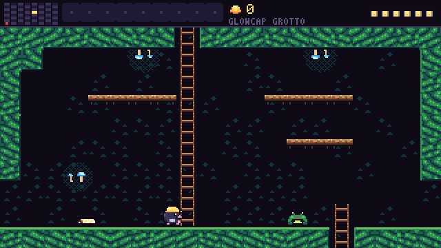
</p>
<p align="center">
  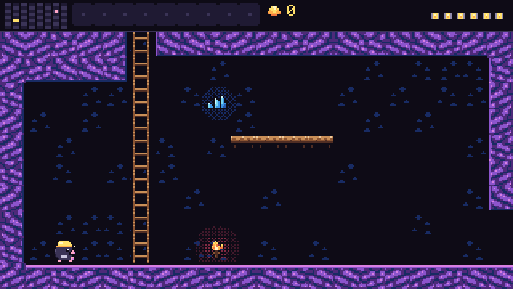
  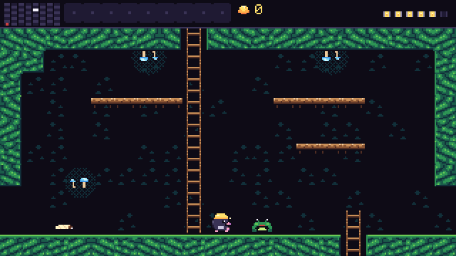
</p>

An 8×8 mine that wraps round at the sides, in four zones: the Ember Deep at
the bottom, then the Crystal Veins, the Glowcap Hollows and the headframe at
the top.

- **Plays like Barbuta:** it boots straight into the mine. Any touch kills;
  Mo has six spare lanterns, then the delve is over, with no continue. He
  walks slowly, his pick barely reaches, and his one fixed jump can't be
  steered once he leaves the ground. Foes come back when you re-enter a room
  and show no damage until they die. The Gloom moves one room whenever Mo
  does; if it finds him it rises in the middle and comes at twice his speed.
  Nothing is explained. The first step right from the camp drops a rock
  from the ceiling; walls hide gems, cracked rock gives way to the pick,
  ladders and ledges hide, still pools are safe and churning ones aren't,
  and one death must be taken on purpose. Glow-worms each give one
  cryptic hint. Items open the way: a copper pot for drips, a tuning
  fork for crystal, a gear crank for the lifts, gloves, a brass tally, a
  canary and a hungry pick. There are three ways up to the Old Lode: a
  lever, the Deep Gate and a 500-ore sledgehammer.
- **Ours:** Mo the mole, the mine and its 64 screens, and its plan: which
  room sits where and how the rooms join (only the coarse structure is
  Barbuta's). The shopkeepers and glow-worms, every tile and the music.

<details>
<summary>The whole mine: all 64 screens, stitched from headless screenshots (spoilers)</summary>
<p align="center">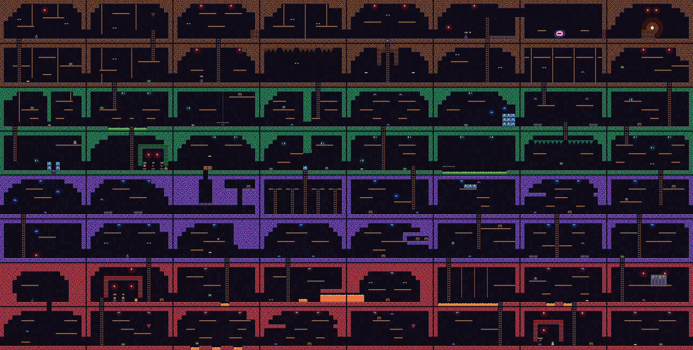</p>
</details>

### 02 · GRUB SHIFT

*Tribute to Bug Hunter (UFO 50 #2).*

<p align="center">
  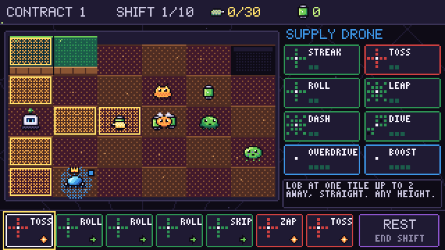
</p>
<p align="center">
  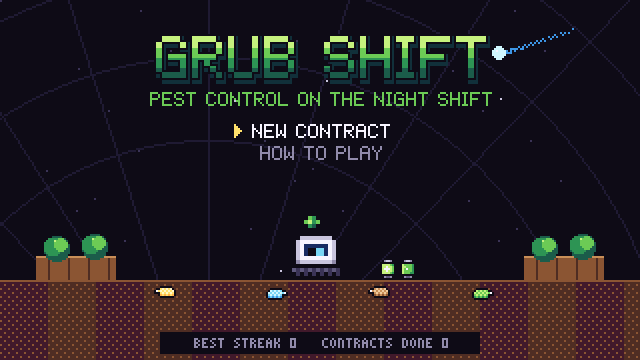
  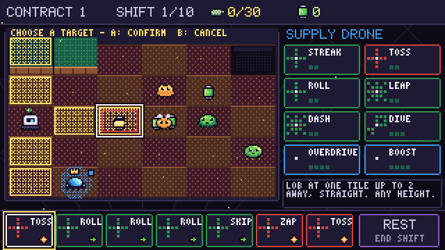
</p>

- **Plays like Bug Hunter:** a 6×5 field whose ground is dealt afresh each
  morning, and seven tool slots that each work once per shift. The shop is
  open any time: swap a tool in and use it at once. Rolls shove grubs and
  squash them from planters; shots can't go uphill. Energy pods blow up when
  three share a tile. Each night one colour whose grubs survived grows a
  level (larva, adult, queen), and its new grubs hatch at that level;
  queens left overnight turn into eggs, and an egg left at the end of a
  shift fails the contract. Clear 30 grubs before the shifts run out; stop
  after a win and the streak waits for you.
- **Ours:** Tilly the farm robot, the dome, the grub species and the names
  and looks of all 41 tools. Three contracts in a row make Employee of the
  Month.

### 03 · ROOFCAT

*Tribute to Ninpek (UFO 50 #3).*

<p align="center">
  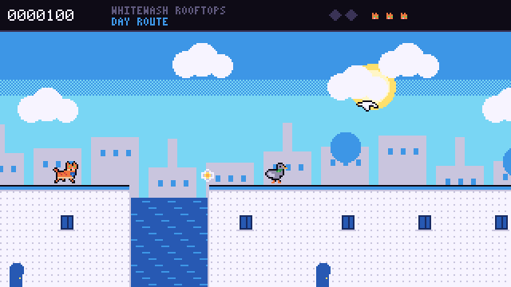
</p>
<p align="center">
  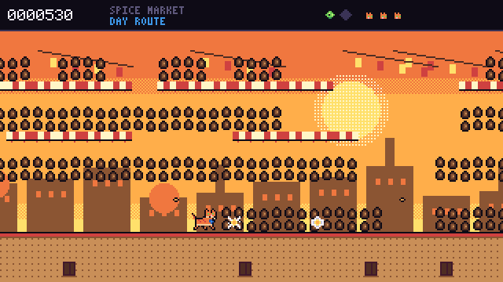
  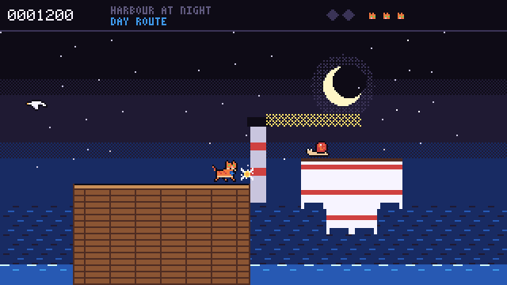
</p>
<p align="center">
  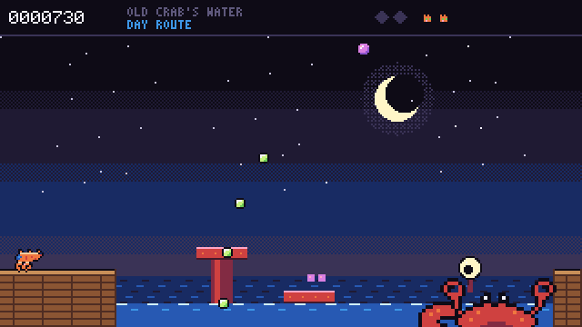
  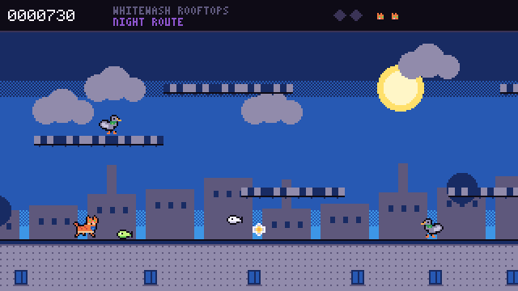
</p>

- **Plays like Ninpek:** one nine-minute town that scrolls on its own, built in
  tiers (the top is the safer way through) and busier the further you get.
  With no input you ride along; left walks you back (tap it to hold your
  place) and right runs ahead. Hold A to jump higher, double jump (also
  after walking off an edge), and drop through ledges. One star at a time;
  the power-up every third kill drops adds a star and throws farther and
  faster, and is lost with a life. Points come only from the eggs foes drop
  (and letters, crowns and snacks). Three lives; a hit stuns you and knocks
  you off the screen, then a spirit floats down and comes back where it is,
  with no grace period. Lanterns at 3,000, 7,000 and every 5,000 must be
  shot for a life. Two bonus stretches are a solid mass of snacks. Old Crab
  has 35 hit points and only its eye counts; it sits low by the water, so
  wait for a low leg. Then a harder second loop. Every foe follows Ninpek's
  roster, and the board keeps the five best scores.
- **Ours:** Pepper the courier cat and Grandma Rosa's parcel, a whitewashed
  seaside town (the rooftops, the Spice Market, the fort walls and the
  harbour), the Magpie Mob, Old Crab and the Night Route. All 52 screens.
  A demo player in the tests gets through the first area with real button
  presses.

### 04 · WET PAINT

*Tribute to Paint Chase (UFO 50 #4).*

<p align="center">
  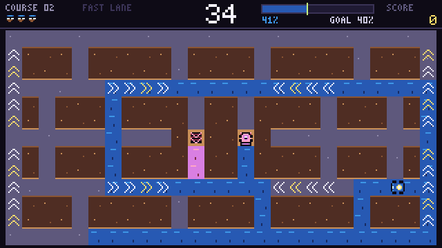
</p>
<p align="center">
  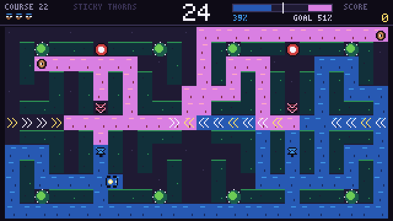
  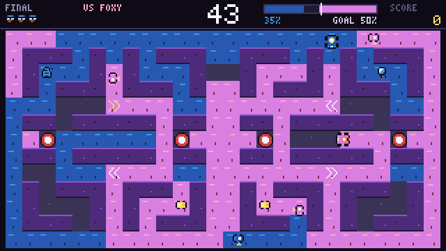
</p>

- **Plays like Paint Chase:** only the d-pad. Bo's kart never stops: it
  turns at the next tile, can't turn round (the pad back brakes, the pad
  ahead speeds up again) and halts dead at a wall. Every tile it crosses
  turns blue; when the clock runs out the blue share must reach the course's
  goal, and every per cent over it is a point (an extra life each 120). Miss
  it and a life goes and the course starts again; three misses and it's
  over, with no continue.
- **The foes** come out of flashing garages in twos and threes and paint
  pink over everything: smudgers, dusters that fly over walls and spray, fast
  tankers, a mother gloop who lays little ones, poppers that burst, hedgehogs
  you can only hit from behind or the side, conkers that fire their spines
  when you line up, and jellies you mustn't hit at full tilt. Boost arrows
  (they stack), bumpers, thorn hedges, swing barriers, bollards and belts,
  and four power-ups that work while their tile isn't blue: the sprinkler,
  the tack shooter, the helper and the freeze pop.
- **Structure:** 25 courses in one go, then the cup final against Foxy
  Fuchsia, who drives by your rules. Before each five, a cutscene acts out
  what every new foe does in a little skit on the road. The early courses
  pay well; 500 points is a real stretch. The score board starts out filled
  in by the Beamdown staff, and only a finished run goes on it. 2P versus on
  any course. A demo driver in the tests plays the first courses with real
  button presses.
- **Ours:** Bo, Foxy and the Marshal, the town square, park, docks, works
  and night streets, all 26 courses, every foe and power-up, and the music.

### 05 · PETAL PARADE

*Tribute to Magic Garden (UFO 50 #5).*

<p align="center">
  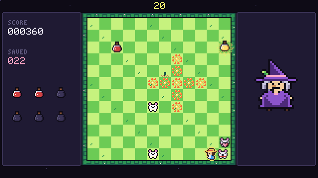
</p>
<p align="center">
  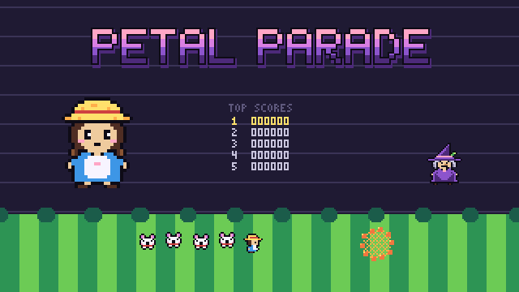
  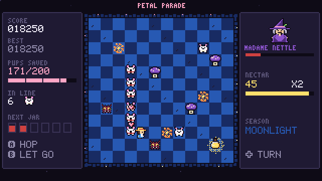
</p>

- **Plays like Magic Garden:** Posy never stops walking, and a turn waits for
  the next tile. Pups she walks over follow in a line; running into it ends
  the run, as does the hedge, a bramble or a toadstool, and a hop clears
  exactly one tile. Let the line go and every pup standing on the sun circle
  is saved, scoring 10 × its place in the line; the rest turn into brambles,
  which look where they are about to hop. The sun circle (a line, a ring or
  a cross) moves on every 10 seconds, and if nobody was saved on it the witch
  plants a toadstool. Saved pups fill a six-jar counter; extra pups make the
  jar riper, and jars ripen on the ground. Eight seconds of nectar let Posy
  smash brambles for a rising chain (only blue and gold break toadstools). Save 200 to win;
  scores go on a board of five.
- **Ours:** Posy the palace gardener, the petalpups and the brambles they turn
  into, the sun circles, the nectar jars, Madame Nettle and four seasons of
  garden. A demo player in the tests wins a whole run with real button
  presses.

### 06 · TIN TROOP

*Tribute to Mortol (UFO 50 #6).*

<p align="center">
  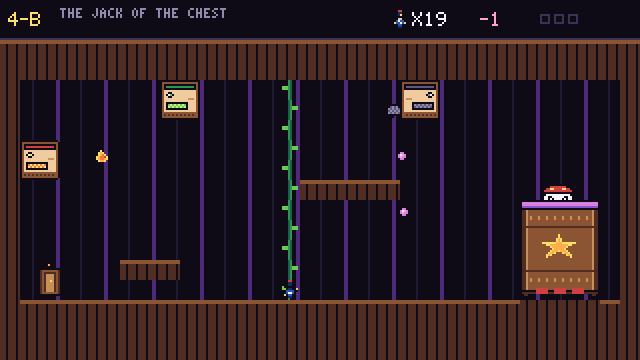
</p>
<p align="center">
  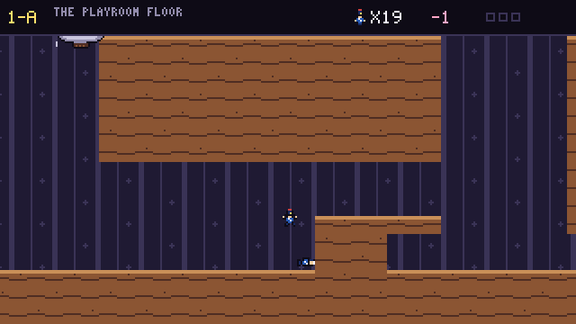
  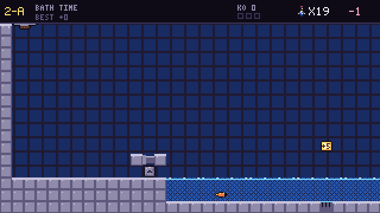
  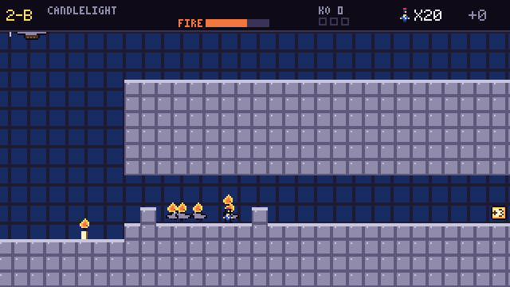
  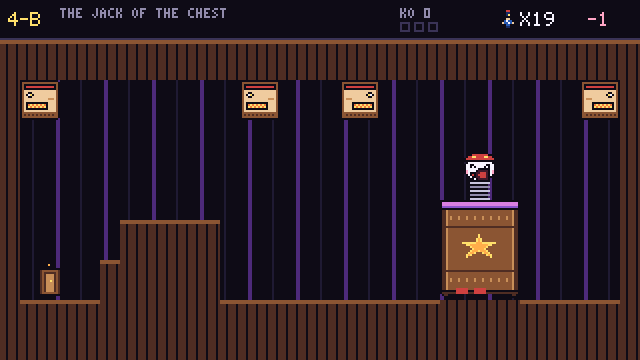
</p>

- **Plays like Mortol:** twenty soldiers are your lives, and spending them is
  how you get anywhere. B alone flies a soldier into the nearest wall, where
  he stays as a ledge; up+B blows him up, breaking toy blocks and foes;
  down+B turns him to stone, and a stone dropped from the air smashes down
  through every block under it and crushes spikes. Rituals chain in mid-air
  for the one soldier. Bodies hold switches down, lie on spikes for the next
  man to cross, float when drowned, and stop laser beams. Burning soldiers
  can't be hurt and set foes alight, seeded soldiers and creatures grow into
  vines, a blast sets a vine burning, and a stone stops a bath tap. Pill
  bugs are rolling bombs whose blast breaks tin blocks a Pop only cracks,
  and launchers shut down once three of their creatures are killed. The
  plane waits at the top left of a view that only scrolls forward; the toy
  chest has doors instead, and no music. Lives carry from level to level,
  and replaying a level to do better raises every level after it. Ten
  levels, the last one the final boss.
- **Ours:** Captain Pip's tin soldiers, the toy blimp, a toymaker's house at
  night (nursery, bathroom, kitchen and toy chest), wind-up mice, paper darts,
  tin rams, pill bugs, toy dragons and the Jack of the Chest. All ten levels
  are new layouts.

### 07 · SKYWELL

*Tribute to Velgress (UFO 50 #7).*

<p align="center">
  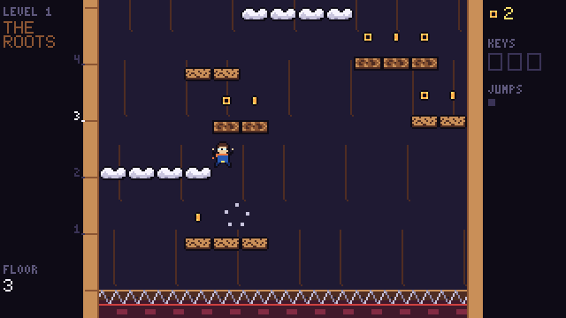
</p>
<p align="center">
  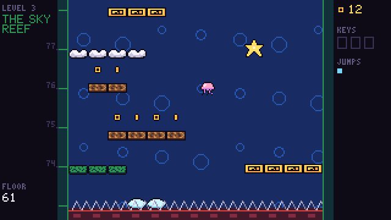
  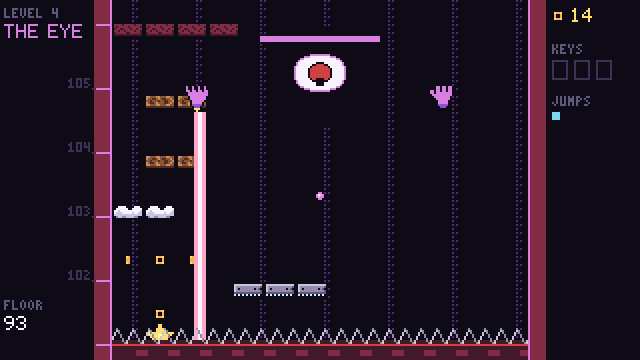
</p>

- **Plays like Velgress:** every run is a new shaft, and a spiked roller at
  the foot of the screen rises whenever you climb past the middle. It is
  the only thing that can kill you, but creatures and hazards knock you
  flying so hard that, unless a platform catches you, you drop floors
  towards it. You come round with your jump in the air still to use. Every
  platform crumbles soon after you land, and you can bounce off any
  creature's head. You double jump, shoot the way you face or straight up
  or down, ride star blocks, and spend coins in a shop between levels.
- **Level by level:** bats that wake when you pass under them, then TNT,
  cloud mines and zappers, then bubbles, fish, jellies and squids, then
  bouncing metal. Shoot down the bird on each level's 12th floor for a key;
  with all three keys a fourth level opens with a final boss.
- **Ours:** Kip the scrap-diver, the Grinder, the Roots, the Sparkworks, the
  Sky Reef, the Tinker's cart, the Keeper Owl and the Well Eye.

### 09 · BANNERFALL

<p align="center">
  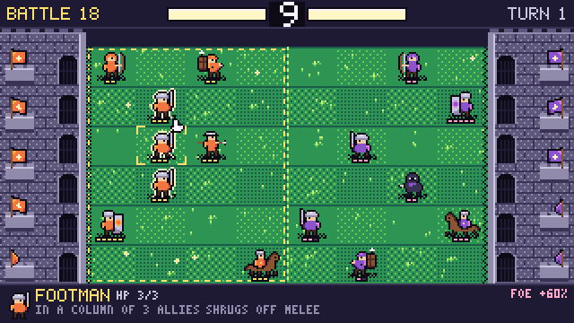
</p>
<p align="center">
  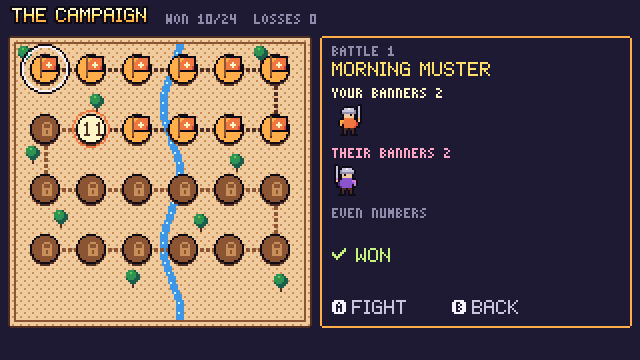
  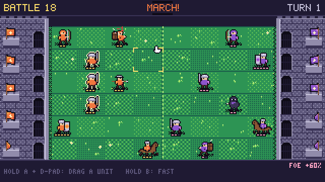
</p>

*A tribute to **Attactics** (UFO 50 #9).*

- **Plays the same:** a 6 × 8 field between two keeps and one new unit a turn
  on a random row. While the timer counts down from 9 you drag units up, down
  or back within your half (forward only to where you picked them up). Then
  everyone attacks and marches in Attactics' order; when two foes step into
  the same tile, the side with the longer line behind pushes through.
- **The troops:** eight units with the original's rules. Footmen in a column
  of three shrug off melee, bowmen shoot down their lane unless a friend is in
  the way, wardens stop arrows until they're hurt, riders move twice, and
  powdermen blow up. Every fifth promotion calls a champion. Battles that
  bring a new troop open with a line about it, and the campaign map shows
  what the next battle brings.
- **The CPU** never moves its troops, but it gets extra ones. The 24-battle
  campaign uses the original's banners, unit pools and percentages. Ranked,
  Survival and 2P Versus are there too.
- **Ours:** the Marigold Guard and the Thistle Host, every unit's name and
  look, the keeps, the battle names and every line of text, the march and the
  battle music.

### 13 · DUSKLING

<p align="center">
  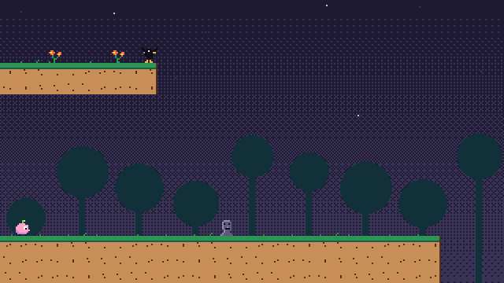
</p>
<p align="center">
  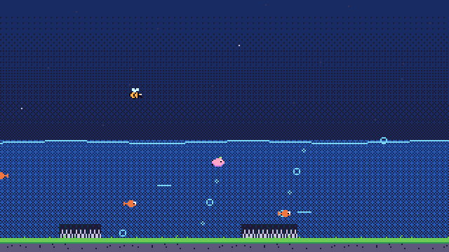
  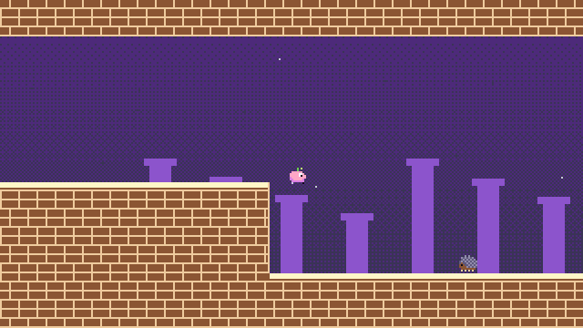
  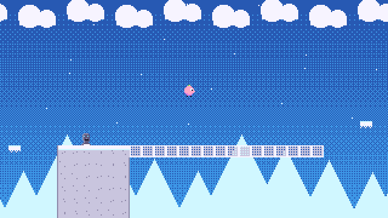
  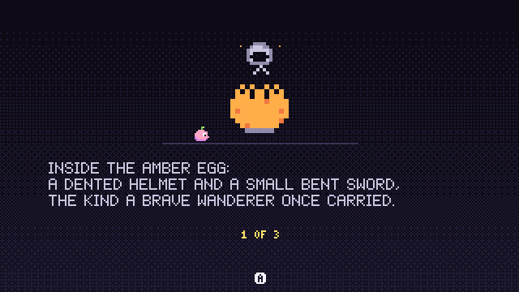
</p>

*A tribute to **Mooncat** (UFO 50 #13).*

- **Plays the same:** the pad has two sides. Every way on the D-pad walks
  left and both buttons walk right (pad B on the title turns it round);
  hold one side and press the other to jump toward the side held, longer
  for higher. Tap and then press both for a low hop, double tap to roll
  (hold it to sprint, with more time to jump off an edge), double tap in
  the air to somersault, and press the other side again in the air to
  slam: a moment's pause with a "!", then straight down. A slam beats foes
  and bounces you the way you hold (or straight up), drops through pink
  ledges, and flips walkers next to it so they can be kicked away; spiked
  prickles can only be beaten that way. One touch ends you, and you come
  back where you came into the room, as often as it takes. Nothing is
  saved on the way.
- **Secrets:** some creatures only just miss you, some are ledges, some
  can be knocked about. Flowers mean a warp is somewhere on the screen;
  warps are never drawn until touched. Stone faces show hidden ledges when
  you jump over them twice, springs hide in plain sight, ceiling eyes drop,
  roll and leap when you slam, and mushroom caps spring you only when
  slammed.
- **Structure:** it opens as an orange dayling drifts down into a dusk wood
  and falls into a pit whose far side isn't there. Then the duskling's
  main way runs through the wood (which brings in one thing at a time, and
  where the Ember Hermit throws sparks and runs off), the mere, the ruins
  and the machine works to the Brass Warden and the white egg. Warps skip
  ahead (one goes back to the start), and warps within warps open the
  amber way to the Ember Hermit and the rose way to the Old Badger, each
  with its egg: every egg is an ending. 42 rooms, ten of them pockets off
  every egg's way; two players on PC. A
  route finder over the real rules recorded a crossing of every room, warp
  and egg, and the tests play them back with button presses.
- **Ours:** the duskling, the dayling and its little light, the Hush Wood,
  the Sunken Mere, the Old Steps, the Humming Works, the Ember Caves and
  the Windy Heights, every creature and boss, every secret's solution, what
  the eggs hold, all 42 rooms and the music.
### 10 · BOOMTOWN

<p align="center">
  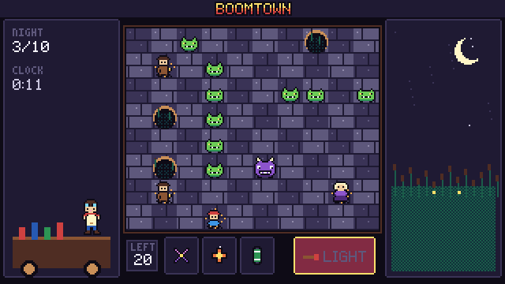
</p>
<p align="center">
  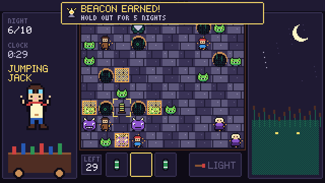
  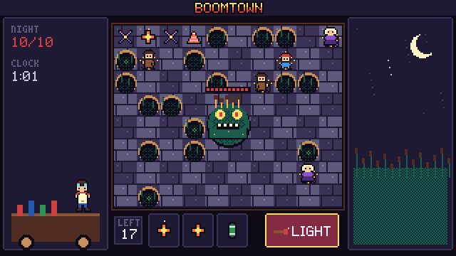
</p>

*A tribute to **Devilition** (UFO 50 #10).*

- **Plays the same:** ten nights on a 10 × 8 square. Pieces come three at a
  time from bags of six (one strong, three middling, two weak); you place as
  many as you like, then light one fuse, and every piece its blast reaches
  goes off in turn. A small diagram shows what the chosen piece hits, but
  once a piece is down its tiles no longer show.
  End a night with as many folk as bogles, or the town is overrun; clear
  them all and a new neighbour moves in. Pieces not used, in the cart or on
  the square, carry over.
- **The pieces and the bogles:** the original's nine patterns, from the
  8-tile starburst and the roman candle that fires to the edge to the
  skyrocket that flies up and lands on its perch, which joins the row of
  three in the rocket's place. Big bogles take two hits
  and stay hurt, old ones heal overnight, and each night brings a new hole
  and the original's count of bogles and pieces.
- **The last night:** the Bog King rises in the middle four tiles with ten
  hits and must go down in one chain. A win scores 10,000, plus 1,000 for
  every folk and piece left, plus a clock bonus.
- **Ours:** Hazel the fireworks maker, Mossbury and its folk, the bogles and
  the Bog King, the names and looks of all eight fireworks, the words and the
  music. A demo player in the tests wins a whole run with button presses.

### 11 · HAT TRICK

<p align="center">
  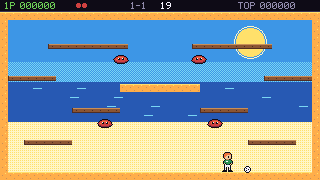
</p>
<p align="center">
  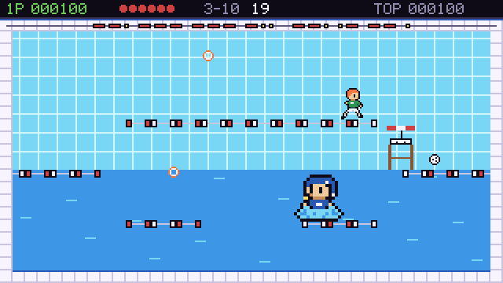
  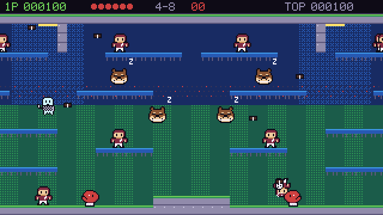
</p>
<p align="center">
  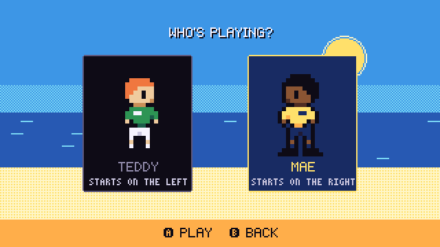
  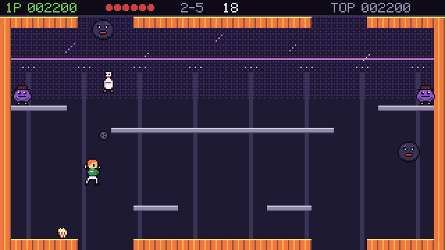
</p>

*A tribute to **Kick Club** (UFO 50 #11).*

- **Plays the same:** one screen at a time, walled round the edges and
  wrapping wherever a wall is missing, out of one side and in at the other,
  down a hole and in at the top; every screen the same on both sides. Your
  only weapon is the ball: walk into it to pick it up, tap B to kick it
  (the pad, your run and your jump all change the kick), hold B for a fast,
  flat driven shot, and without it slide on the run (over gaps, on thin
  air) or head it. Hold A to jump high, tap it for a hop; the pad steers in
  the air, stiffly. The kid is a big target: one touch of anything is a
  life. Every screen has its own ball spot to fight your way to.
- **The lit ball:** touch it and it glows; leave it to come to rest (a
  second lying still) or carry it too long and it goes dark.
  Kills while it stays lit drop popcorn 100, a pretzel 200, a taco 500,
  then a drumstick 1,000 every time, but only once the body lands. Kick the
  ball through a hidden spot and a dessert drops.
- **The clock:** 20 counts of 2.5 s; whatever is left is 100 points a
  count. At zero it is extra time, and the Timekeeper walks in, through
  walls, and stays, deaths and all, until the screen is clear.
- **Structure:** four worlds of nine screens and a boss, 40 in all; three
  lives, more at 10,000, 25,000, 50,000, 75,000 and 100,000, no continues,
  and back to 1-1. End a screen on your own side and the balloons have you
  away sooner. Co-op shares the one ball; two codes open the unfinished
  versus pitch. The demo player in the tests clears all 40 screens and
  every boss with button presses, and a test keeps the first world gentle
  and the last a wall.
- **Ours:** Teddy and Mae of the Hat Trick Club, Sandy Court, Lucky Lanes,
  the Lido and the Big Stadium, spikers, frisbees, beach balls, pins,
  bowlers, spinners, buoys, polo players, duckies, props, gloves and
  bulldogs, King Spiker, the Kingpin, the Lifeguard and his Chair, the
  Captain, the Timekeeper, the food, the codes, a secret of our own and the
  music.

### 14 · CUTLASS CUP

<p align="center">
  
</p>
<p align="center">
  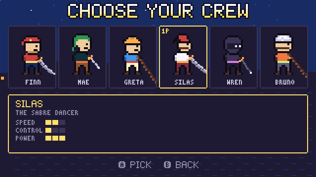
  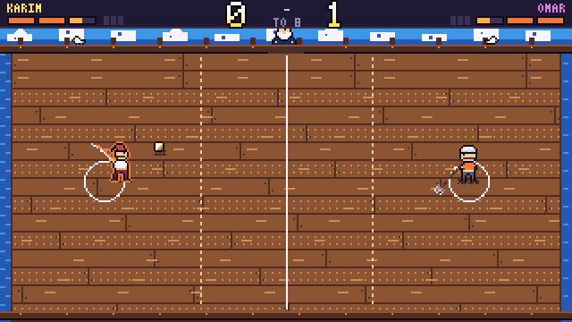
</p>

*A tribute to **Bushido Ball** (UFO 50 #14).*

- **Plays the same:** knock the ball past your rival for a point, first to 8.
  The ball gets faster with every return (a lob slows things down again), up
  and down aim, and a rolling strike goes faster or curves. The judge rolls
  the ball out to whoever lost the last point.
- **Meter:** two strikes fill half a bar. A double tap throws your trick, and
  holding the button charges a broadside, which spare bars upgrade; one that
  hits you is caught and must be mashed back.
- **Fouls:** dawdling, a blade on your rival and jumping the serve (play goes
  on); the third gives away a point. You may go right up to your rival's
  circle.
- **Modes:** six fighters with the original's stats and kits, a five-match
  tournament with unlimited continues, 2P versus and 2P co-op doubles. Like
  the original, there's no music during play. A demo player in the tests
  beats three rivals with real button presses.
- **Ours:** the harbour and the galley *Merry Mackerel*, old Bosun Crabbe, and
  Finn, Mae, Greta, Silas, Wren and Bruno with their coins, sea urchins,
  harpoon, squall, darts and powder pots. The tunes are ours too.

### 15 · FENNEC FOUNTAIN

<p align="center">
  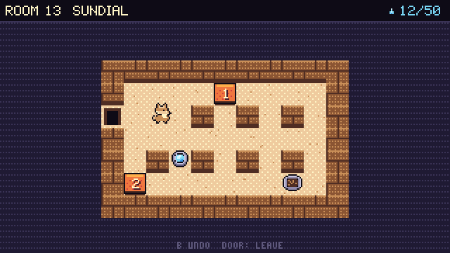
</p>
<p align="center">
  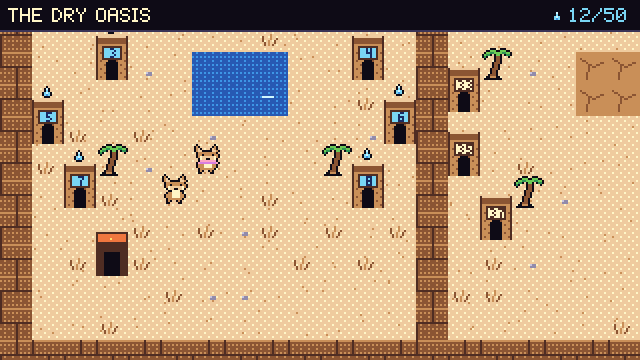
  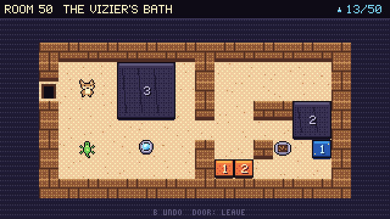
</p>

*A tribute to **Block Koala** (UFO 50 #15).*

- **Plays the same:** Sokoban where numbers are weights. A line of blocks
  moves only if no block is pushed into a heavier one, and a block pushed
  into a 1 that can't move takes it in (2 and 1 make 3). Five turns grey.
  The fennec is slow, B undoes without limit and A opens the room menu
  (start over, leave, or set one undo mark).
- **Special blocks:** blue blocks move only for other blocks, black ones
  shrink when you stop pushing them, geckos copy your steps, arrows send
  blocks one way, stone patches take no blocks, and plates hold doors open.
- **Structure:** fifty rooms around a garden, with gates at 5, 10, 20, 30
  and 40 drops, and a workshop for ten rooms of your own. After three
  teaching rooms, each room takes 77 to 300 steps at its shortest, with big
  loops that move the blocks round again and again. Talk to Tuft to swap
  which sibling walks.
- **Ours:** Fen and Tuft the fennecs, Lord Humph the camel and his bath, the
  garden, all fifty rooms and the music.

### 16 · TINTAIL

<p align="center">
  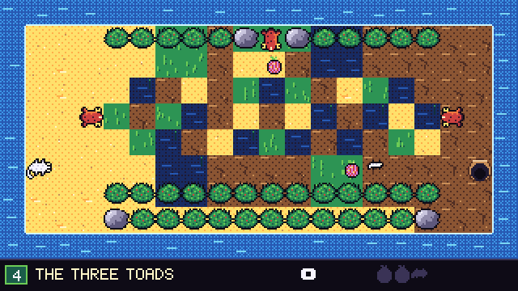
</p>
<p align="center">
  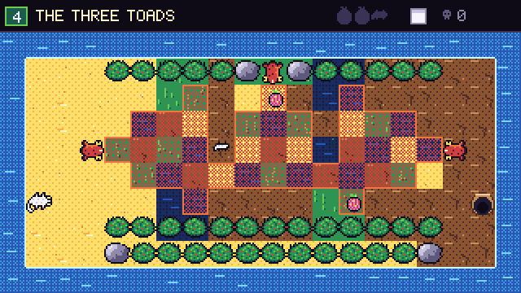
  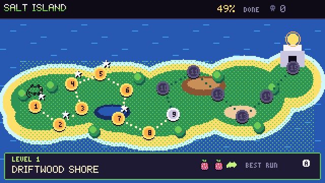
</p>

*A tribute to **Camouflage** (UFO 50 #16).*

- **Plays the same:** a grid stealth puzzle in real time. Twig takes the
  colour of the tile she stands on; matching the ground, she walks through a
  predator's sight unseen. One colour at a time, she's exposed while she
  changes and can't change in danger, so every crossing is planned ahead.
- **The island:** toads watch fixed areas, storks walk fixed loops (they block
  the toads' view, and walk into you whatever colour you are), hollow logs
  hide you, and sun and rain pads dry or wet the grass. Hold B and every
  watched tile turns pink, but you can't move. If you're eaten you can undo.
- **Structure:** fifteen single-screen levels on a branching map, each with
  two prickly pears and a hatchling that follows one step behind in its own
  colour. Only the best single escape counts toward completion.
- **Ours:** Twig, the toads, storks and falcon, Salt Island and the old lighthouse,
  all fifteen levels (a solver in the tests proves each one), and the music.

### 17 · BELLHOP

<p align="center">
  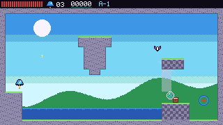
</p>
<p align="center">
  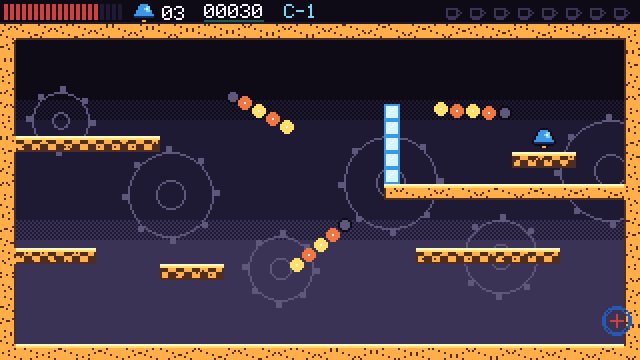
  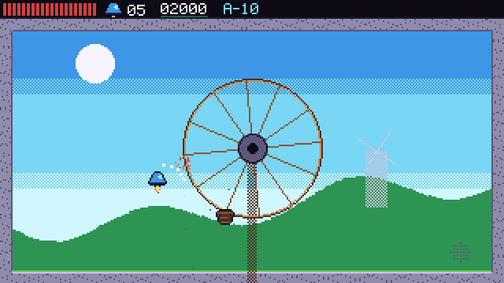
</p>
<p align="center">
  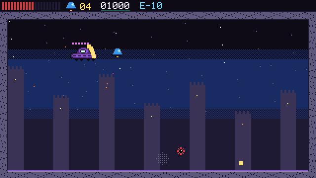
  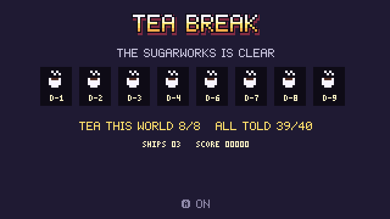
</p>

*A tribute to **Campanella** (UFO 50 #17).*

- **Plays the same:** the Tinkler flies side-on on CHIME CIRCUIT's flight
  model: it falls unless you hold A, a held thrust climbs and a tapped one
  hovers, and steering builds slowly and drifts on. Thrust burns fuel from
  the red bar top left; a dry tank means a fall. Any touch of a wall, a
  floor, an enemy or a shot is a crash. B slashes to the side you last
  steered: it takes enemies down, breaks blocks, glass and bubbles (most of
  which put fuel back) and slows your fall a little while it lasts.
- **Score is life:** three spare ships, and one more every 1,000 points,
  always. Circlers pay 500 once you have flown close past all four sides,
  a big coin scatters five timed coins worth 1,000 in all, and every regular
  stage hides a cup of tea behind an unmarked one-tile spot.
- **Structure:** fifty one-screen stages in five worlds, each with a
  crystal room at X-5 and a boss at X-10: a millwheel of buckets, an apple
  to knock into a cider press, twin cogs whose lamps light one cog at a
  time, a gumball machine, and Lady Hush, whose blue spike balls are the
  only thing that hurts her. Four warp sparkles show for five seconds,
  levers can lock a cup away for good, a crash doesn't undo the damage
  done to a boss, and a run is one sitting. The demo pilot in
  the tests plays the whole game with real presses and takes all forty
  cups.
- **Ours:** Ansel and the Tinkler (the chime ship of CHIME CIRCUIT), Lady
  Hush and her stolen bells, tea instead of coffee, Millbrook, the
  Orchard, the Clockworks, the Sugarworks and Hush Citadel, all fifty
  stages, the bosses, the owl, the BREW-ROOM code and the music.

### 18 · LOST LINKS

<p align="center">
  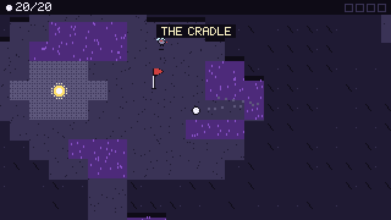
</p>
<p align="center">
  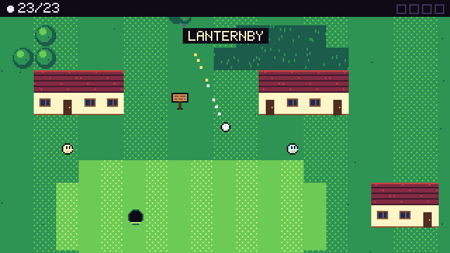
  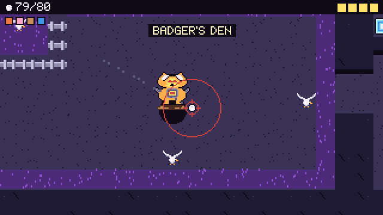
</p>
<p align="center">
  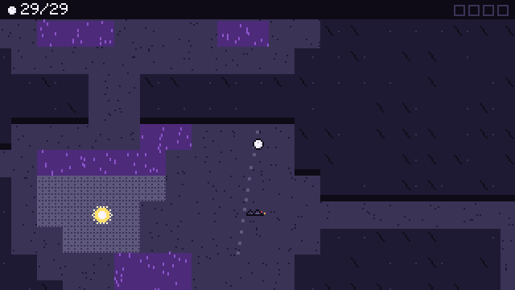
  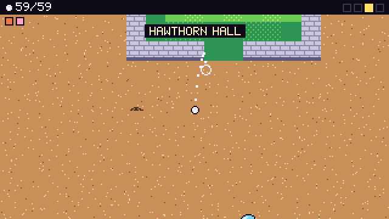
</p>

*A tribute to **Golfaria** (UFO 50 #18).*

- **Plays the same:** you are a golf ball, and every move is a stroke. Aim
  with the d-pad and hold A: dots light up along the line to show the power,
  up and down, slower the longer you hold; let go. Only from sand, a divot or
  a hole does the ball leave the ground. Strokes are your health: twenty to
  start, three more for each of twenty irons, all of them underground. Run
  out and you wake at the last pin you touched, keeping all you found; the
  cave round a pin is a safe zone. Hold B to check the ground ahead.
- **The world:** one open world on two layers. Every hole drops you to the
  caves right underneath (or climbs back up). Slopes, rough, greens, sand,
  water and pits that send the ball back where it was hit from, jumping
  flowers, bridges, bushes and cracked blocks; larks and albatrosses to roll
  into for strokes, slicers that burst out of the ground and shove, sippers
  that suck strokes, and ten scorecrows that watch for five strokes, then
  fly off. Birds and bugs come back whenever you change layer.
- **Structure:** you wake in a cave under Lanternby. Four abilities in the
  four corners (the Hammerhead; Backspin, hold A to brake; the Dune Tread,
  tap B on sand to jump; the Skipper), eight strays, twenty golf-ball folk, a
  signpost that keeps count, a hidden village of Keepers, ten pins and the
  four pieces of the Star Pin. Set it in the crypt under the old clubhouse,
  light the sanctum's plates, and face the Brass Badger. A demo player in the
  tests plays the whole game with real button presses.
- **Ours:** Dimple, the Keepers and their story, the Brass Badger, all 53
  places on both layers, every creature and name, and the music.

<details>
<summary>The whole world, both layers (spoilers)</summary>
<p align="center">
  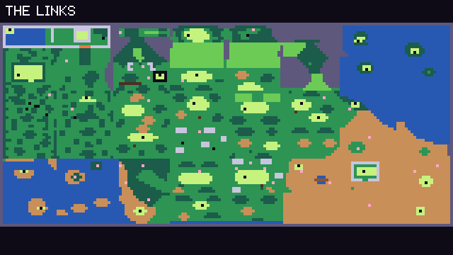
  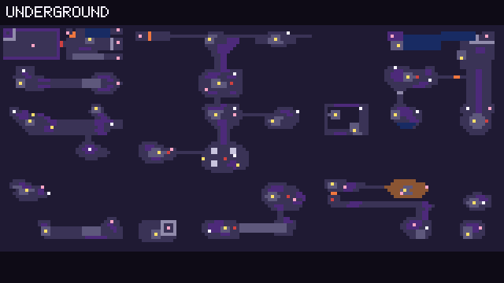
</p>
</details>

### 19 · CHIME CIRCUIT

<p align="center">
  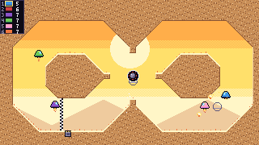
</p>
<p align="center">
  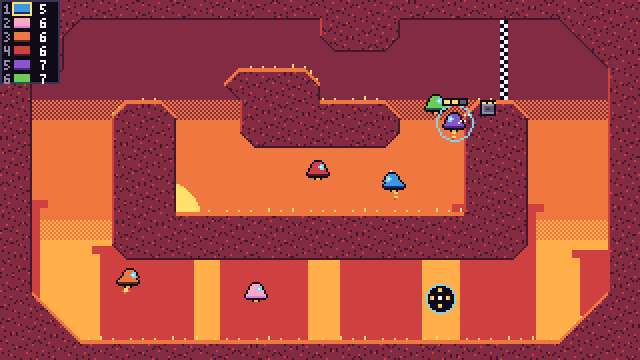
  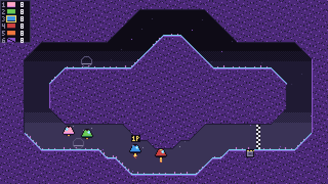
</p>
<p align="center">
  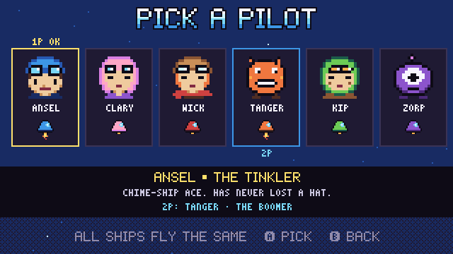
  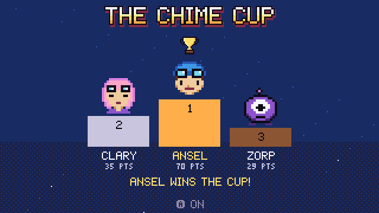
</p>

*A tribute to **The Big Bell Race** (UFO 50 #19).*

- **Plays the same:** the chime ship flies side-on: it falls unless you
  hold thrust, steers left and right with a drift that carries it on, and
  never runs out of fuel. Six ships race eight laps round a track that fits
  on one screen. Walls, floors and ceilings take one of your three hit
  points; B is a short slash that doesn't hurt, it only knocks a rival
  away, ideally into a wall. A wrecked ship relaunches from under the start
  line and flies that lap again, and every finished lap mends a hit point.
- **Pickups:** stations flash "!!" before a pickup appears, and flying into
  it uses it at once: bullets in four directions, a trail of mines (they
  don't spare you), two circling fireballs, a big slash, or a payload on a
  chain that blows up into three fires.
- **Structure:** eight hand-made tracks in a fixed order (a tutorial loop,
  a dip with a slot through it, a narrow loop, three figure-8s, a forked
  loop and a mile of bends with a tunnel underneath), 9/7/5/3/2/1 points
  over eight races, the last race's winner starting at the back, CPUs that
  are slower than you but sometimes turn back to hunt you, and two players
  at once on the same screen. The stats keep each player's average lap and
  race; each pilot has an ending. A ship knocked out of the track is
  relaunched, where the original's could get stuck. A demo pilot in the
  tests flies all eight tracks and wins the cup with real button presses.
- **Ours:** the chime ship, Ansel and his sister Clary, visitors from
  HOMESPUN, SKYWELL and WOBBLE DERBY, all eight tracks and their skies,
  the LOOT-GALE code and the LAST-LAMP page, and the music.

### 21 · TUSKWIND

<p align="center">
  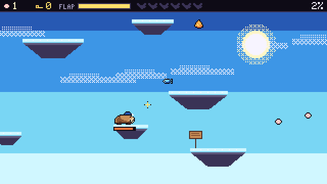
</p>
<p align="center">
  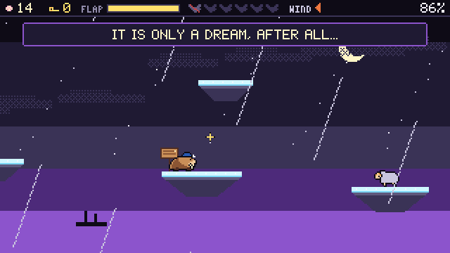
  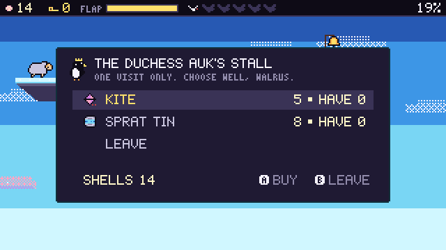
</p>
<p align="center">
  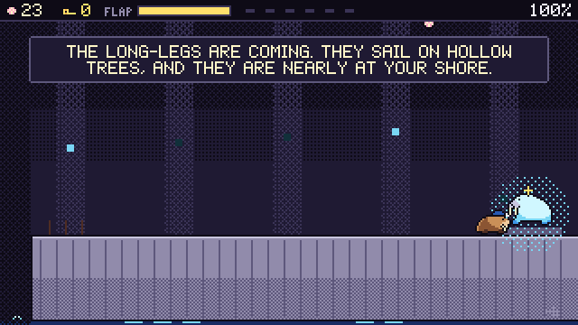
  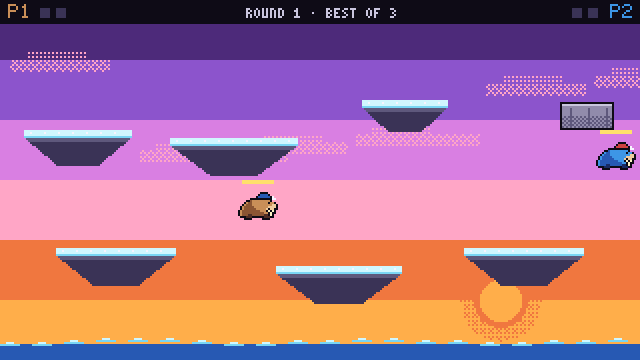
</p>

*A tribute to **Waldorf's Journey** (UFO 50 #21).*

- **Plays the same:** Burl is asleep, and in his dream he crosses a chain
  of floating islets towards a door at the far end. Every jump is set up on
  the ground: UP/DOWN swing a "+" cursor, holding A fills a meter under him,
  and letting go sends him that way (aimed dead flat, he lunges along the
  ground instead); B calls a charge off. In the air his flippers are all
  he has: hold A to fly, LEFT/RIGHT trimming his speed, on a yellow bar that
  only sprats fill. Plain islets let him through
  from below; rocks bounce him off; pink foam lasts just one full charge.
- **The way:** a new map every journey, with the same quotas every time:
  six lighthouses whose terns each pull him out of the sea once, 36 loose
  shells that are both money and score, two chests and two keys, three
  stalls of the Duchess Auk (two wares, one visit), 22 signs, wind bells,
  rams that charge whoever lands on their islet, and mantas gliding high
  that knock him away, carry him, or drop a key when burst. The sky sets as
  he goes; a wind rises at about 40 % and a storm wind at 80 % that stays.
- **Structure:** reach the door, then the hall: spiral shells from the
  terns he didn't need, a shaft lined with shells, a hidden chest over the
  chasm, and the old one, whose talk depends on carrying 50 shells. A
  journey takes a few minutes for the demo player in the tests, which
  finishes generated maps from the title with real button presses, both
  endings; 2P brawl on a single wrapping screen, best of 1 to 9 rounds.
- **Ours:** Burl in his nightcap, Skerry the old one, the Duchess Auk,
  terns, rams, mantas, cockles and whelks, the bobber, spyglass, grapnel,
  kite, spinner and sprat tin, all 23 signs, both talks, the hall, and the
  music.

### 23 · TURNIP TRUCK

<p align="center">
  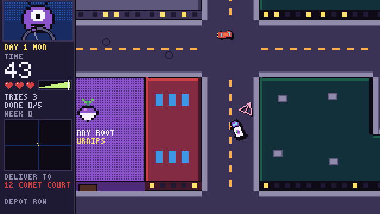
</p>
<p align="center">
  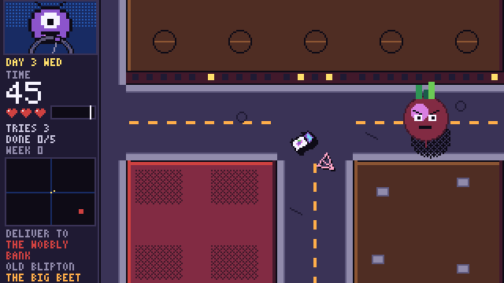
  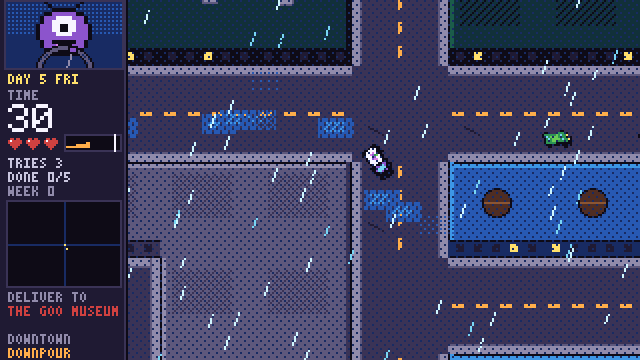
</p>
<p align="center">
  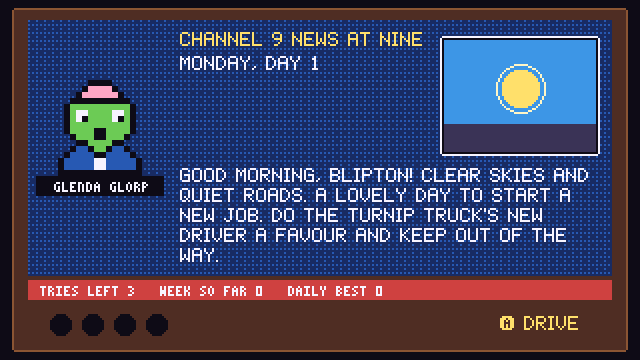
  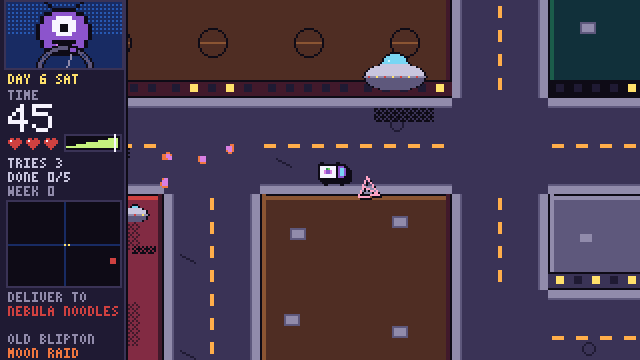
</p>

*A tribute to **Onion Delivery** (UFO 50 #23).*

- **Plays the same:** a top-down city under a camera that never turns,
  and a truck that does: LEFT and RIGHT turn it to its own left and right,
  so driving down the screen RIGHT goes screen-left. Hold A for the gas and
  B to brake (weakly), then reverse slowly; tap a turn to sidestep, hold A+B with a
  turn for a powerslide that turns you round on the spot, and hold it too
  long to spin out (mid-spin, any car you touch is smashed). It can't turn
  from a stand, slides like soap, and walls only bounce and spin it.
- **The job:** each workday, five deliveries to random named places (a
  red dot on the radar, a red arrow now and then, a red circle on the
  road), then back to the depot's small half circle before the clock hits
  00, or the truck catches fire. Deliveries one to four add 8 seconds, the
  fifth 30, overtime ones nothing; crates on balloons over the hazards,
  reached only by flying off a ramp, add 12. Three hearts: cars, brine,
  gas canisters and the chaos take them, a stretch at top speed brings one
  back (watch the speedometer) and every delivery fills them. Three spare
  tries for the whole week. Zib sits at the wheel at the top of the
  dashboard, turning it with you.
- **Structure:** seven days, each opened by the Channel 9 newscast;
  Monday is quiet, and from Tuesday to Sunday one chaos event a day, each
  once, in a shuffled order: brine spraying from the hydrants and waves
  sweeping across the roads, a giant beetroot on the charge, harmless but
  slowing hordes of mushmen, a gang that chases you and shoots from its
  getaway cars, rain with puddles that spin you out, and saucers bombing
  from above. One city, the same every time, that wraps in every direction,
  with dead ends, alleys, ramps, a brine canal and its bridges. Fifty
  deliveries in a week is the Alien and an early retirement. A practice
  code, a reverse-steering code, a secret in the fenced lot and a demo. The
  demo player in the tests clears every kind of day and two whole weeks
  with button presses.
- **Ours:** Zib, Granny Root and her turnip depot, Glenda Glorp, Blipton
  and all 33 places, its nine districts, the brine burst, the big beet,
  the mush mob, the radish ring, the downpour, the moon raid and the music.
### 24 · SHUTTERBUG

<p align="center">
  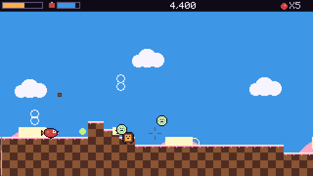
</p>
<p align="center">
  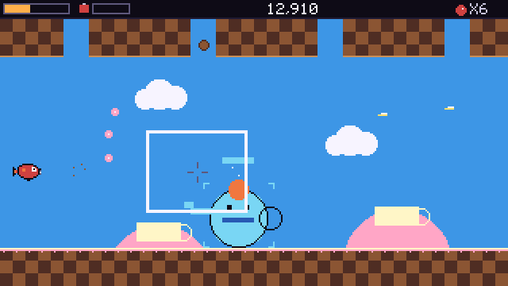
  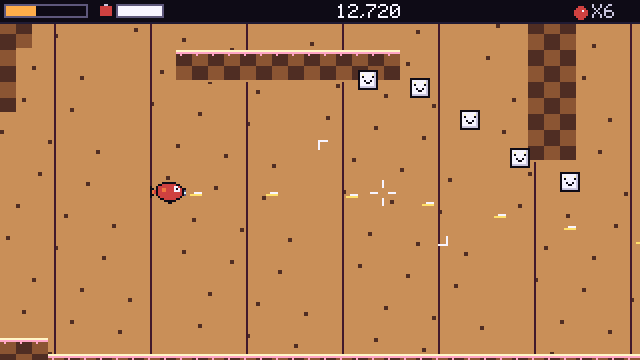
</p>
<p align="center">
  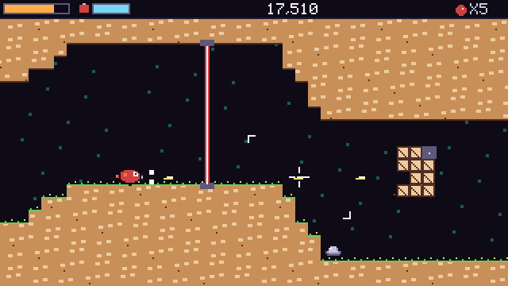
  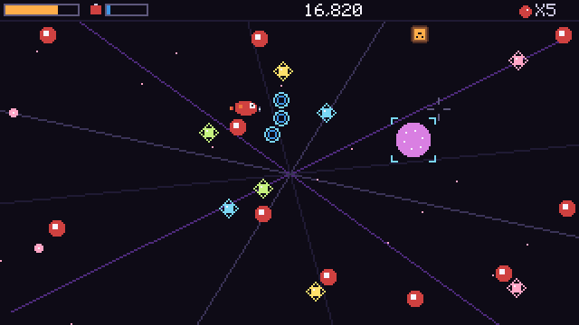
</p>

*A tribute to **Caramel Caramel** (UFO 50 #24).*

- **Plays the same:** a side-scrolling shooter with no power-ups at all.
  Hold B and the gun fires by itself; hold it long enough and two dots
  light, and letting go throws four rings that bounce off rock. Touching
  rock does no harm; only being pinned by the scroll does. Two hits a
  life (the armour, then the ship), no spare ships to start with, eight
  from points (8,000 up to 186,000), and a lost ship starts the stage
  again with the shown score back at 0.
- **The camera:** tap A for a photo a third of the screen ahead. What it
  catches stops still, takes double damage, pays double and goes up with
  a bang that hurts its neighbours (and takes every foe of its kind from
  the same photo with it). It cancels green foes' parting shots, drops
  foes off walls and ceilings onto whatever is below, stops whole ghost
  trains, makes wisps solid, freezes moving blocks, shakes score orbs out
  of odd things, turns each planet's red foe into a repair wrench and
  opens the bosses' weak points. The meter refills slowly, or at once with
  two pink bulbs, which only fly to you when you stop firing.
- **Structure:** a prologue that teaches it all, Teatime Planet (Madame
  Scone, then the Teapot), Comet Rain A, Gloom Planet (Old Croak, who can
  be left alone, then the Signalman), Comet Rain B and Fossil Planet
  (laser mazes, two generators, then King Thunderjaw). Photograph the
  hidden U, F and O, one on each planet, and the Kaleidoscope waits after
  the king (the F shows only as Old Croak's fight starts, and the camera
  can't take both the letter and him). The credits name every foe, with
  a picture of each one you photographed. 1 player, or 2 in co-op. The demo player in the tests wins
  the whole game from the title with real button presses, by both
  routes.
- **Ours:** Poppy the puffer-blimp and her pal Sprig, the three planets
  and the Comet Rain, all 25 foes, Madame Scone, the Teapot, Old Croak,
  the Signalman, King Thunderjaw, the Kaleidoscope, every cave and wave,
  and the music.

### 25 · OPEN HOUSE

<p align="center">
  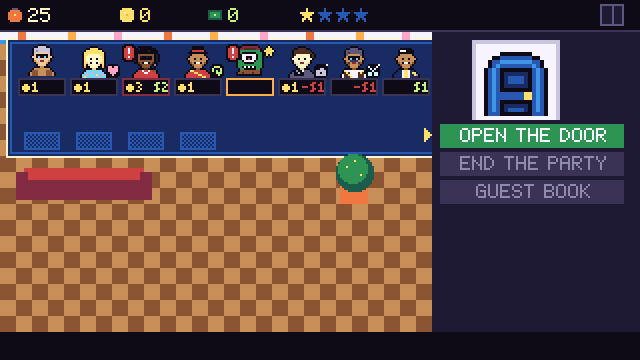
</p>
<p align="center">
  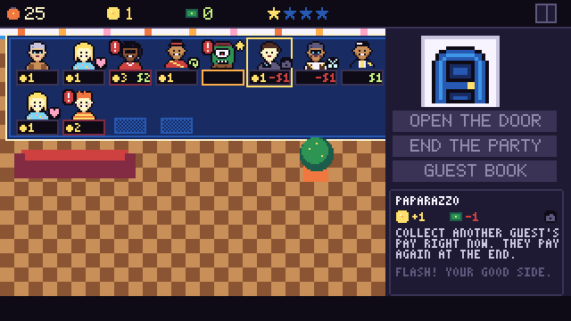
  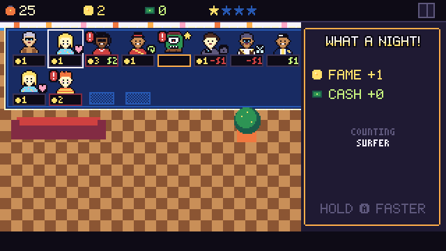
</p>
<p align="center">
  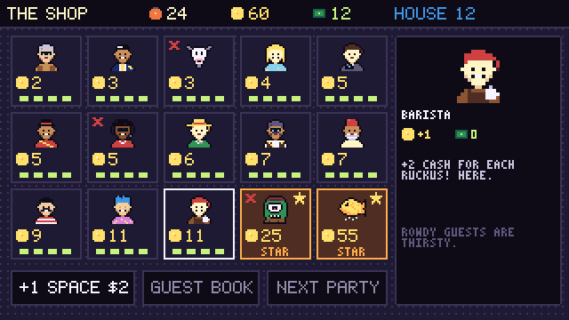
  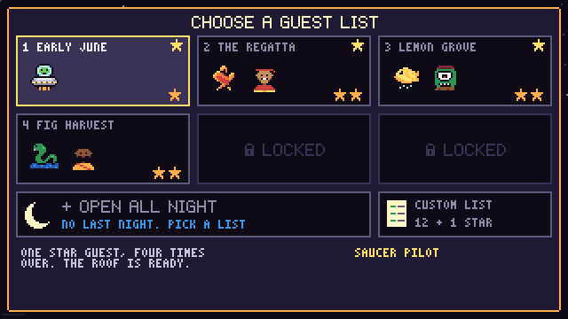
</p>
<p align="center">
  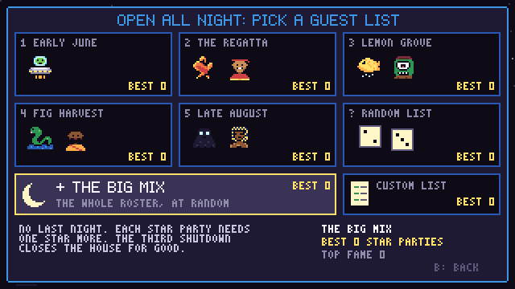
  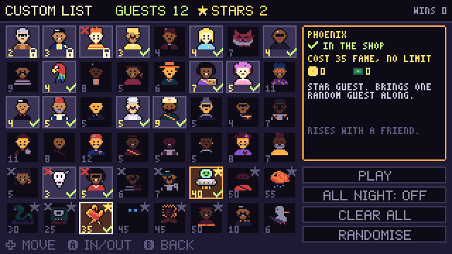
</p>
<p align="center">
  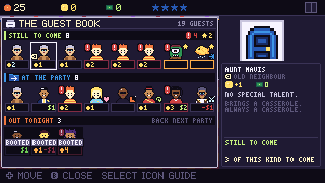
  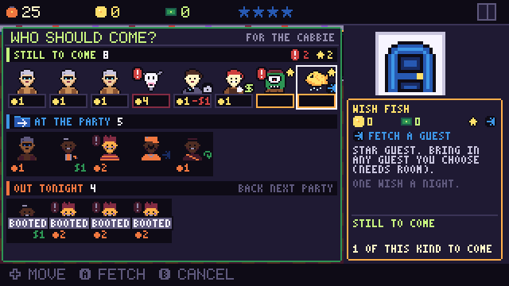
</p>
<p align="center">
  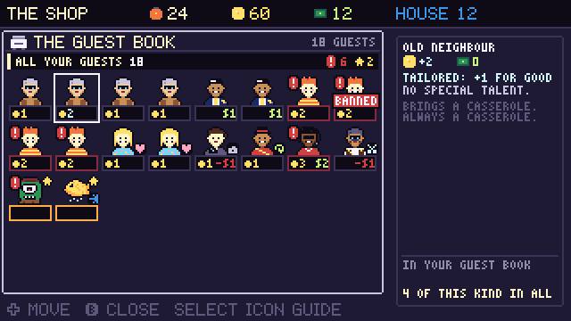
  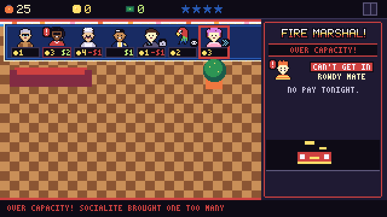
</p>
<p align="center">
  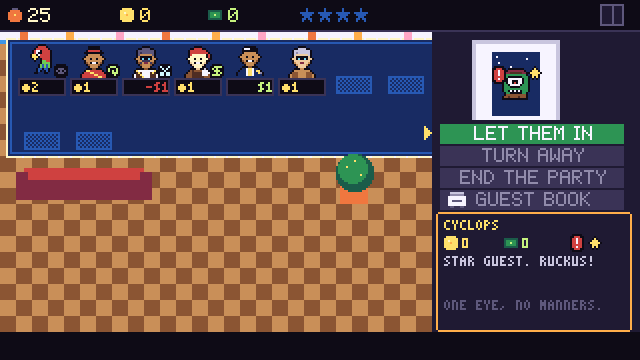
  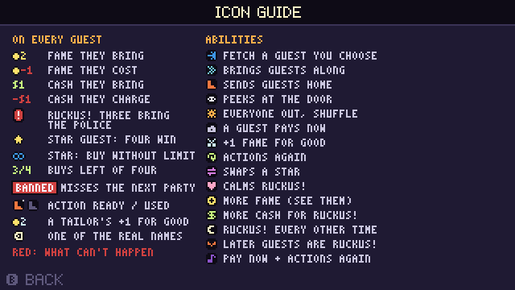
</p>

*A tribute to **Party House** (UFO 50 #25).*

- **Plays the same:** open the door and a random guest from your guest book
  walks in. The guest book by the door works like the rolodex: every guest
  copy as a tile with its own badges, in three groups (still to come, at
  the party, out tonight), with a cursor and a box that tells the guest
  under it; the fetchers pick from the same book. Three rowdy guests bring the police, and guests brought along
  can overflow the house for the fire marshal; either way nobody pays and one
  guest misses the next party. End the party in time and everyone pays fame
  (to buy guests) and cash (to add space).
- **The guests:** all 46 of Party House's guests with their costs, pay,
  talents and trouble, from fetchers, bouncers and peekers to drummers,
  upstarts and the nine star guests. Win by ending a party well with four
  stars in it, within 25 nights. Fame stops at 65 and cash at $30, as in
  the original.
- **Structure:** five set guest lists with the original's pools, then a
  Random list and the five-win streak. 2P Versus takes alternate nights and
  shares the shop.
- **Ours:** the house by the sea, the nosy neighbour's lamp, every guest's
  name, portrait and line (the Saucer Pilot, the Wish Fish, the Punk Singer,
  the Goat...), the list names and the music.
- **Owner's additions:** B ends a party (after a YES/NO); a party with
  nothing more to happen ends by itself; a guest-by-guest tally with a tick
  for every point (hold A to hurry it); a shop and a list grid where every
  move wraps (B jumps to NEXT PARTY); and **OPEN ALL NIGHT**, an endless
  mode on any list or a big random mix of the whole roster: no last night,
  one more star needed for each star party, three shutdowns and the lights
  go out, with a best kept for each list. Two guests of his own, dealt by
  the Random list and OPEN ALL NIGHT: the **Crooner** (cost 10) scores a
  guest on the spot and gives everyone else their action back, once a
  party; the **Albatross** (cost 6, +6 fame, +$1) makes everyone who comes
  in after him RUCKUS!. And a **custom list**: an editor with every guest
  and star, where A puts one in the shop or takes it out (the neighbour,
  cousin and rowdy mate are locked in), with CLEAR ALL, RANDOMISE and an
  ALL NIGHT toggle. It needs a star and six guests, is saved, and keeps its
  own record.
- **Easy to read:** every guest wears small badges (fame, cash, RUCKUS!, a
  star and an icon for its ability, dimmed once used) in the house, the
  shop, the guest book and the editor, with an ICON GUIDE to explain them
  (SELECT in the guest book, or the START menu). The guest book opens over
  the party with the top bar and the door in view, counts the RUCKUS! and
  stars still to come, and marks each copy's own (a tailor's +1s, a real
  name). Shutdowns say why in red (OVER CAPACITY!, TOO MUCH
  TROUBLE!, with the culprits marked), the banned guest wears a red BANNED
  tag until the party they miss, a peek leaves the guest waiting by the
  door while the party goes on, stars show a no-limit sign in the shop, and
  every list is open from the start, turning gold once beaten.

### 26 · SKID KIDS

<p align="center">
  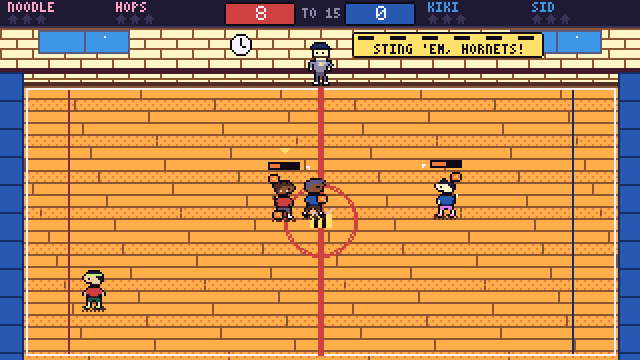
</p>
<p align="center">
  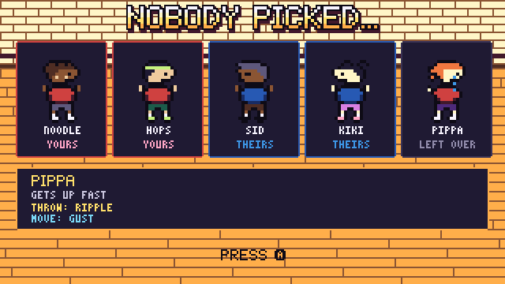
  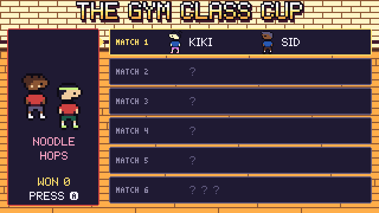
</p>
<p align="center">
  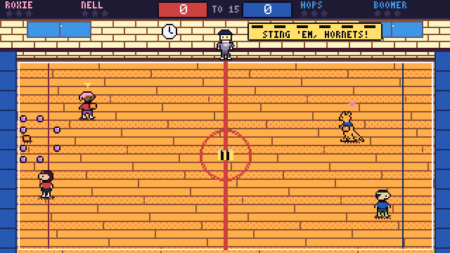
  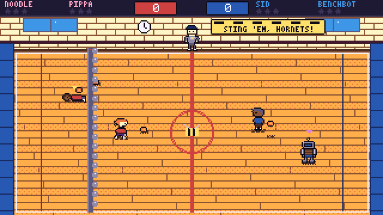
</p>

*A tribute to **Hot Foot** (UFO 50 #26).*

- **Plays the same:** two on two in a school gym, seen from above, your team
  on the left of a centre line nobody may cross. Beanbags skid along the
  floor, bounce off the walls and stop, and a sliding bag that touches a
  kid of the other team is a point; first to 15. One button does it all:
  tap B by a bag to pick it up, tap it with a bag to pass (and swap), tap it
  with nothing near to swap kids, hold it to wind up (rooted, the pad aims),
  and let go. A quick tap-and-let-go tosses the bag by your feet; a full
  wind-up knocks the kid it hits flat. A jumps, and your partner jumps
  with you; A during a wind-up calls it off and jumps. A bag held too long
  throws itself. Your partner only fetches bags and holds them: swap to it
  (or over and back) to get one.
- **Stars:** jumping over a sliding bag, or a juice box, is half a star, so
  one jump can earn both kids one. With a star, a full wind-up is the kid's
  special throw, and A again in the air its special move. The Coach starts
  play with a bag on the line and keeps throwing in bags and juice boxes,
  mostly onto the line; the CPU chases every one, ambush or not, steers
  round puddles and can't read a wiggly throw.
- **The kids:** the original's twelve kits one for one: wiggly throws,
  getting up fast, high jumps, arcing lobs, a quick wind-up, stars shared
  with a partner, two bags, speed that never slips, quick hands, a kid who
  ignores the line, the Coach's pet and a kid who runs rivals over, with
  the comet, ripple, yo-yo and popper throws and the stomp, gust, reel and
  splash moves, each on three kids.
- **The tournament:** TAKE TURNS (five kids at random: you pick one, the
  other side two, you one of the last two, and the one left over cries) or
  HAND-PICK, then six matches with no second chances: the CPU's two picks
  first, three more teams, a kid with Boomer the kangaroo, and at last the
  kid nobody picked with the robot it built to get even. 2P co-op (the
  goals count) and 2P versus, a demo that plays when the title sits, the
  kids played and crowned, and our own codes (no saving or goals while
  on). A demo player in the tests wins the whole tournament with button
  presses.
- **Ours:** NOODLE, PIPPA, HOPS, MILO, SPARKY, NELL, KIKI, ROXIE, TOBY, SID,
  BUZZY and MOOSE in red and blue bibs, Boomer and his marble bag, Benchbot
  and its sweeper wall, the Coach, the Hornets' gym, every line of talk and
  the music.

### 28 · DUNE EXPRESS

<p align="center">
  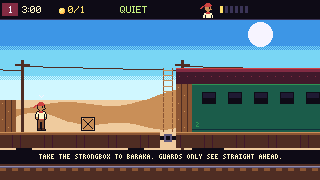
</p>
<p align="center">
  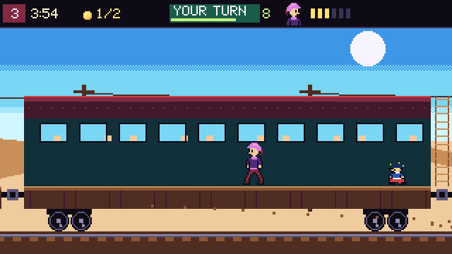
  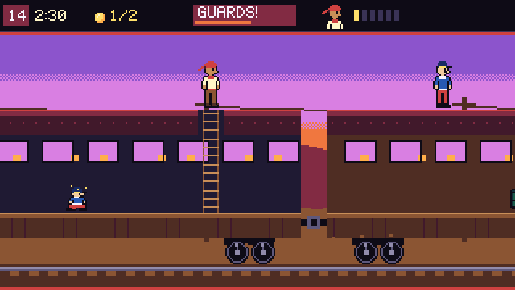
</p>

*A tribute to **Rail Heist** (UFO 50 #28).*

- **Plays the same:** rob a moving train and escape to your mount at the back
  before the train reaches town. Each heist opens with a look along the whole
  train, inside and out. While every guard stands still it's real time; once
  one is up and about it goes in turns, ten seconds for you (the clock runs)
  and three and a half for the lawmen (it stops).
- **The rules:** a guard shoots an outlaw he sees straight ahead, once, and
  then can only punch and throw; his bullet takes whoever is first in line,
  another lawman too, and a gunshot wakes everyone nearby. Duck behind
  anything a tile high, punch through walls, floors and ceilings, push, carry
  and throw barrels, crates, anvils, powder sticks and geese, hide and roll in
  a barrel, stand on a guard's head, and load the gun slowly. Levers flip
  every iron gate, the crank gun turns on the lawmen from behind, and rams
  run down whoever is in front.
- **Structure:** twenty missions in order for the same three outlaws, one or
  two a mission (a pair starts at opposite ends and takes turns), with loot,
  a rescue, a full belt of bullets and the Governor to finish; three stars a
  mission (no kills, every guard down, and Rail Heist's own time goals); 2P
  Versus on a longer train dealt fresh each time.
- **Ours:** Wade, Hush and Pearl, Old Hettie and Biscuit the camel, the Salt
  Line and all twenty trains (every one is won by a scripted run in the
  tests, without a kill and under its time goal), the powder sticks, geese,
  rams and the lucky horseshoe, and the music.

### 45 · DOT & DASH

<p align="center">
  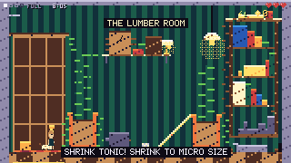
</p>
<p align="center">
  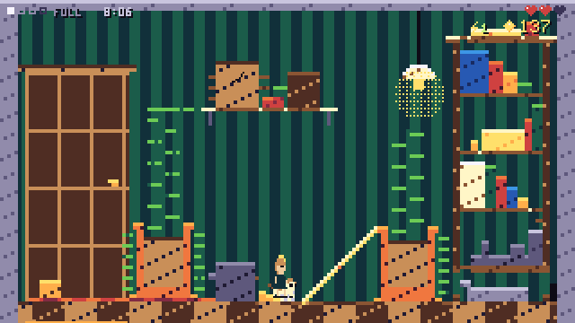
  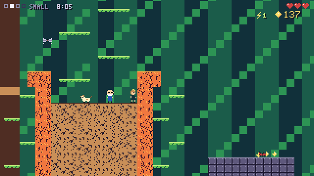
</p>

*A tribute to **Mini & Max** (UFO 50 #45).*

- **Plays the same:** locked in a room during a party, a girl and her dog
  get small. Hold down to shrink into whatever is under you, hold up to grow
  back; the room at full size is the map, and where you shrink is where you
  arrive. Every speck of the room holds a micro world, the same for everyone,
  and the second tonic makes Dot tiny inside it, small enough for gaps one
  speck high.
- **The rules:** lift what you stand on and throw it, up in an arc or down
  under your feet to build steps, even at full size; what you hold makes you
  taller. Crackers, darts, boomers, rollers, quake blocks, hourglasses, venom
  that spreads, the Big Bang, and the dog himself as a weapon. Dash roams on
  his own, stops and goes when told, gives tips, and his nose points out
  spots worth shrinking into. Hearts, energy that makes throws hurt, falls too
  long for someone so small, a clock that ticks on every time you grow back,
  and at no hearts you are simply full size again.
- **Structure:** 39 upgrades (tonics, the mitt, the satchel, bug commands,
  kicks, spins, sprint, armour, wings, hearts and energy eggs), each kind in
  many places that give the next level; five shops; flyports; favours for the
  tiny towns; big glints two to a dangerous cave; 500 glints to the cat in the
  door knob, a clockwork knight stopped from the inside, and after the
  escape, 1,000 more to put the room in balance.
- **Ours:** Dot and Dash, Granny Thimble and Professor Crumb, Queen Tabitha
  and Sir Sprocket, Tock in the clock and Nib in the keyhole, the lumber room
  and every town in it (Tuftville in the rug, Fernby and Loamton in the pots,
  Tickburg on the clock, Glimmer on the reading lamp, Wormwood between the
  walls, Latchtown on the door knob), the generator, and the music.
### 46 · MANDIBLES

<p align="center">
  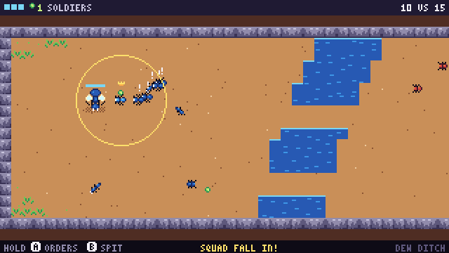
</p>
<p align="center">
  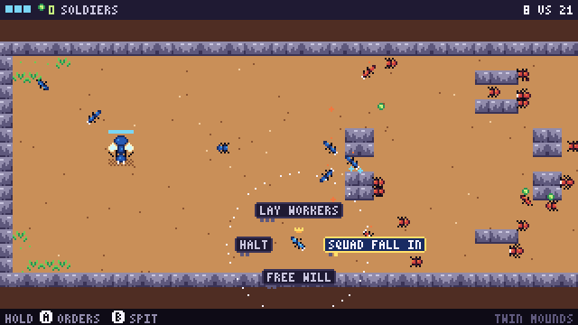
  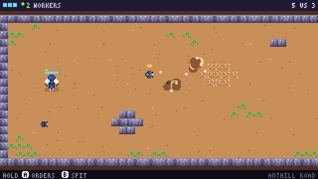
  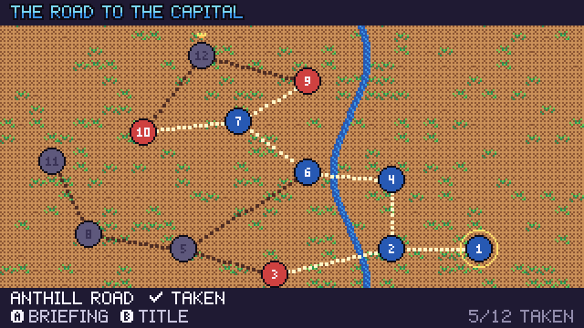
</p>

*A tribute to **Combatants** (UFO 50 #46).*

- **Plays the same:** you are one blue soldier ant, slow on purpose. B
  spits the way you face in eight directions. Hold A for the command cross:
  up lays workers or soldiers (from anywhere) or withdraws, right is Fall In,
  down Free Will, left Halt, each with a soldiers-only version a second
  press away. Commands reach the ants within a few tiles (they show "!").
  Soldiers on Fall In spit when you do, so a stack of five and you one-shot
  a red ant, but orders go stale in two seconds, one step in four goes
  astray and an ant that loses sight of you forgets you. Carry green sap to
  your queen: a worker costs 1, a soldier 2. Only your ant comes back, free,
  after a moment, as long as your army has an ant left; the field is lost
  when none is. A dead queen stops hatching and leaves food, as do dead
  longlegs.
- **The reds:** twice your health and about twice your numbers, food by
  their queens, few soldiers. They beeline for sap and turn for home the
  moment they pick some up, come straight at you when their jaws are empty,
  send the odd scout, get stuck on corners, and every soldier locks its
  aim, so an angle beats it. Lure a red worker onto your queen and it gnaws
  at her from then on while you pick it off. Ants that touch brawl in a
  cloud of dust; health, type and luck pick who walks out. The longlegs eat
  anybody; lead one into the reds.
- **Structure:** twelve fields on a branching road to the capital (a hard
  wall on the west road, an easy one north, side roads to a wide lawn and a
  garden of longlegs), a pointless bonus field, and 2P versus on three
  fields. The demo player in the tests wins every field with button
  presses.
- **Ours:** the Bluebell Colony and the Rust Horde, General Stag and his
  letters, the longlegs, every command's name, all 16 fields and the music.
### 30 · FLINTHOLD

<p align="center">
  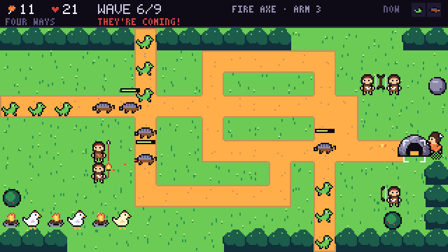
</p>
<p align="center">
  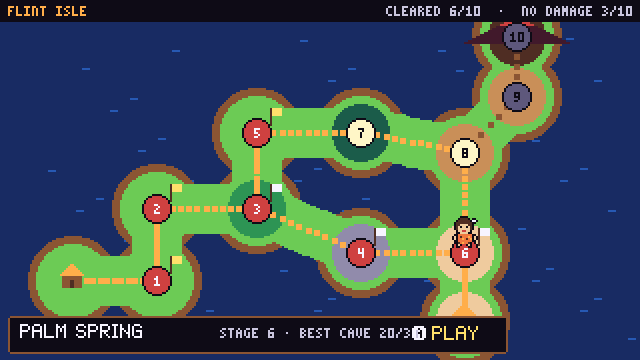
  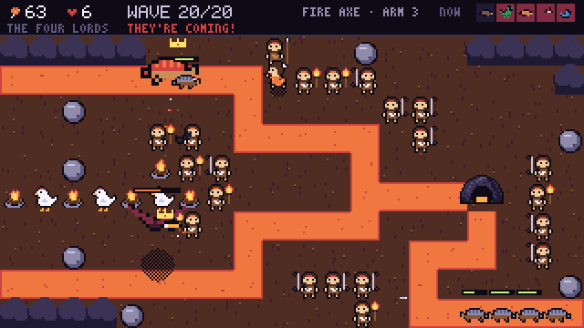
</p>

*A tribute to **Rock On! Island** (UFO 50 #30).*

- **Plays the same:** beasts come down fixed roads to the cave, wave after
  wave; the cave has 30 hearts. Build for as long as you like, then sound
  the horn facing the road. Pim walks eight ways, fairly slowly, and holds B
  to throw the way she points, diagonals too; her arm and weapon (bones, a
  stone axe, a fire axe through armour) are bought at the cave between waves.
  Any beast that touches her costs the cave a heart. Each spawn point pays
  20 meat a wave, ticking in over a short pay-out when a wave ends; kills pay
  at once, and 99 is the most you can hold.
- **Hunters, hens and fire:** a thrower climbs to spear, barb or bow, sling,
  hurler or boulder, or torch, blaze or pitch, with the original's damage,
  rates and reach. They throw straight at where a beast is, so quick ones
  get away. A fire pit beside a hunter adds half again; hens pay 5 a wave
  raw and cook by one pit in two waves or by two in one (or at once, if you
  set them down during the pay-out), then sell for 30.
- **Structure:** ten stages and three villages on the island map (two found
  only by walking off the map), each stage's last wave a boss, twenty waves
  and all Four Lords at once to finish (a quarter of an hour), and no music
  while you build. The title plays a demo when left alone, and the demo
  player in the tests wins every stage and village with real button presses.
- **Ours:** Pim, the Hearth Clan and Flint Isle, all 13 layouts and their
  waves, the nippers, redbacks, fangcats, clubtails, gliders, gnats, the
  shagtusk and the Four Lords (Snap, Jaw, Plate and Gale), the villagers
  and the music.

### 31 · TILTSHOT

<p align="center">
  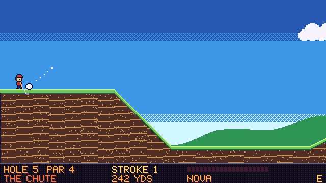
</p>
<p align="center">
  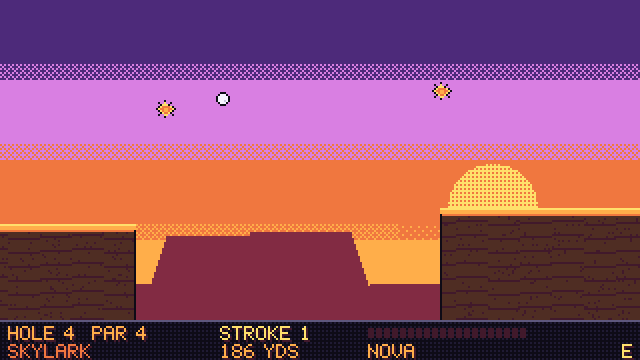
  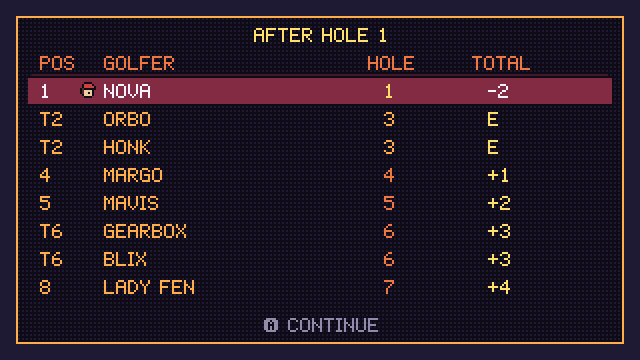
</p>

*A tribute to **Pingolf** (UFO 50 #31).*

- **Plays the same:** golf seen side-on on courses built like pinball
  tables. LEFT and RIGHT turn a dotted guide; hold A and the meter fills and
  stays full, but hold it there and the golfer flashes red (EASY NOW!) and
  blows up, and the stroke is gone. Let go to swing. While the ball flies,
  A slams it down once a stroke, keeping its speed across (a SLAM lamp on
  the dot-matrix display shows it is ready); slammed onto a slope that
  falls away it races off on fire. Sand stops it dead, water and pits send
  it back to where it was hit from (the stroke counts, nothing more), a
  fast flat ball skips across water, and the hole counts the moment the
  ball is in the cup. SPLASH!, KA-BOOM!, BIRDIE! and the rest flash up on
  the display, pinball style.
- **The courses:** bumpers, spring pads and spring lines that throw far
  harder than bumpers, orange movers on thirteen holes (blimps, hop-bots,
  kites, fish, sparks, trundlers on the ground and lanterns on chains) that
  break at a touch and nearly stop the ball, purple junk that breaks and
  slows it a little, pegs, roofs, tunnels, bridges, a pillar hanging from
  the sky, and a red block with a strange message. No hole but the par 1
  can be aced without a slam, and the tests prove it.
- **Structure:** eighteen fixed holes in order at the original's pars (61
  in all, with the par-1 TOSS-UP at 9 and the par-6 LAST ORBIT at 18),
  eight golfers on the board, lowest total wins; the CPU rivals are weak and
  random (the best of them ends 4 to 13 over par). 1P or 2P versus, five
  golfers who all play the same, the original's two stats, and a code in
  the credits that works like a terminal code. The tests replay a route
  round every hole with real button presses (34 strokes in all).
- **Ours:** the Comet Classic, Nova, Digby, Peaches, Tuck and Moss, the
  twelve regulars, Wick (HOMESPUN) and Kip (SKYWELL) by the code, all
  eighteen holes, the movers and junk, the words on the display, and the
  music.

### 32 · FORLORN HOPE

<p align="center">
  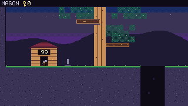
</p>
<p align="center">
  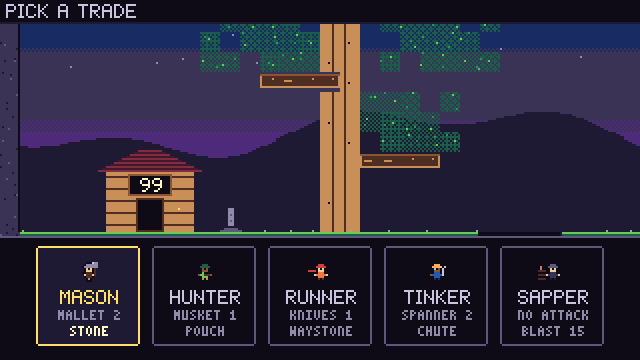
  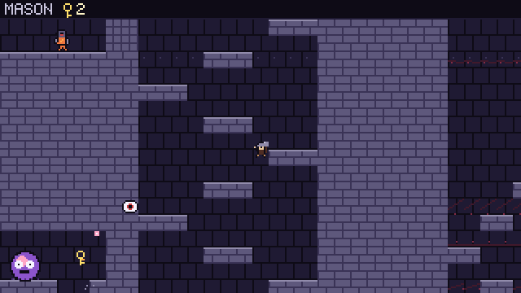
</p>
<p align="center">
  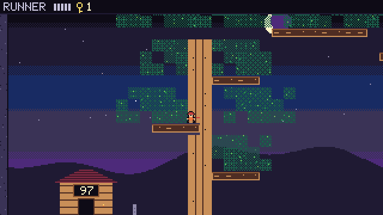
  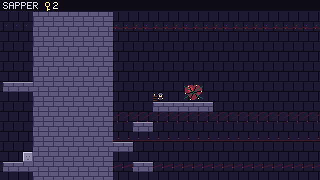
</p>

*A tribute to **Mortol II** (UFO 50 #32).*

- **Plays the same:** 99 volunteers wait on the counter over the troop's
  door, and there is no way to get more. Each life you pick a trade there:
  the mason swings a mallet and turns into a stone that stays where it is
  made, in mid-air too; the hunter shoots far (20 shots) and leaves a pouch
  that refills ammo forever; the runner double-jumps, throws knives (5) and
  leaves the one waystone, which UP on the pad by the door goes to and back;
  the tinker throws spanners in an arc (15) and leaves a chute down through
  the ground; the sapper has no attack and blows up for 15. Tap B to
  attack; hold it until the volunteer flashes and let go to give them up;
  the charge carries through a waystone or a chute and can be let go there
  (a mason's stone just under the waystone, again and again, is the endless
  climb), and dying while holding it sets the gift off anyway. Nothing is
  put back: foes keep their wounds and stay dead, and keys, open doors,
  stones, pouches, chutes and the waystone stay for the whole run.
  Seventeen kinds of foe with the original's hit points, three plates
  raising yellow, green and blue blocks only while weighed down, drains,
  combs and bells you can block or break, loose rock and out-of-place brick
  that blasts open, three tall gulpers you feed a volunteer each, and four
  thorn hearts of 30, which alone stay on the black screen between lives.
  One sitting, no saving.
- **Structure:** one fixed map of 190 x 170 tiles (about 6 x 10 screens).
  The obvious way on from the camp is a blind drop into spikes. The tower
  way (three plates, the gulper, the stingback, the slime and the fly maker,
  a sealed wall), the bottom-right chimney (every plate held, then bombed
  into the hearts' room) and the castle way (keys, doors, the bloater's
  corridor, the dungeon) all lead to the hearts, past a bottom-left pocket
  of keys and plenty of dead ends. Win having lost fewer than 50 for the
  Alien; the title keeps the original's two stats, the most doors unlocked
  and the most plates pressed. Two players take turns from one pool; a code
  lets out only three trades. With real presses the demo player wins
  having lost 21, an expert plan wins having lost 12 (the original's best
  known is 13), and the chimney and the castle way are walked too.
- **Ours:** the volunteers of Holloway and their five trades, the camp and
  the Old Yew, the meadow, the undercroft, the caves and the vault, the
  deep, the sump, the roots, the undermarsh, the chimney, the tower and
  Thornkeep, the whole map, every foe (wall-eyes, oozles, midges, hornets,
  shellbacks, hatcheteers, squawkers, tuskers, idols, drakes, hornet bells,
  rust knights, bloaters, broodhens, hornheads, stingbacks, gulpers) and the
  thorn hearts, the words, and eight tunes, one for each trade.

### 34 · BRAVADO

<p align="center">
  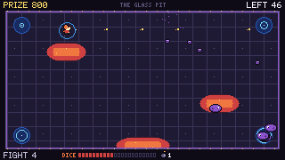
</p>
<p align="center">
  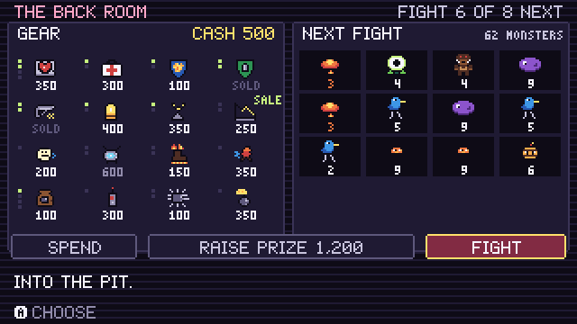
  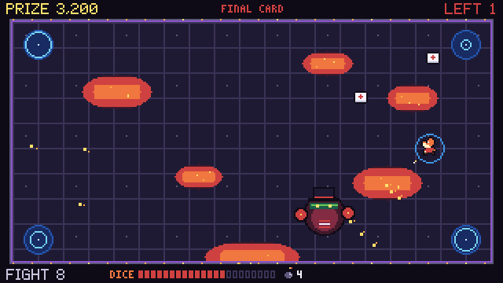
</p>
<p align="center">
  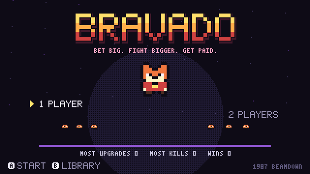
  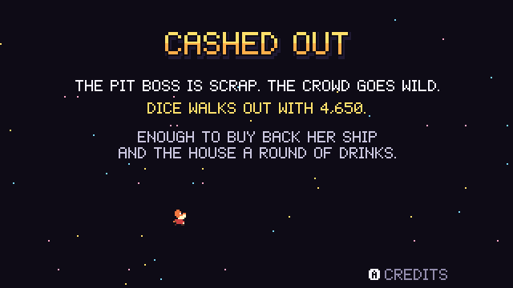
</p>

*A tribute to **Overbold** (UFO 50 #34).*

- **Plays the same:** one fixed arena, the same every fight: you start in
  the middle, monsters come in a few at a time from the four corner pads
  (never more than twelve on the floor; the bigger the prize, the quicker,
  up to a prize of 900), and lava pools sit in the way. Six health, and
  nearly everything takes six. Tap A to shoot the way you face; hold it and
  the gun keeps firing the same way while you walk, so you strafe. B drops
  a bomb that kills everything in its blast outright, you included. Lava
  bites every half second; monsters don't care.
- **The bet:** fight 1 pays a fixed 100. Before fights 2 to 7 the next
  fight starts as one random pack for 100, and every UP THE STAKES adds
  100 and another random pack, named only once it's in, up to 16
  packs and 1,600. Fight 8 is always full: twelve packs, then the Pit
  Boss, for 3,200. The back room sells sixteen kinds of gear at the
  original's prices (7,900 for the lot), one of them on sale and another
  hiked by 100 every visit: health, medkits that heal past full, blast and
  shot guards, faster, harder, fanned and bouncing shots, a shove, a drone
  that copies you a moment later (its bombs included), lava walking, a
  dash (fire twice on the move) that flattens anything, more bombs, a detonator, nail bombs and bait bombs.
- **Structure:** eight fights, then the ending; dying ends the run. The
  goals: win a fight worth 500, come out of all eight standing, and walk
  out with 4,500 or more. Two players share the pit, the purse and the
  gear. The demo player in the tests wins whole runs from the title with
  real presses, and on its cherry plan banks 1,300 for the last fight and
  walks out with over 4,500.
- **Ours:** Dice, who bet her ship on a pair of sevens, and her brother
  Domino; the Glass Pit and the back room; mites, gasbags, brutes, powder
  kegs, stilters, peepers, slag, the Pit Boss and its fizzers; every
  piece of gear's name and icon; the story, the words and ten tunes.

### 39 · BUZZBOLT

<p align="center">
  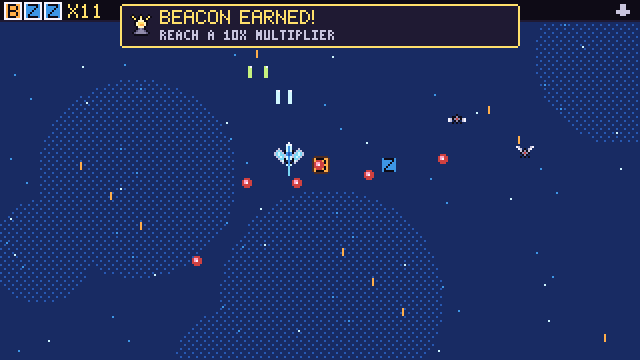
</p>
<p align="center">
  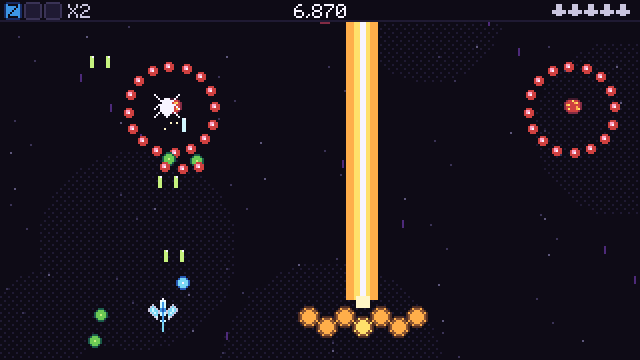
  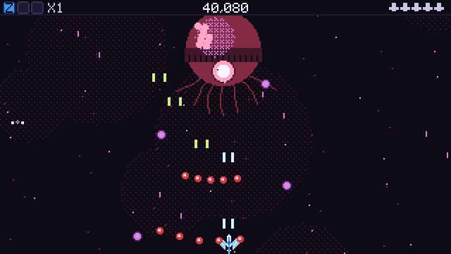
</p>
<p align="center">
  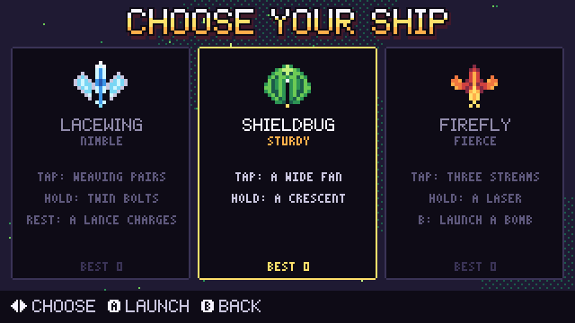
  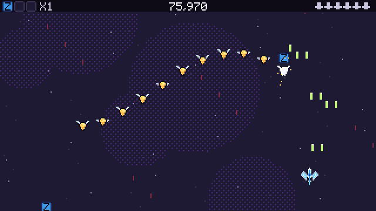
</p>

*A tribute to **Star Waspir** (UFO 50 #39).*

- **Plays the same:** a fast vertical shooter over the whole wide screen,
  where one hit is a loss and two ships is all you start with. Tap A for
  the ship's wide spread at full speed; hold it for focused fire, and the
  ship slows right down. Most shots are aimed where you were, so they can
  be herded; green ones home in. Foes that aren't shot leave; bosses
  don't, except wave 1's pair, which flies off if left alone.
- **The letters:** every kill drops one, always in the order B, Z, Z, B, Z,
  Z (a boss drops three), and you fly into them. Every three make a word:
  BZZ puts the multiplier up by one with no limit, ZZZ brings an option
  (two at most), BBB and ZBB are the ship's own specials, and any other
  word puts the multiplier back to x1. The multiplier carries on from
  wave to wave and is cashed in on the bosses and the golden swarm.
  Losing a ship costs the multiplier and every gift. More ships come at
  25,000, 100,000 and 200,000.
- **The ships:** the lacewing's weaving pairs and its lance, charged by not
  firing; its drone dives at foes, its orbs soak up shots, its hiveship
  beams. The shieldbug's wide fan and crescent; its drone shields, its
  power-up and its screen clear. The firefly's three streams and laser;
  its drone fires rockets, BBB gives it a bomb for B, ZBB a dragonfly ally.
- **Structure:** five waves, each ending in a boss and a time bonus that is
  never multiplied; wave 3 is the hard one, wave 4 has walls with gates and
  a golden swarm worth a fortune, wave 5 is the last boss alone, all aimed
  fans to weave through. An opening of our own comes before the title;
  after the last boss, the ending, the credits and the high-score table.
  The demo player in the tests clears all five waves with each ship,
  pressing real buttons.
- **Ours:** the Hive Wing, the B and Z letters, the Blight and its bosses
  (the Ironbacks, the Bloatfly, the Queen Tick, Scythewing and Dustwing,
  the Sporeheart), every wave, the opening, the table's names and the music.

### 44 · HOMESPUN

<p align="center">
  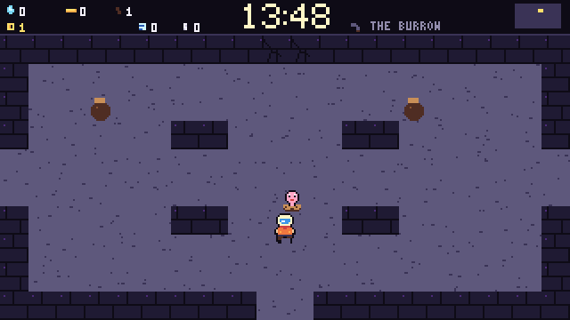
</p>
<p align="center">
  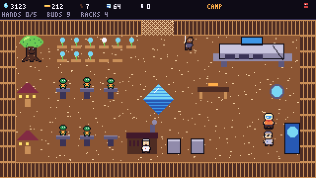
  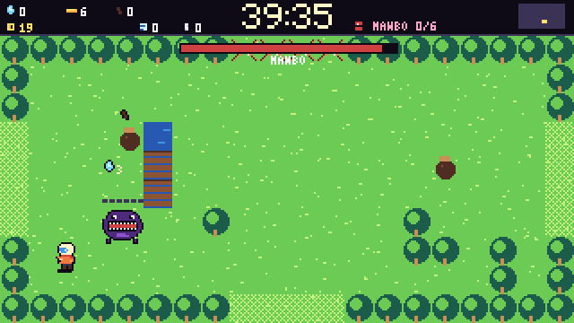
</p>
<p align="center">
  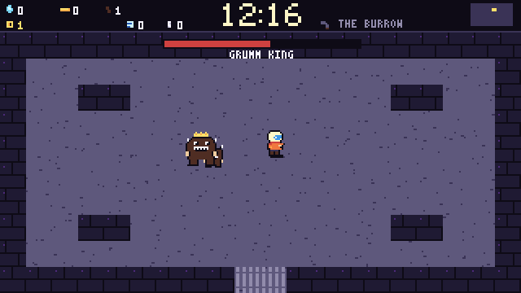
  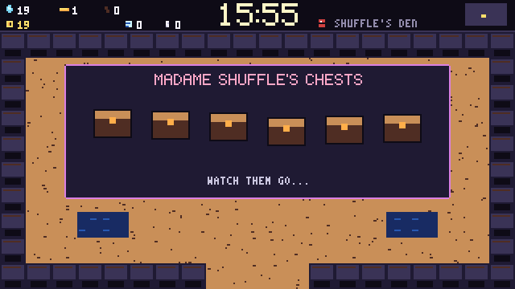
</p>

*A tribute to **Pilot Quest** (UFO 50 #44).*

- **Plays the same:** at camp Wick's yo-yo knocks glints out of the
  Glowstone, one a hit, and she has to walk over them. Old Burl plants
  six glintbuds (10, 40, 160, 640, 2,560 and 10,240 glints), each making a
  glint every 2 s; the workbench turns 1,000 glints into a bar; huts give up to six
  hands for six anvils (a bar every 2 minutes) and the Thinker (data), once a
  gear comes home; bins raise what camp can hold; Dr. Orrery researches
  better yo-yos, Fertilizer, Big Bins, the Pep Pill and Starfuel. All of it
  keeps working in real time while the console is on, in the menus or in
  another cartridge, but not while it is off.
- **The Wilds:** Tolly lets Wick out only with jerky, and every strip she
  carries becomes two minutes on the clock, which is also her health: a hit
  costs 30 s (more from the worst), and if it runs out she loses everything
  she found. The Wilds are one map, but each save shuts its own roadblocks
  and shuffles which caves hold the dungeons and the folk; a new game plus
  shuffles them again. Three dungeons each guard a ship part; odds from
  foes, pots and chests (at the original's loot rates) pay for
  hopstones, noodlers and Madame Shuffle's chests; Hush's letter to Tanger
  earns the thunderpipe; the Volthog guards the way to Mother Loom, who
  spins thread at camp once beaten, faster for every idle hand. Then Mawbo
  roams the Wilds: beat it six times in one trip for the Alien.
- **Ours:** Wick and the *Tumbleweed*, the moor-moon Oddmoor, Old Burl,
  Gristle, Dr. Orrery, Tolly, Kit, Hush, Tanger and Madame Shuffle, the
  Wilds and their six regions, the three dungeons, all 19 foes and
  the six bosses, and the music.

### 41 · RIMSHIRE

<p align="center">
  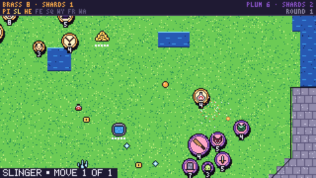
</p>
<p align="center">
  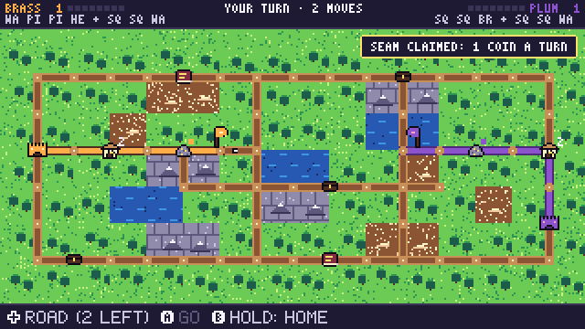
  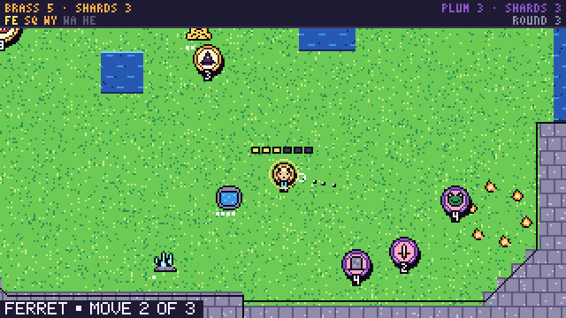
</p>

*A tribute to **Lords of Diskonia** (UFO 50 #41).*

- **Plays the same:** two layers. On the board the banners take turns
  stepping along the roads, one space on the first turn and two after,
  every move used; a banner can't cross its own trail, holding B takes it
  home, and stepping onto the other banner, its home or its trail starts a
  battle there, the side that stepped acting first. Inns hire out the same
  three disks all war and close after three visits, tomes teach one of three
  skills, seams pay for ten turns, chests pay once. The loser of a battle
  goes home, calls up its reserves and moves next; a war is won when a
  battle would start and the other side has no disks.
- **The battles:** the field's corners come from the four board tiles round
  the fight (woods with trees, tents and huts, crags with cliffs, dunes,
  lakes); a fight at a home has its own yard, and a castle's stone floors
  lie between bastions. Pick one of
  the first three disks in the queue, turn the aim, hold A to charge the
  pips, let go. A foe struck by one of your disks takes that disk's melee;
  two foes knocked together take 1 each. Water drowns, the haze closes in
  after five turns each, and five quiet rounds are a stalemate. Hold B to
  look round the field.
- **Structure:** fifteen disks for hire with the original's numbers (the
  ferret's three dashes, the brute's stun, the adder's poison, the piper's
  stars, the leech's thirst, the menhir that can't be moved...), eight
  skills, ten campaign wars that each bring one new idea, the random streak
  (both armies start alike; only the computer's aim gets sharper) for the
  cherry, and two players. The demo player in the tests wins every
  war with real button presses.
- **Ours:** Rimshire, the Brass and Plum banners, the Plum Empress and Lady
  Brass's letters, all sixteen disks and eight skills, the ten boards, the
  streak's board maker and the music.
### 47 · WOBBLE DERBY

<p align="center">
  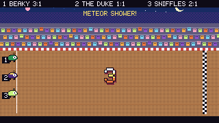
</p>
<p align="center">
  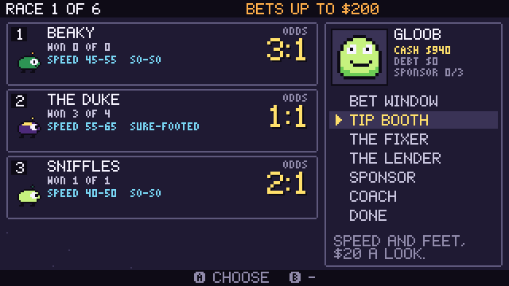
  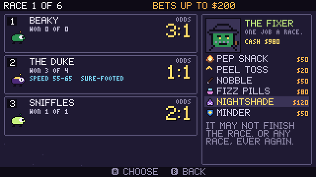
</p>
<p align="center">
  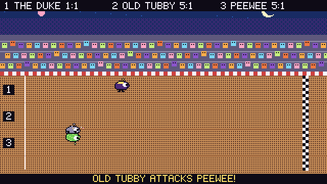
  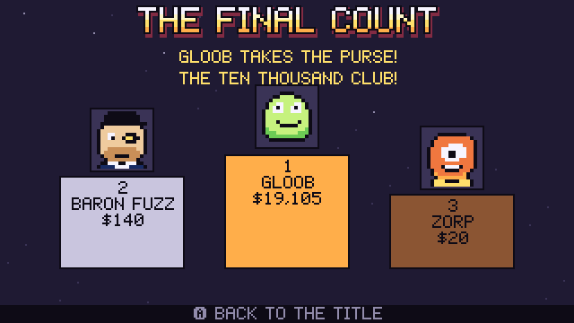
</p>

*A tribute to **Quibble Race** (UFO 50 #47).*

- **Plays the same:** you and two rival punters bet on races you can't
  touch. Before the meeting twenty races are run unseen, and their results
  set the odds. Each race you back one of three runners (only a win pays),
  with a cap that rises race by race and no limit on the last. Then the
  machine runs the race: speed, clumsiness and luck decide it, and a runner
  that tumbles over the line still wins.
- **Between races:** one look a race at the tip booth shows a runner's
  speed and footing and warns of meteors, garbage spills or smog. The Fixer
  does one job a race at the original's prices: a pep snack, litter, a
  nobble for good, pills that send a runner wild at its neighbours, or
  nightshade, which kills at the first fall. A minder stops them all but
  litter and fines the meddler. The Lender charges 15 % a race, compounded.
  The stables offer three runners for future races: sponsor up to three for
  $500 each time they win, and train them at the coach.
- **Structure:** meetings of 3, 6, 9 or 12 races, CPU rivals who fix races
  too, and up to three players at one pad. A demo punter in the tests plays
  a whole meeting with real button presses.
- **Ours:** Crater Downs under two moons, the 26 wobblers (each keeps the
  speed and clumsiness band of one of the original's runners), the sixteen
  punters, five of them cameos from other UFO 40 cartridges, the Tip Booth,
  the Fixer, the Lender, the Coach, Dot Dial and the Wobble Wire, and the
  music.

### 48 · DRIFTLINE

<p align="center">
  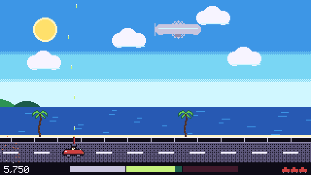
</p>
<p align="center">
  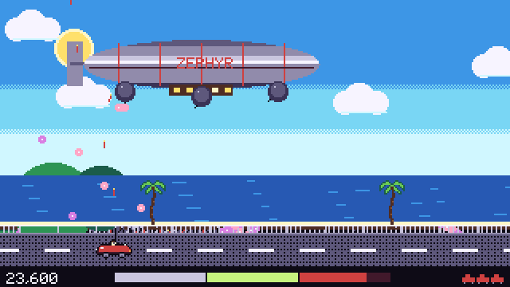
  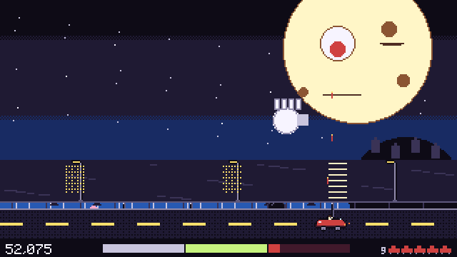
</p>
<p align="center">
  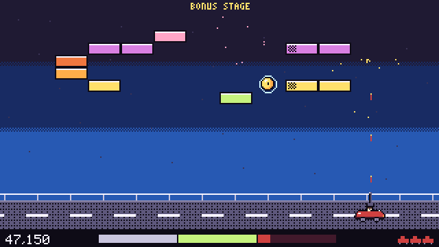
  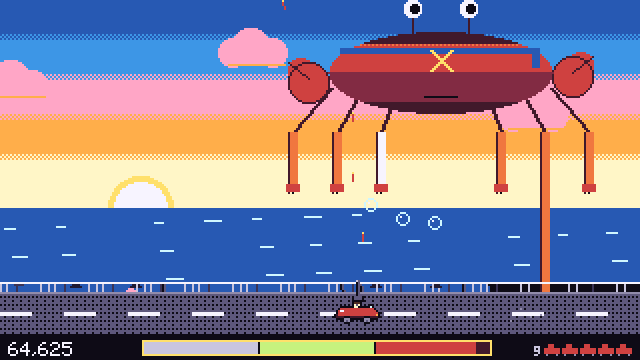
</p>

*A tribute to **Seaside Drive** (UFO 50 #48).*

- **Plays the same:** a red convertible locked to the road at the bottom
  of the screen while the coast goes by. Driving is aiming: the gun swings
  the way you steer, through a 90-degree cone, and stays put when you stop;
  UP brings it back to straight up. Hold A for the roof gun's stream, B for
  side pairs along the road, the only thing that reaches cars on it. One hit
  loses the car; the next drives in from the left, fully charged, and
  sweeps the screen.
- **The meter:** grey, green, red: the section sets how hard, how often
  and how fast the guns shoot, and nothing within it counts. It fills
  only while you drive left (the power drift, with sparks) and drains slowly
  otherwise, so the drive becomes a rhythm: surge right to shoot, drift left
  to charge.
- **Structure:** four fixed stages, morning to sunset to midnight to the
  open sea, each with its own foes and a boss you can see in the background
  all stage. Clear a stage without losing a car and a Breakout bonus stage
  follows: the car is the paddle, a coin in a bubble the ball, gunfire
  breaks blocks too, and clearing them all gives the coin, worth two more
  cars (the only extra cars there are). 1P, or 2P in one car: player 1
  drives, player 2 aims and fires. A run takes about 13 minutes; the demo player in the tests wins
  it from the title with real presses, alone and in co-op.
- **Ours:** Lou and the Gull, Dee on the gun, Harbour Road, the Sundown
  Strip, the Moonlit Mile and Open Water, every foe and wave, the whales'
  swells, the three block layouts, the Zephyr, the Orrery, the Man in the
  Moon and Old Crab (visiting from ROOFCAT), a Beamdown saucer, and the music.

### 49 · FULL PEAL

<p align="center">
  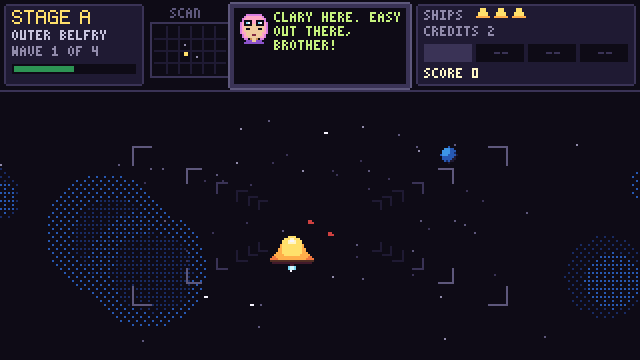
</p>
<p align="center">
  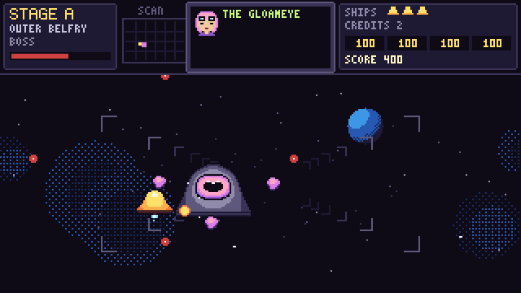
  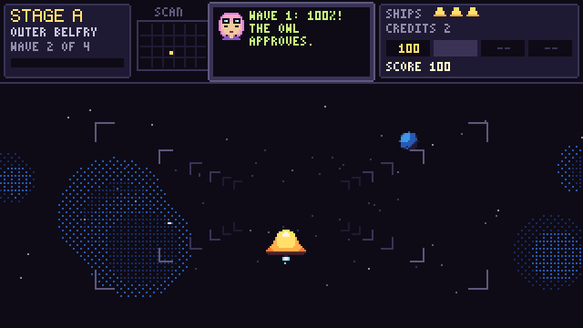
</p>
<p align="center">
  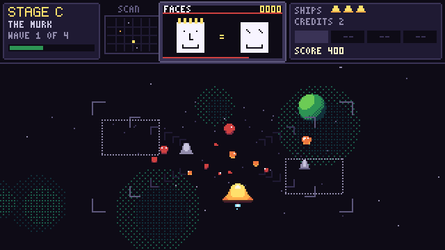
  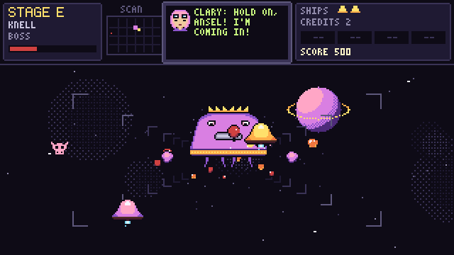
</p>

*A tribute to **Campanella 3** (UFO 50 #49).*

- **Plays the same:** the bell ship flies into the screen, free on a flat
  plane of 6 × 4 lanes, with no gravity, no fuel and no walls (orange
  marks warn of the edges). A fires into the distance down the lane you're
  in; B fires the side blaster along the plane, away from the way you're
  moving, and holding it keeps its aim: far off, the forward gun; here on
  the plane, the blaster. One hit costs a ship; the next is there at once.
- **Grades, not points:** each of the twenty waves is graded by the share
  of its foes you shot down, 0 to 100 (an owl for a 100). A 100 or a 0 in
  a stage brings a balloon round after its boss: red 1, orange 3, more
  orange for every 100, and 50 points buy a continue. Three ships a credit,
  never given back between stages; losing them sends you back to the
  stage's first wave. The final count is the twenty grades plus 100 for
  every continue left; 1,500 is the third goal.
- **Structure:** five fixed stages of four waves and a boss, sixteen foes
  (some come in from the distance and sit on the plane, some keep their
  distance and lob crosses, some can't be hurt at all), five bosses with
  one weak point each and a nastier second half, the last one healing until
  your sister flies in. A code takes your guns away. A second controller
  holding A turns the cockpit monitor into Clary's console: fifty
  four-colour micro-games, playable whatever the main game is doing (even
  on its game-over screen), each with a high score. The demo pilot in the
  tests wins the whole game from the title with real presses.
- **Ours:** Ansel and the Tinkler with his sister Clary on the radio (from
  BELLHOP and CHIME CIRCUIT), the bell-planet Knell, Outer Belfry, Tin
  Nebula, The Murk and Tollgate, all sixteen foes, the Gloameye,
  Knucklebell, the Inkwell, Shellback and Queen Sordina, every wave, all
  fifty micro-games, and the music.

## Install on PS Vita

You need a Vita running HENkaku / h-encore / Ensō with **VitaShell**.

1. Download `ufo40.vpk` from the [latest release](https://github.com/naniiic137/ufo-40/releases).
2. Copy it to the Vita:
   - **USB:** in VitaShell press **SELECT** to start USB mode, then copy the file to `ux0:`.
   - **FTP:** press **SELECT** for FTP, then upload the file with any FTP client.
3. In VitaShell, find `ufo40.vpk`, press **Cross** and choose **Install**.
4. Start **UFO 40** from the LiveArea bubble (title ID `UFOF00040`).

Saves live in `ux0:data/UFO40/`. The game runs at 960×540 (the 320×180
framebuffer at exactly ×3) with 2-pixel bars top and bottom.

## Windows

Download `UFO40-windows.zip` from the releases and run `ufo40.exe`.

- Saves go to `%APPDATA%\UFO40`. If you put an empty `portable.txt` next to the
  exe, it keeps them in a `saves` folder beside it instead.
- **F11** or **Alt+Enter** toggles fullscreen. The window scale is in Options.

## Controls

| Console | Keyboard (PC / web) | PS Vita | Gamepad |
|---|---|---|---|
| D-pad | Arrows or WASD | D-pad or left stick | D-pad or left stick |
| A | Z, J or Space | Cross | A (bottom face button) |
| B | X or K | Circle | B (right face button) |
| START | Enter or Esc | START | Start |
| SELECT | Shift or Backspace | SELECT | Back / Select |

- **START** opens the pause menu in every game: Resume, Restart, Controls, Quit.
- **SELECT** on a cartridge in the library opens its card: time played,
  times opened, goals, DELETE SAVE and its own CONTROLS, where A, B and
  SELECT can swap jobs for that cartridge only. **B** goes back to the main
  menu.
- **Two players:** the 2-player modes of Wet Paint, Bannerfall, Duskling and Cutlass Cup take two
  gamepads, or split the keyboard: player 1 on WASD + F/G, player 2 on the
  arrows + K/L. On the Vita (one controller) those modes are locked.
- **Full Peal's hidden console** is for a second player while player 1
  keeps every usual key: a second gamepad, or the numeric keypad (8 4 2 6
  to move, 0 or Delete for A, . or End for B).
- On phones the web page shows an on-screen D-pad with A, B, START and SELECT.

## Building

The core is portable C11. Local builds on Windows use the portable
[w64devkit](https://github.com/skeeto/w64devkit) toolchain (gcc + make), and
nothing needs installing.

```sh
make headless     # the headless runner
make test         # build it and run every scripted test in tests/
make shots        # regenerate the README screenshots and GIFs into docs/shots

# Windows desktop build (w64devkit + SDL2 mingw development libraries)
make sdl SDL2_DIR=C:/path/to/SDL2-2.32.10/x86_64-w64-mingw32

# Linux desktop build (uses sdl2-config)
make sdl
```

CMake does the same job for Vita, the web and CI. It reads the same file list
(`sources.mk`), so there's only one list to maintain:

```sh
# PS Vita (inside the vitasdk/vitasdk docker image)
cmake -S . -B build-vita -DUFO40_VITA=ON && cmake --build build-vita    # -> build-vita/ufo40.vpk

# Web (with emsdk activated)
emcmake cmake -S . -B build-web && cmake --build build-web              # -> build-web/index.html

# Desktop + CTest
cmake -S . -B build && cmake --build build && ctest --test-dir build
```

The Vita and web builds run in GitHub Actions (`.github/workflows/`):

| Workflow | What it does |
|---|---|
| `test` | builds the headless runner with gcc on Ubuntu and runs every test (Make and CTest) |
| `vita` | builds the `.vpk` inside `vitasdk/vitasdk:latest` |
| `web` | builds with emsdk and deploys to GitHub Pages from `main` |
| `windows` | cross-compiles with mingw-w64 and zips the exe with `SDL2.dll` |
| `release` | on `v*` tags, attaches the `.vpk` and the Windows zip to a GitHub Release |

## Architecture

```
src/engine/            platform-independent core (no dependencies)
  gfx.c                320x180 8-bit framebuffer, 32-colour palette, sprites with
                       flip / palette swap / outline, clipping, camera, dithering,
                       palette fades and flashes
  font.c               original 5x7 proportional font + 3x5 tiny font
  audio.c              4-channel synth (2 PolyBLEP pulses, 4-bit triangle, LFSR noise),
                       ADSR envelopes, vibrato, sweeps, arpeggios; UFO-MML sequencer
  input.c rng.c        pressed / held / released / auto-repeat; PCG32
  save.c scene.c       CRC32-checked saves; scenes with palette-fade transitions
src/shell/             the console: boot, main menu, 50-slot library, options and jukebox,
                       save data, pause menu, goal toasts
src/games/*/           one folder per cartridge: rules, art, audio, levels
src/platform/sdl2/     PC + PS Vita + Emscripten in one file
src/platform/headless/ scripted test runner, PNG / GIF / WAV writers, Vita LiveArea art
```

- **Rendering.** Games draw palette indices into the framebuffer. Once per
  frame, the platform layer runs the 57,600 pixels through a 32-entry colour
  table into one streaming SDL texture and scales it by a whole number. That
  keeps the Vita's 444 MHz ARM (which the game clocks up to) nearly idle.
  Palette fades and white flashes happen in that colour table, so they cost
  nothing.
- **Timing.** The game logic always steps at a fixed 60 Hz. A frame that
  lasts a whole number of 1/60 s ticks (within a millisecond) runs exactly
  that many steps, so a 60 Hz vsync gives one step per refresh with no drift
  or judder; other refresh rates fall back to an accumulator. 120 Hz screens
  don't change the game's speed.
- **Audio.**
  - Output is 48 kHz stereo, rendered in the SDL audio callback (or on the
    main thread on the web).
  - Music is written in **UFO-MML**, a compact text notation. For example
    `@14 v12 o5 c8 e g ^4 [d e]2` sets instrument, volume and octave, then
    plays notes with lengths, ties and repeat blocks.
  - Sound effects use the same notation and take over one channel for a
    moment, just like old hardware.
  - Every track and jingle is original: 234 compositions across the console and
    the twenty-seven cartridges.
- **Art.** Sprites are written as strings of palette letters in the C source
  (`k` ink, `y` yellow, `C` cyan and so on), so there are no binary assets at
  all. The Vita LiveArea images are drawn by the engine itself
  (`ufo40_headless --vita-assets vita/sce_sys`) and saved as 8-bit indexed PNGs.
- **Saves.**
  - Global progress (goals and settings) goes in one CRC-checked file.
  - Each game saves its own run or checkpoint (or, like Roofcat, just its
    high scores).
  - The main menu's Save data screen deletes one game's save, resets its
    goals (which clears its save too, since games rebuild goals from their
    saved progress) or deletes everything, play counts included.
  - Where they're stored: the exe folder or `%APPDATA%\UFO40` on PC,
    `ux0:data/UFO40/` on Vita and `localStorage` in the browser.
- **Testing.**
  - Tests are plain text scripts (`tests/*.ufs`) that press buttons, wait,
    use cheats to set up situations and then `expect` game state.
  - Grub Shift keeps its rules in one pure struct. An autoplay bot that looks
    two moves ahead plays whole contracts from it as a balance smoke test.
  - Underdelve checks its mine with probes built on its own physics: every
    room walked and jumped from every way in, the rooms reachable from the
    camp with each route into the tower, and no way into a room that drops a
    returning Mo onto spikes. Its opening and the smith's way into the
    tower are also played by buttons alone.
  - Tin Troop has a route test for every level that plays its obstacles the
    intended way, and Skywell has a demo climber that checks generated pits
    can be climbed.
  - Fennec Fountain ships every room with its shortest solution, and a test
    plays all fifty with button presses on the real rules.
  - Duskling has a route finder that searches button patterns on its real
    rules; every room, warp and egg has a test replaying the presses it
    found, and switching a secret off shows which rooms cannot be crossed without it.
    A steady player tries every mix of wait, take-off and jump hold on each
    obstacle of the first seven rooms, and a test keeps them forgiving.
  - Wet Paint checks that all 26 courses are sound, and its demo driver
    (the same one that drives Foxy) plays a run from the title screen.

Example test (`tests/ud_02_hazard_death.ufs`):

```
# UNDERDELVE: spikes kill in one hit; a lantern goes out and Mo comes back
# where he entered the room.
game underdelve
wait 15
cheat no_gloom
cheat room 1 0 170 130
cheat clear_enemies
wait 5
expect lanterns == 6
hold RIGHT 60
expect deaths == 1
expect lanterns == 5
wait 90
expect state == 1
expect px < 180
```

## Credits and license

- A vibe-coded project by [@naniiic137](https://github.com/naniiic137): the
  design, code, pixel art, music and levels were generated with an AI coding
  assistant (Claude Code), directed and play-tested by naniiic137.
- Inspired by the idea and games of **UFO 50** by Mossmouth. Go play the real thing.
- [SDL2](https://www.libsdl.org/) (zlib license) handles windows, input and
  audio on every platform. [vitasdk](https://vitasdk.org/) and
  [Emscripten](https://emscripten.org/) handle the Vita and web builds.

UFO 40 is **non-commercial**. You may play, share, study and change it for any
non-commercial purpose, but you may not sell it or use it commercially.

- **One licence for everything** (code, pixel art, music, sound, levels and
  text): the [PolyForm Noncommercial License 1.0.0](LICENSE).
- UFO 40 is free and stays free: no sales, no donations, no ads.
- It is an unofficial fan tribute, not affiliated with or endorsed by
  Mossmouth; "UFO 50" and its game names belong to Mossmouth. Rights holders
  with any concern can [open an issue](https://github.com/naniiic137/ufo-40/issues)
  and it will be changed or taken down.
- SDL2 keeps its own zlib licence.
